<h1 align="center">avsec</h1>

<p align="center">
  <b>Захищене відео через наявний аналоговий відеотракт</b><br>
  <sub>Відтворення схеми ISITIA 2021 · демонстрація її меж · заміна на стандартній криптографії<br>
  з експериментальним порівнянням за фіксованого бюджету на синтетичних і <b>природних</b> кадрах</sub>
</p>

<p align="center">
  
  
  
  
  
  
  
</p>

<p align="center">
  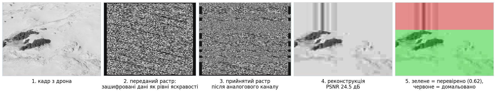
</p>

<p align="center">
  <a href="#-швидкий-старт">Швидкий старт</a> ·
  <a href="#-як-це-працює">Як це працює</a> ·
  <a href="#-формули">Формули</a> ·
  <a href="#-результати">Результати</a> ·
  <a href="docs/reconstruction_2021.md"><b>Завдання ISITIA 2021</b></a> ·
  <a href="ROADMAP.md">Road map</a> ·
  <a href="docs/conclusions.md">Висновки</a> ·
  <a href="docs/methods.md"><b>Каталог схем</b></a> ·
  <a href="docs/substitution_b2s.md">B2s: заміна</a> ·
  <a href="docs/claims.md">Твердження</a> ·
  <a href="docs/limitations.md">Межі застосовності</a> ·
  <a href="docs/glossary.md">Словник</a> ·
  <a href="docs/README.md">Карта документації</a>
</p>

---

## 🎯 Виконання завдання ISITIA 2021

> **Завдання:** відтворити схему захисту відеоканалу БпЛА зі статті ISITIA 2021,
> показати її межі й запропонувати вдосконалення.
>
> **Відповідь одним документом:**
> ### ➜ [docs/reconstruction_2021.md](docs/reconstruction_2021.md)
>
> Документ читається окремо від решти репозиторію і містить чотири розділи:
>
> | Частина | Що в ній | Перевірити |
> | --- | --- | --- |
> | **1. Реконструкція** | будова `B1`: регістр зсуву з лінійним зворотним зв'язком (LFSR), сітка 12×16, таблиця перестановки; **репліка таблиць I–III** вихідної публікації для початкових станів 44257, 1234, 1111 | `run.bat lab` |
> | **2. Випробування на зображеннях** | застосування реконструкції `B1` до чотирьох фрагментів аерофотографії: вихідне, скрембльоване та відновлене зображення | `run.bat lab` |
> | **3. Криптоаналіз** | пʼять атак із зазначенням моделі загроз, результату й часу; перебір визначає заданий початковий стан регістра **44257** за 5,13 с | `avsec attack` |
> | **4. Модифікації** | ланцюжок `B1 → B2 → B3 → B4 → B4t/P`: кожен крок відповідає конкретній вразливості з розділу 3, із зазначенням вартості | `run.bat research` |
>
> **Основні числові результати:**
>
> * репліка таблиць вихідної публікації дає середню подібність **3,70 %** проти
>   **3,94 %** у публікації; за незмінного початкового стану регістра розкид по
>   чотирьох фрагментах аерофотографії становить **6,55 відсоткового пункту**,
>   тобто показник характеризує пару «алгоритм — набір зображень»;
> * перебір реалізованого простору початкових станів визначає заданий стан
>   **44257** за **5,13 с**;
> * збирання за сумісністю меж **без знання ключа** дає **94,94 %** правильних
>   сусідств при **0,00 %** правильних абсолютних позицій, тобто **витік
>   структури, а не повне розкриття кадру**.
>
> Одна команда відтворює розділи 1–2 і записує результат у
> [`results/lab/`](results/lab):
>
> ```bash
> run.bat lab            # або ./run.sh lab
> ```

<p align="center">
  <a href="docs/reconstruction_2021.md">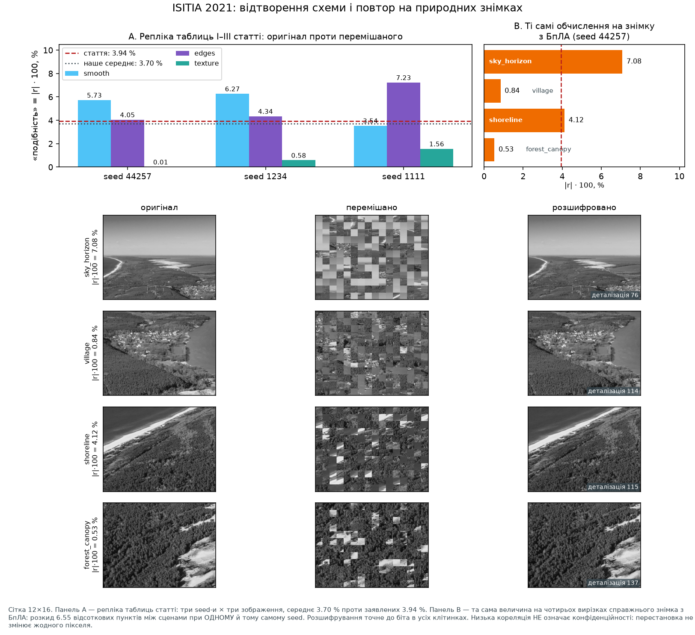</a>
</p>

---

> [!IMPORTANT]
> **Основний результат роботи — негативний.**
> Переналаштована проста база (`B4t`) перевершує запропоновану схему (`P`) у
> кожному каналі кожного з трьох наборів даних. Два запропоновані механізми —
> кілька описів і burst-aware розміщення — не покращують наскрізну якість і
> навіть не вміщуються в бюджет без тих самих змін транспорту, які й дають
> увесь виміряний виграш. Подробиці: [ROADMAP](ROADMAP.md#головний-результат-і-чому-він-негативний),
> [висновки §6](docs/conclusions.md).

---

## 📖 Про що це

Вихідна стаття —
Mardiyanto R., Suryoatmojo H., Setiawan F., Irfansyah A. N.
*Low Cost Analog Video Transmission Security of Unmanned Aerial Vehicle (UAV)
based on Linear Feedback Shift Register (LFSR)*, ISITIA 2021, с. 414–419,
DOI [10.1109/ISITIA52817.2021.9502241](https://doi.org/10.1109/ISITIA52817.2021.9502241)
— пропонує захищати відеоканал дрона **перестановкою блоків кадру** за
послідовністю LFSR.

Цей репозиторій робить три речі:

1. **Відтворює** цей алгоритм (метод `B1`) і **показує його межі**: обраний кадр
   відновлює перестановку повністю за 1,3 мс; одна відома пара — теж повністю на
   гладкому й текстурному вмісті. А **на гладкому вмісті — типовому для
   аерозйомки — впізнаване зображення (24,7 дБ) відновлюється взагалі без ключа
   і без відомої пари**, лише з переданого зображення.
2. **Будує заміну** на стандартній криптографії (`B3`, `B4`, `P`): дані
   шифруються AEAD і передаються **через той самий аналоговий тракт** як рівні
   яскравості.
3. **Вимірює**, що саме це дає і чого коштує — 183 600 моментів показу на трьох
   наборах даних (з них один — **24 незалежні знімки з БпЛА**), 56 рисунків, і
   окремий розділ про те, де запропонована схема **програє**. Вона програє
   переналаштованій простій базі в кожному каналі кожного набору, і це головний
   результат, а не застереження до нього.

### Це не аналоговий шифратор

**Гібридна архітектура.** Аналоговими лишаються сигнал на композитному інтерфейсі
та сам тракт передавання. Уся обробка **до** передавача і **після** приймача —
цифрова:


```mermaid
flowchart LR
    subgraph TX["Передавач (на борту)"]
        A["Камера<br/>кадр 256×192"] --> B["Джерельне<br/>кодування"]
        B --> C["AEAD<br/>ChaCha20-Poly1305"]
        C --> D["Reed–Solomon<br/>GF(256)"]
        D --> E["Розміщення<br/>в растрі"]
        E --> F["Модулятор<br/>рівні яскравості"]
    end
    F --> G(["АНАЛОГОВИЙ ТРАКТ<br/>CVBS 625/50"])
    subgraph RX["Приймач (на землі)"]
        G --> H["Демодулятор<br/>+ синхронізація"]
        H --> I["Reed–Solomon<br/>виправлення"]
        I --> J["Перевірка AEAD<br/>тег 128 біт"]
        J --> K["Складання<br/>кадру"]
        K --> L["Показ<br/>+ карта віку"]
    end
    style G fill:#ffe0b2,stroke:#e65100,stroke-width:3px
    style C fill:#c8e6c9,stroke:#2e7d32
    style J fill:#c8e6c9,stroke:#2e7d32
```

Базові методи `B0a`, `B1`, `B2` навпаки передають **саме зображення** аналоговим
растром — це опора для порівняння, а не захищений режим.

---

## ⚡ Швидкий старт

### Windows

```bat
git clone https://github.com/RE22GDV/avsec.git
cd avsec
run.bat
```

### Linux / macOS

```bash
git clone https://github.com/RE22GDV/avsec.git
cd avsec
chmod +x run.sh
./run.sh
```

Перший запуск сам створює `.venv`, ставить залежності і відкриває веб-інтерфейс
на <http://127.0.0.1:8765/>. Більше нічого робити не треба.

| Команда | Що робить |
| --- | --- |
| `run.bat` / `./run.sh` | веб-інтерфейс (за замовчуванням) |
| `run.bat demo` | один кадр через усі методи, із зображеннями |
| `run.bat test` | увесь набір тестів |
| `run.bat check` | перевірка датасету + 35 перевірок протоколу |
| `run.bat research` | повна програма досліджень (≈1 година, відновлювана) |
| `run.bat budget` | бюджет каналу, затримка, пам'ять |

### Встановлення вручну

```bash
python -m venv .venv
# Windows: .venv\Scripts\activate
source .venv/bin/activate
pip install -r requirements.txt      # або requirements-dev.txt із тестами
pip install -e .
avsec info
```

Потрібен **Python 3.10+**. Без встановлення пакета теж працює:

```bash
PYTHONPATH=src python -m avsec.cli info
```

> **Про версію Python.** Лаунчер свідомо обирає **не найновіший** інтерпретатор,
> а перший із 3.12 → 3.11 → 3.10. Найсвіжіший Python зазвичай випереджає
> наявність готових пакетів numpy/scipy, і тоді `pip` намагається збирати scipy
> з джерел — на звичайному ПК це падає через відсутній компілятор Fortran.
> Щоб примусово задати інтерпретатор:
>
> ```bat
> set AVSEC_PYTHON=py -3.12
> run.bat
> ```
> ```bash
> AVSEC_PYTHON=python3.12 ./run.sh
> ```

<details>
<summary><b>Залежності і навіщо кожна</b></summary>

| Пакет | Навіщо |
| --- | --- |
| `numpy` | увесь сигнальний тракт |
| `scipy` | фільтрація, вікна SSIM, ресемплінг |
| `cryptography` | ChaCha20-Poly1305 / AES-256-GCM, HKDF-SHA256 |
| `reedsolo` | Reed–Solomon над GF(256) |
| `opencv-python` | читання й масштабування зображень |
| `Pillow` | формати, яких не покриває OpenCV |
| `PyYAML` | конфігурації |
| `matplotlib` | рисунки PNG 300 dpi / SVG / PDF |

**Жоден криптографічний примітив тут не написаний власноруч.** AEAD береться з
`cryptography` (обгортка OpenSSL), Reed–Solomon — з `reedsolo`. Це свідоме
рішення: див. [docs/threat_model.md](docs/threat_model.md).

</details>

---

## 🧰 Що вміє програма

<table>
<tr><td width="50%">

**Десять методів в одному бюджеті**
`B0a`, `B0a-R` — незахищене аналогове;
`B0d`, `B0d-W` — цифрове без криптографії;
`B1`, `B2` — перестановка 2021 року;
`B3`, `B4` — AEAD;
`B4t` — **переналаштований `B4`**: транспорт
`P` без MDC і BAWP;
`P` — запропоноване.

**Два рівні моделі каналу**
Рівень A — растрові спотворення;
рівень B — справжня форма CVBS 625/50.

**Атаки на бази**
Обраний кадр, відома пара, складання за
межами, багатокадрова, перебір seed.

</td><td width="50%">

**35 перевірок протоколу**
Мутація кожного семантичного поля, межі
парсера, повтори, зрив стану сеансу.

**Відновлюваний матричний прогін**
`кліп × метод × профіль × канал × повтор`
зі стабільними id, resume і перевіркою
повноти поіменно.

**Веб-інтерфейс**
Усі експерименти, перегляд збережених
прогонів, карти віку, експорт рисунків.

</td></tr>
</table>

### Інтерфейс

<p align="center">
  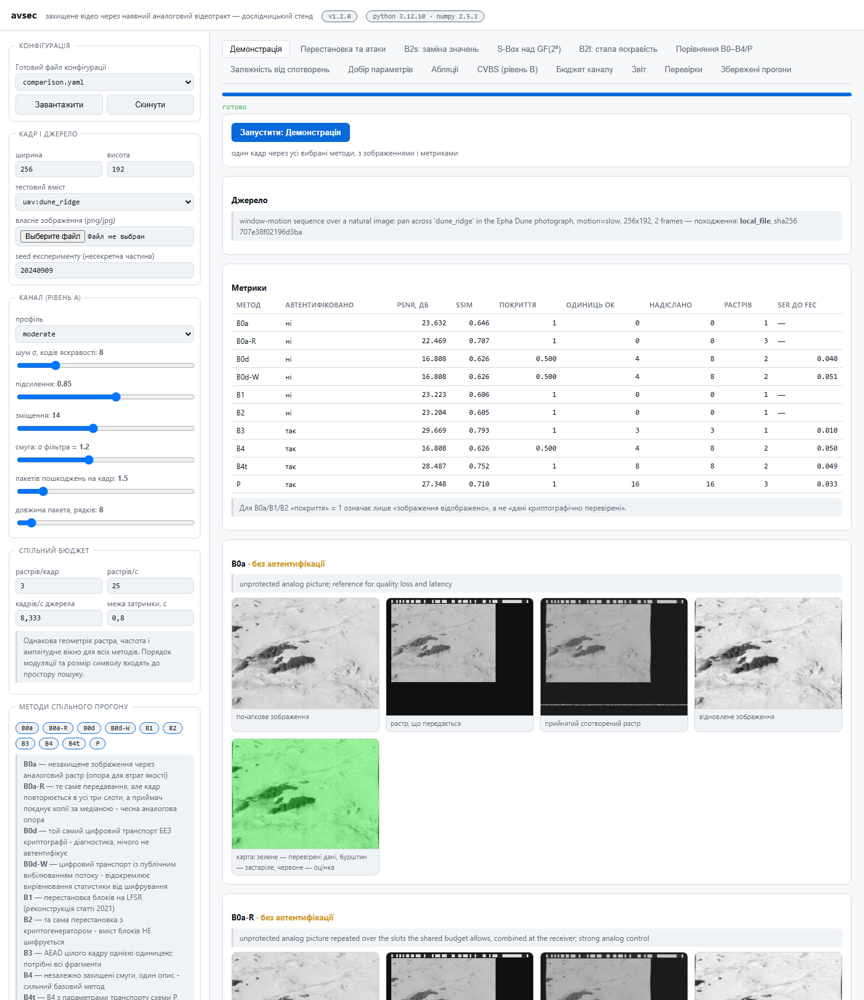
  <br><em>Демонстрація на реальному кадрі з дрона: метрики всіх методів і чотири стадії тракту для кожного</em>
</p>

<details>
<summary><b>Ще скріншоти</b></summary>

<p align="center">
  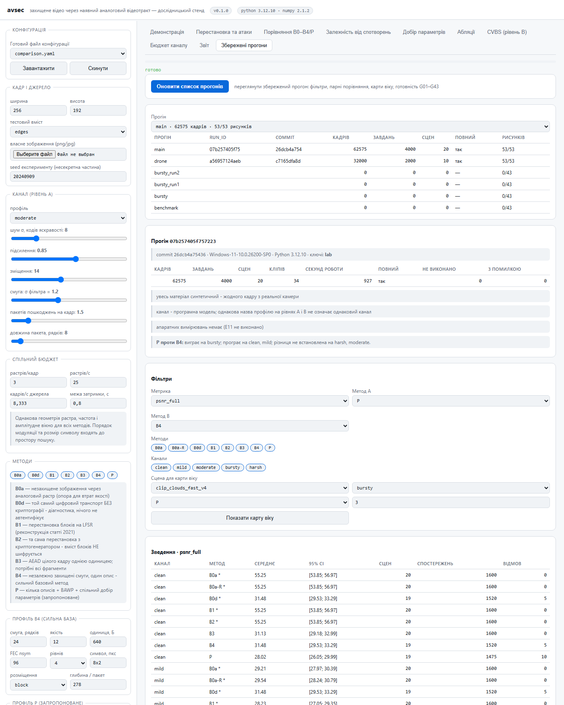
  <br><em>Перегляд збереженого прогону: фільтри, парні порівняння, окремі сцени, готовність рисунків</em>
</p>

<p align="center">
  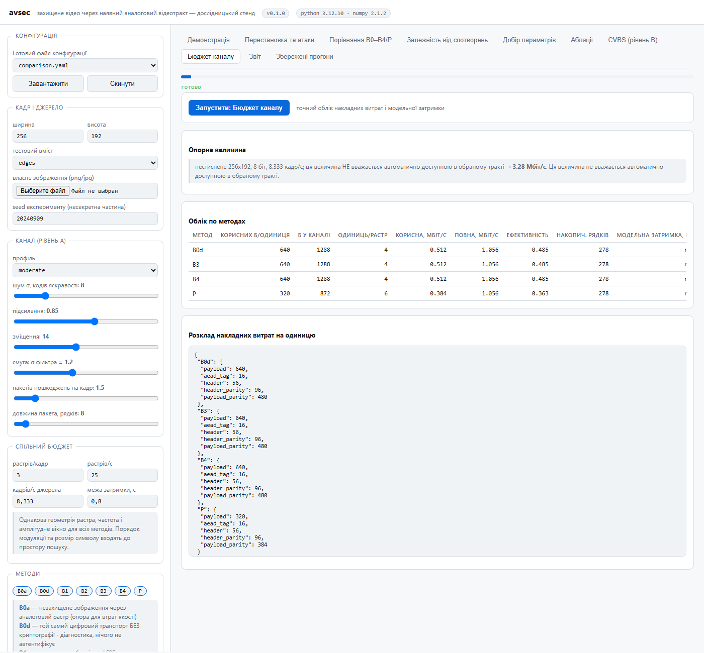
  <br><em>Бюджет каналу: точний облік накладних витрат, модельна затримка, три величини пам'яті</em>
</p>

<p align="center">
  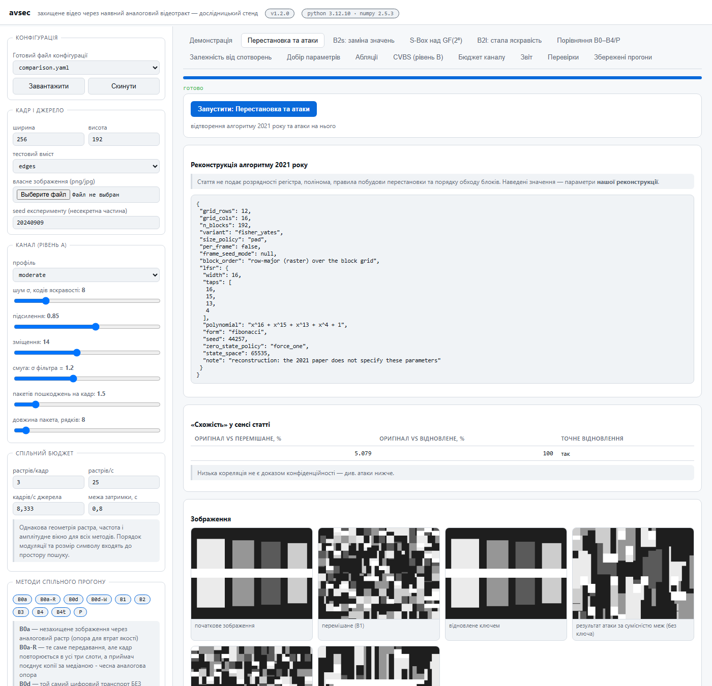
  <br><em>Перестановка 2021 року і атаки на неї</em>
</p>

</details>

---

## ⚙ Як це працює

### Структурна схема тракту

Одиниця захисту — **не кадр, а сегмент**. Кадр ріжеться на смуги, кожна смуга
кодується, шифрується і захищається окремо, тож втрата однієї не руйнує решту:

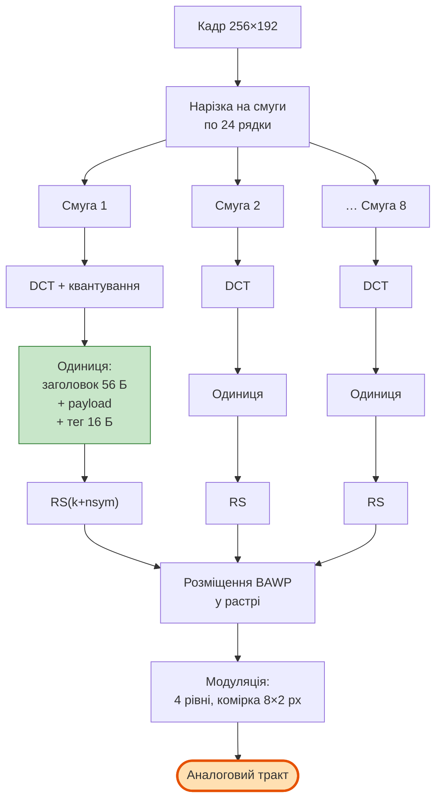
```mermaid
flowchart TD
    F["Кадр 256×192"] --> S["Нарізка на смуги<br/>по 24 рядки"]
    S --> C1["Смуга 1"] & C2["Смуга 2"] & CN["… Смуга 8"]
    C1 --> D1["DCT + квантування"]
    D1 --> U1["Одиниця:<br/>заголовок 56 Б<br/>+ payload<br/>+ тег 16 Б"]
    U1 --> R1["RS(k+nsym)"]
    C2 --> D2["DCT"] --> U2["Одиниця"] --> R2["RS"]
    CN --> DN["DCT"] --> UN["Одиниця"] --> RN["RS"]
    R1 & R2 & RN --> P["Розміщення BAWP<br/>у растрі"]
    P --> M["Модуляція:<br/>4 рівні, комірка 8×2 px"]
    M --> T(["Аналоговий тракт"])
    style U1 fill:#c8e6c9,stroke:#2e7d32
    style T fill:#ffe0b2,stroke:#e65100,stroke-width:3px
```

### Структура одиниці передавання

```
┌────────────────────────────────────┬──────────────────┬──────────┐
│ ЗАГОЛОВОК (56 Б, автентифікований) │ ШИФРОТЕКСТ       │ ТЕГ 16 Б │
├────────────────────────────────────┤ (payload 320 або │          │
│ magic 2 · version 1 · algo 1       │  640 байт)       │ Poly1305 │
│ session_id 8 · session_epoch 4     │                  │ ніколи   │
│ stream 1 · dir 1 · frame_id 4      │                  │ не       │
│ seg_id 2 · desc_id 1 · n_desc 1    │                  │ урізаний │
│ counter 8 · geometry 8 · CRC 4     │                  │          │
└────────────────────────────────────┴──────────────────┴──────────┘
        ↑ входить в AAD цілком              ↑ ChaCha20-Poly1305
```

Заголовок передається **у відкритому вигляді** (приймачу треба знати, куди
складати смугу), але цілком входить до AAD: змінити в ньому хоч один біт —
означає не пройти перевірку тега.

### Розміщення BAWP — алгоритм

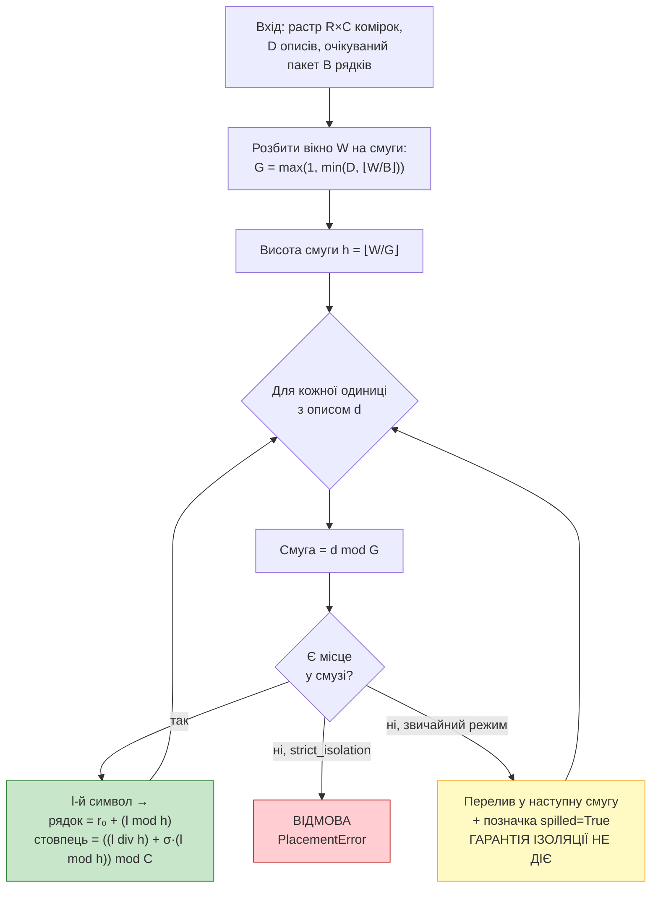
```mermaid
flowchart TD
    A["Вхід: растр R×C комірок,<br/>D описів, очікуваний пакет B рядків"] --> B["Розбити вікно W на смуги:<br/>G = max(1, min(D, ⌊W/B⌋))"]
    B --> C["Висота смуги h = ⌊W/G⌋"]
    C --> D{"Для кожної одиниці<br/>з описом d"}
    D --> E["Смуга = d mod G"]
    E --> F{"Є місце<br/>у смузі?"}
    F -->|так| G["l-й символ →<br/>рядок = r₀ + (l mod h)<br/>стовпець = ((l div h) + σ·(l mod h)) mod C"]
    F -->|ні, strict_isolation| X["ВІДМОВА<br/>PlacementError"]
    F -->|ні, звичайний режим| Y["Перелив у наступну смугу<br/>+ позначка spilled=True<br/>ГАРАНТІЯ ІЗОЛЯЦІЇ НЕ ДІЄ"]
    G --> D
    Y --> D
    style X fill:#ffcdd2,stroke:#b71c1c
    style Y fill:#fff9c4,stroke:#f9a825
    style G fill:#c8e6c9,stroke:#2e7d32
```

Межа гарантії: **умова «пакет зачіпає не більше двох смуг» виконується лише поки
немає переливу**. Контрприклад, за якого вона порушується, знайдено, відтворено
в тесті й описано в [docs/revision_history.md](docs/revision_history.md) (дефект F12).

### Рішення приймача про кожну одиницю

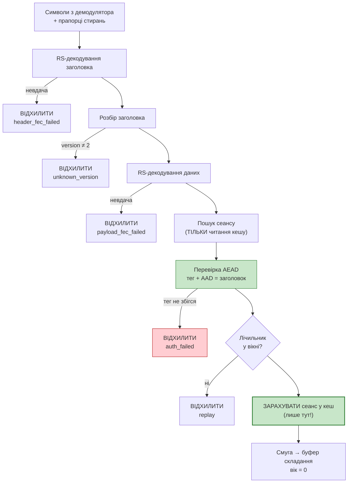
```mermaid
flowchart TD
    A["Символи з демодулятора<br/>+ прапорці стирань"] --> B["RS-декодування заголовка"]
    B -->|невдача| R1["ВІДХИЛИТИ<br/>header_fec_failed"]
    B --> C["Розбір заголовка"]
    C -->|version ≠ 2| R2["ВІДХИЛИТИ<br/>unknown_version"]
    C --> D["RS-декодування даних"]
    D -->|невдача| R3["ВІДХИЛИТИ<br/>payload_fec_failed"]
    D --> E["Пошук сеансу<br/>(ТІЛЬКИ читання кешу)"]
    E --> F["Перевірка AEAD<br/>тег + AAD = заголовок"]
    F -->|тег не збігся| R4["ВІДХИЛИТИ<br/>auth_failed"]
    F --> G{"Лічильник<br/>у вікні?"}
    G -->|ні| R5["ВІДХИЛИТИ<br/>replay"]
    G --> H["ЗАРАХУВАТИ сеанс у кеш<br/>(лише тут!)"]
    H --> I["Смуга → буфер складання<br/>вік = 0"]
    style F fill:#c8e6c9,stroke:#2e7d32
    style H fill:#c8e6c9,stroke:#2e7d32,stroke-width:2px
    style R4 fill:#ffcdd2,stroke:#b71c1c
```

Порядок «перевірити → потім змінити стан» — не деталь. У першій версії кеш
сеансів змінювався **до** автентифікації, тож вісім підроблених заголовків
витісняли справжній сеанс і далі приймався повтор (дефект **F01**, критичний).

### Ієрархія ключів

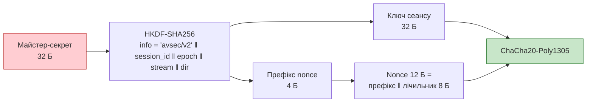
```mermaid
flowchart LR
    MS["Майстер-секрет<br/>32 Б"] --> HKDF["HKDF-SHA256<br/>info = 'avsec/v2' ‖ session_id ‖ epoch ‖ stream ‖ dir"]
    HKDF --> K["Ключ сеансу<br/>32 Б"]
    HKDF --> NP["Префікс nonce<br/>4 Б"]
    NP --> N["Nonce 12 Б =<br/>префікс ‖ лічильник 8 Б"]
    K --> AEAD["ChaCha20-Poly1305"]
    N --> AEAD
    style MS fill:#ffcdd2,stroke:#b71c1c
    style AEAD fill:#c8e6c9,stroke:#2e7d32
```

Лічильник **монотонний і резервується наперед у довговічному стані**: після
перезапуску передавач продовжує з зарезервованої позиції, а не з нуля. Плюс
32-бітова епоха сеансу входить і в AAD, і в KDF — повторне використання nonce
неможливе навіть після втрати стану (дефекти **F02**, **F03**).

### Конвеєр дослідження

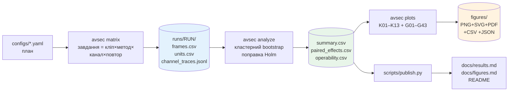
```mermaid
flowchart LR
    P["configs/*.yaml<br/>план"] --> M["avsec matrix<br/>завдання = кліп×метод×<br/>канал×повтор"]
    M --> RAW[("runs/RUN/<br/>frames.csv<br/>units.csv<br/>channel_traces.jsonl")]
    RAW --> A["avsec analyze<br/>кластерний bootstrap<br/>поправка Holm"]
    A --> TAB[("summary.csv<br/>paired_effects.csv<br/>operability.csv")]
    TAB --> F["avsec plots<br/>K01–K13 + G01–G43"]
    TAB --> PUB["scripts/publish.py"]
    F --> FIG[("figures/<br/>PNG+SVG+PDF<br/>+CSV +JSON")]
    PUB --> DOC["docs/results.md<br/>docs/figures.md<br/>README"]
    style RAW fill:#e3f2fd
    style TAB fill:#e8f5e9
    style FIG fill:#fff3e0
```

Кожне опубліковане число походить з **одного** `run_id`, який записано у файл
разом із ним. Слова «значуще» і «перевага» вибирає код за фактичним довірчим
інтервалом, а не автор.

---

## 🧮 Формули

> [!NOTE]
> Формули записані **простим текстом у моноширинному блоці** — так вони видно в
> будь-якому переглядачі Markdown, а не лише там, де працює LaTeX. Під кожною
> згорнуто джерело LaTeX: його можна скопіювати в статтю.

<details open>
<summary><b>Якість і покриття</b></summary>

Середньоквадратична похибка і PSNR по **всьому показаному кадру**:

```text
              1      H-1  W-1                     2
   MSE  =  ───────    ∑    ∑   ( I(y,x) − Î(y,x) )
             H·W     y=0  x=0

                        255²
   PSNR =  10 · log₁₀ ───────
                        MSE
```

<details><summary>LaTeX</summary>

```math
\mathrm{MSE} = \frac{1}{HW}\sum_{y=0}^{H-1}\sum_{x=0}^{W-1}\bigl(I(y,x)-\hat I(y,x)\bigr)^2,
\qquad
\mathrm{PSNR} = 10\log_{10}\frac{255^2}{\mathrm{MSE}}
```

</details>

За `MSE = 0` PSNR нескінченний. Такі кадри **рахуються окремо** (`bit_exact`), а
не підмінюються скінченною сталою на кшталт 99 дБ.

**Поточне автентифіковане покриття** — головна метрика захищеного тракту:

```text
           | { (y,x) : піксель з одиниці, що пройшла AEAD у ЦЬОМУ кадрі } |
   cov  =  ───────────────────────────────────────────────────────────────
                                   H · W
```

<details><summary>LaTeX</summary>

```math
\mathrm{cov} = \frac{\bigl|\{(y,x): \text{піксель з одиниці, що пройшла перевірку AEAD у цьому кадрі}\}\bigr|}{HW}
```

</details>

Старі пікселі (з попереднього кадру) і домальовані інтерполяцією **не входять**.
Для `B0a`, `B1`, `B2` значення `cov = 1` означає лише «зображення відображено».

</details>

<details open>
<summary><b>Розміщення BAWP</b></summary>

Вікно висотою `W` символьних рядків ділиться на смуги:

```text
   G  =  max( 1,  min( D,  ⌊ W / B ⌋ ) )          h  =  ⌊ W / G ⌋
```

де `D` — число описів, `B` — очікувана висота пакета пошкодження.

Усередині смуги з рядками `[r₀, r₀+h)` і `C` стовпцями `l`-й символ потрапляє
у комірку:

```text
   row  =  r₀ + ( l mod h )

   col  =  ( ⌊ l / h ⌋  +  σ · ( l mod h ) )  mod C
```

<details><summary>LaTeX</summary>

```math
G = \max\Bigl(1,\ \min\bigl(D,\ \lfloor W/B \rfloor\bigr)\Bigr),
\qquad h = \lfloor W/G \rfloor
```

```math
\mathrm{row} = r_0 + (l \bmod h),
\qquad
\mathrm{col} = \bigl(\lfloor l/h \rfloor + \sigma\,(l \bmod h)\bigr) \bmod C
```

</details>

Це бієкція на комірки смуги для `l < h·C`. Пакет висотою `b ≤ h` символьних
рядків руйнує щонайбільше

```text
   b · ⌈ n / h ⌉
```

символів будь-якого кодового слова довжини `n` — **за умови, що слово лежить
усередині однієї смуги**. Фактичний максимум рахується вичерпним перебором усіх
початкових позицій пакета, а не за цією межею.

</details>

<details>
<summary><b>Одиниці виміру пакета — де ховається помилка</b></summary>

Чотири різні «одиниці» плутати не можна. Саме на цьому переході стався дефект
[R03](docs/revision_history.md), і він змінив висновок роботи:

```text
   L рядків растру   ──▶   ⌊ L / h_симв ⌋ + 1   ──▶   символи    ──▶   байти
                            символьних рядків          модуляції         RS
   └──── канал ────┘       └───── модем ──────┘       └ 2 біти ┘    └ GF(256) ┘
                                                        кожен
```

* **Додаткова одиниця** в другому переході — бо пакет, що не починається на межі
  комірки, зачіпає на один символьний рядок більше.
* **Чотири клітинки модема — один байт**, а не чотири: за 2 біт на клітинку
  ділення на 4 обов'язкове.
* **Одиниця транспорту — не одне кодове слово, а п'ять**: заголовок плюс блоки
  payload, кожен зі своїм бюджетом виправлення.

Порахувати клітинки, назвати їх байтами і порівняти суму з бюджетом одного
слова — це три помилки поспіль. Саме так і було до
[R03](docs/revision_history.md); тепер перерахунок робить
[`avsec.damage`](src/avsec/damage.py), а його вирок звірено зі справжнім
декодуванням Ріда — Соломона.

<details><summary>LaTeX</summary>

```math
\underbrace{L\ \text{рядків растру}}_{\text{канал}}
\ \longrightarrow\
\underbrace{\Bigl\lfloor \frac{L}{h_{\text{симв}}} \Bigr\rfloor + 1\ \text{символьних рядків}}_{\text{модем}}
\ \longrightarrow\
\underbrace{\text{символи модуляції}}_{2\ \text{біти кожен}}
\ \longrightarrow\
\underbrace{\text{байти RS}}_{\text{GF}(256)}
```

</details>

</details>

<details>
<summary><b>Reed–Solomon і бюджет</b></summary>

Код `RS(k + nsym, k)` над GF(256) виправляє `t` помилок і `e` стирань, поки

```text
   2·t  +  e  ≤  nsym
```

Стирання (позиція відома з прапорця демодулятора) коштує **вдвічі дешевше** за
помилку — тому модем позначає непевні комірки, а не вгадує їх.

Розмір одиниці «на дроті» і корисна швидкість:

```text
   wire  =  RS_hdr(56)  +  RS_pay(payload + 16)
             └заголовок┘    └─── дані + тег ───┘

                     u · payload · 8
   R_корисна  =  ──────────────────────
                        T_растру
```

<details><summary>LaTeX</summary>

```math
2t + e \le \mathrm{nsym}
```

```math
\text{wire} = \underbrace{\mathrm{RS}_{\text{hdr}}(56)}_{\text{заголовок}}
+ \underbrace{\mathrm{RS}_{\text{pay}}(\text{payload}+16)}_{\text{дані}+\text{тег}},
\qquad
R_{\text{корисна}} = \frac{u \cdot \text{payload} \cdot 8}{T_{\text{растру}}}
```

</details>

де `u` — скільки одиниць реально вміщується в растр **після розміщення** (не за
сирою місткістю).

</details>

<details>
<summary><b>Затримка — різниця, а не сума</b></summary>

```text
   latency( f )  =  t_display( f )  −  t_capture( f )
```

<details><summary>LaTeX</summary>

```math
\mathrm{latency}(f) = t_{\text{display}}(f) - t_{\text{capture}}(f)
```

</details>

Саме **різниця позначок часу** на віртуальному годиннику. Сума тривалостей
етапів дала б завищену оцінку, бо етапи перекриваються: поки серіалізується
растр `k`, смуга `k+1` уже накопичується. Для поточного профілю різниця між
цими двома числами — 175 мс зі 334 (дефект **F16**).

</details>

<details>
<summary><b>Статистика</b></summary>

Порядок усереднення зафіксований, і канали в нього **не входять**:

```text
   кадри  ──mean──▶  повтори  ──mean──▶  кліпи  ──mean──▶  сцени  ──mean──▶  джерела
```

Одиниця незалежності оголошується у плані: `scene` узагальнює на нову сцену тих
самих записів, `source` — на **новий запис**.

Парне порівняння двох методів — **кластерний bootstrap за одиницями
незалежності** (10⁴ ресемплів):

```text
             1    S
   Δ̂   =   ───   ∑   ( x̄ᴬ_s  −  x̄ᴮ_s )
             S   s=1

   CI₉₅  =  [ Δ⁽²·⁵﹪⁾ ,  Δ⁽⁹⁷·⁵﹪⁾ ]
```

<details><summary>LaTeX</summary>

```math
\bar x_{\text{одиниця}} = \operatorname*{mean}_{\text{кліпи}}
\Bigl(\operatorname*{mean}_{\text{повтори}}
\bigl(\operatorname*{mean}_{\text{кадри}} x\bigr)\Bigr)
```

```math
\hat\Delta = \frac{1}{S}\sum_{s=1}^{S}\bigl(\bar x^{A}_s - \bar x^{B}_s\bigr),
\qquad
\mathrm{CI}_{95\%} = \bigl[\Delta^{(2{,}5\%)},\ \Delta^{(97{,}5\%)}\bigr]
```

</details>

Одиниці, де немає результату одного з методів, **виключаються й перелічуються**,
а не обрізаються за індексом. p-value походить з двобічного bootstrap-тесту на
**самих парних різницях**, а не з ширини інтервалу; для наперед оголошеної
сім'ї застосовується поправка Holm, а відсутність значущості окремо
відрізняється від доведеної еквівалентності (TOST).

</details>

---

## 🗂 Дані

### Реальні кадри з дрона

<p align="center">
  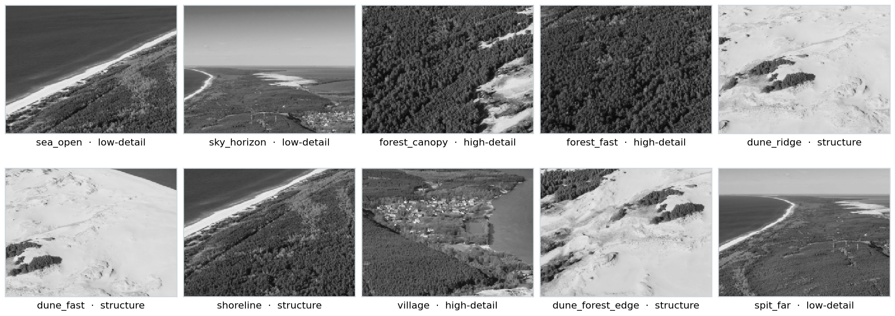
</p>

| | |
| --- | --- |
| **Джерело** | Curonian Spit NP, аерофотознімок біля дюни Ефа, 12.05.2017 |
| **Автор** | A.Savin, [Wikimedia Commons](https://commons.wikimedia.org/wiki/File:Curonian_Spit_NP_05-2017_img17_aerial_view_at_Epha_Dune.jpg) |
| **Камера** | **DJI FC6310** (сенсор Phantom 4 Pro) — справжній дрон |
| **Роздільність** | 4213 × 2633, повний кадр камери, **не перекодований** у цьому репозиторії |
| **Ліцензія** | Free Art License 1.3 — вільне використання з атрибуцією |

Це JPEG, бо саме його записала камера і саме він доступний під вільною
ліцензією; вільного RAW з дрона зіставної якості не існує. Тому у звітах
написано «оригінал камери», а **не** «нестиснений».

**17 послідовностей зі штучним рухом вікна.** Вікно кадрування панорамує
фотографією між оголошеними наперед прямокутниками. Це справжній вміст, але
рух — наш: паралакса, скошування рядків, адаптації експозиції й руху в сцені
тут немає, і жодне твердження в репозиторії на них не спирається.

Контент навмисно різний: гладке море й небо (майже плоскі), крона сосон
(найважча текстура кадру), берегова лінія і край дюни (довгі контрастні межі),
село (поле дрібних яскравих об'єктів).

> **Це один запис, а не сімнадцять.** Усі 17 кліпів мають спільний
> `source_id`: спільний сенсор, об'єктив, година доби, погода й місцевість.
> Bootstrap по цих сценах оцінює невизначеність **усередині цієї фотографії** і
> не узагальнюється на новий запис. Тому весь знімок тримається як **test**:
> ділити одну фотографію на calibration/validation/test не має сенсу, і
> `avsec dataset validate` тепер позначає таку спробу як помилку. Нічого на
> цьому знімку не налаштовувалося — конфігурації взято з синтетичного набору.
> Перекриття вирізок **вимірюється** геометрично і записується в маніфест
> (`crop_overlaps`); 63 пари зі 136 справді перетинаються, і ми цього не
> приховуємо.

```bash
python scripts/fetch_drone_photo.py      # перевірити або завантажити фото
```

### Набір незалежних джерел: 24 фотографії, 24 автори

Щоб висновок міг стосуватися **нового запису**, а не нової вирізки з того
самого, потрібні різні записи. Реєстр `data/real/sources.json` містить 24
аерофотознімки з Wikimedia Commons: 24 різні автори, 9 моделей камер DJI
(Phantom 3 Pro, Phantom 4, Phantom 4 Pro, Mavic Pro, Mavic Air, Mavic Air 2,
Mini 2, Mini 3 Pro, Inspire 2/X5S), різні місця, вільні ліцензії (CC0,
CC BY-SA). З кожної фотографії береться **один** кліп, тож «більше даних» тут
означає «більше знімків».

| | |
| --- | --- |
| **Одиниця незалежності** | вихідна фотографія (`source_id`) |
| **Розподіл** | 14 test / 5 calibration / 5 validation — **за джерелом** |
| **Категорії** | призначені за виміряною градієнтною енергією знімка, до будь-якого результату |
| **Файли** | рендери Wikimedia з камерних оригіналів (не самі оригінали — сервіс просить не тягнути оригінали пакетно); у реєстрі записано URL, ліцензію, автора, камеру й sha256 того файла, з якого рахувалися числа |
| **У репозиторії** | лише реєстр; 63 МБ знімків завантажуються командою нижче |

```bash
python scripts/fetch_natural_sources.py   # завантажити й звірити хеші
avsec dataset validate --config configs/research_natural.yaml
```

Повний перелік усіх 24 знімків — автор, апарат, ліцензія, роздільність,
split і sha256 — у [паспорті наборів даних](docs/datasets.md).

### Синтетичний набір

34 процедурні сцени (20 тестових, 8 калібрувальних, 6 валідаційних) — горизонт,
дорога, цілі, текстура, краї, хмари, сітка, слабке освітлення, текст. Кожна має
власну точку зйомки й експозицію, тож це **різні сцени**, а не одна двічі.

```bash
avsec dataset validate --config configs/research_main.yaml
```

---

## 📊 Результати

<!-- AVSEC:RESULTS:BEGIN -->

**Перевага запропонованої схеми залежить від каналу.** `P` значуще краща за `B4` на bursty і значуще гірша на clean, mild. Загального виграшу немає, і це головний результат прогону, а не застереження до нього. Покроковий розклад цієї різниці (E13) показує, що її дають **параметри транспорту** (+4.18 дБ), тоді як самі запропоновані механізми — кілька описів і BAWP — дають -1.00 дБ. Пройдений у зворотному порядку, цей розклад **не існує взагалі**: при вихідному розмірі одиниці механізми не вміщуються в бюджет, тобто вони не є самостійним доповненням до базової схеми. **Переналаштована база `B4t`** — та сама схема з транспортом `P`, але без обох механізмів — значуще перевершує `P` в усіх 4 каналах, де різниця встановлена (-1.19…-1.53 дБ).

_Усі числа нижче походять з одного прогону:_ `run_id=fe45d509310b99d4`, commit `25534623fc247da4a07c7238f46cae4b068b68b3`, Windows-11-10.0.26200-SP0, Python 3.12.10, NumPy 2.5.3. Матеріал: 34 кліпів / 34 сцен усього, з них 20 у цьому прогоні (split test); **синтетичні дані**.

- **Обсяг:** 72000 оброблених кадрів, 20 незалежних сцен, 5 профілів каналу, 9 методів.
- **`clean`:** P − B4 = -3.45 дБ [-3.89; -2.93] за 18 сценами — значуще, перевірене покриття 1.000 проти 1.000.
- **`mild`:** P − B4 = -3.45 дБ [-3.89; -2.93] за 18 сценами — значуще, перевірене покриття 1.000 проти 1.000.
- **`moderate`:** P − B4 = -0.27 дБ [-0.72; +0.23] за 18 сценами — різниця не встановлена, перевірене покриття 0.956 проти 0.875.
- **`bursty`:** P − B4 = +1.50 дБ [+0.65; +2.44] за 18 сценами — значуще, перевірене покриття 0.809 проти 0.742.
- **`harsh`:** жоден метод не дав жодного придатного моменту показу — порівнювати нічого.
- **Перевірки протоколу:** 35/35 пройдено.
- **Бюджет:** B4 — 0.512 Мбіт/с корисних даних (ефективність 0.485), P — 0.384 Мбіт/с (0.363); модельна затримка 159 мс, логічний буфер 68.5 кБ.
- **Рисунки:** 56 з 56 (вісім основних, решта — додаткові матеріали) — усі побудовано.
- **Апаратних вимірювань немає** (E11 не виконано): усе нижче — модель.

Повні таблиці: [docs/results.md](docs/results.md) · аналіз і висновки: [docs/conclusions.md](docs/conclusions.md) · курована добірка з усіма рисунками: [results/](results/).
<!-- AVSEC:RESULTS:END -->

### Вісім основних рисунків

Вісім, бо стільки несе аргумент. Решта — 5 ключових і 43 каталожні — це
додаткові матеріали для перевірки: [docs/figures.md](docs/figures.md). Біля
кожного лежить його CSV з даними і JSON з параметрами побудови.

<table>
<tr>
<td width="50%"><a href="results/main/figures/K01.png">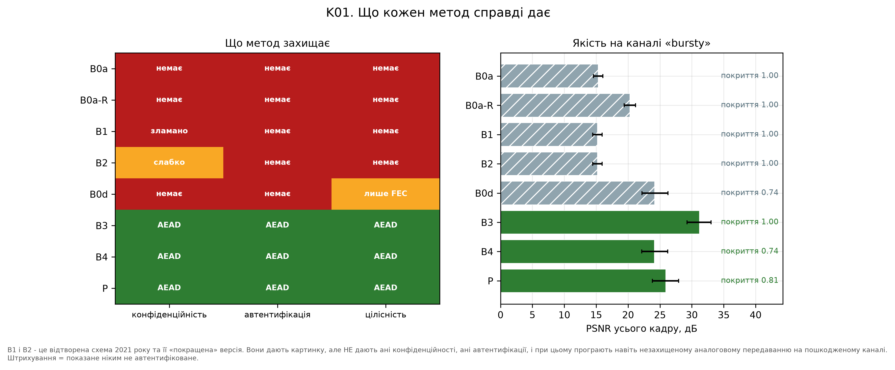</a><br>
<b>K01. Захист і якість за методами.</b> Захист і якість поруч. <code>B1</code>/<code>B2</code> дають
картинку і <b>нічого</b> більше — і при цьому програють навіть незахищеному
аналоговому передаванню на пошкодженому каналі.</td>
<td width="50%"><a href="results/main/figures/K04.png">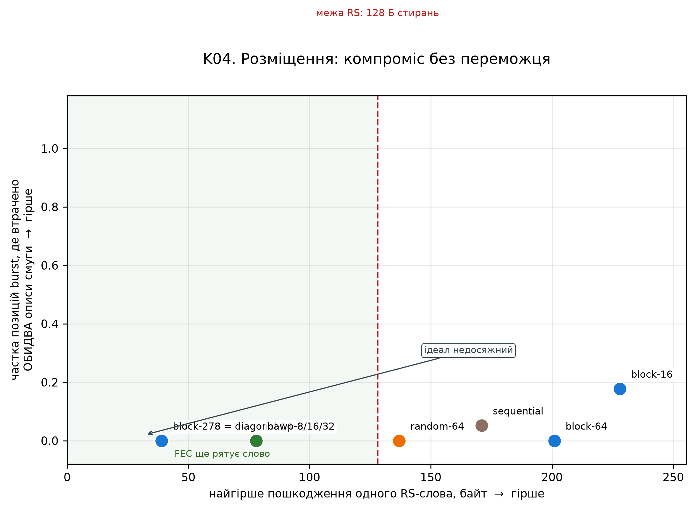</a><br>
<b>K04. Розміщення: компроміс без переможця.</b> Глибоке блочне мінімізує
пошкодження кодового слова, BAWP — спільну втрату описів. Обидва кути зайняті,
і жоден не дає виграшу в якості.</td>
</tr>
<tr>
<td><a href="results/main/figures/K05.png">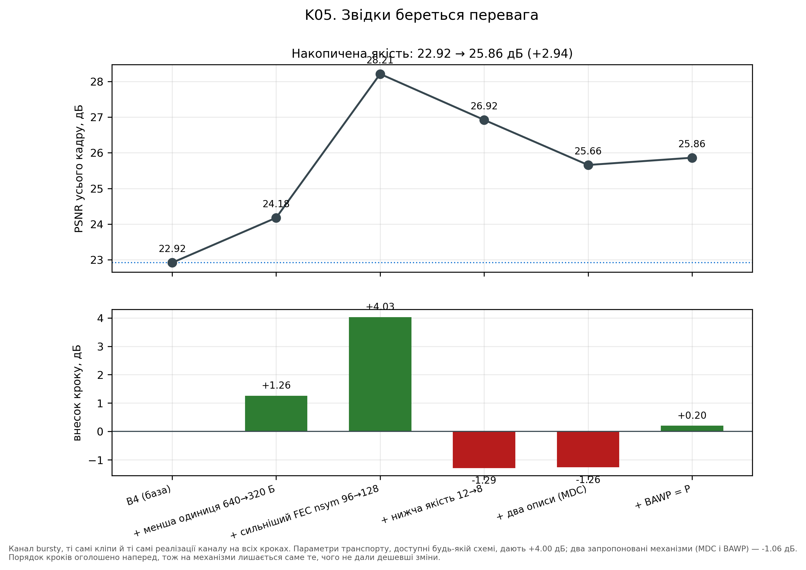</a><br>
<b>K05. Звідки береться перевага.</b> Покроковий розклад різниці
<code>B4</code>→<code>P</code> з парними інтервалами на кожному кроці. Виграш
дають параметри транспорту, доступні будь-якій схемі.</td>
<td><a href="results/main/figures/K11.png">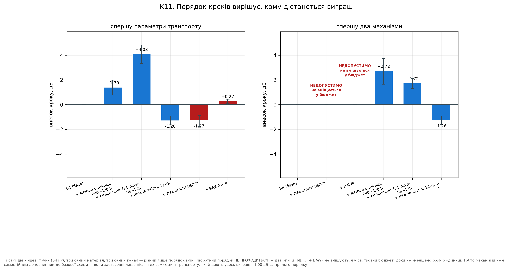</a><br>
<b>K11. Залежність результату від порядку кроків.</b> Той самий розклад у зворотному порядку.
Покроковий внесок — властивість шляху, а не компонента; тут видно, скільки
саме коштує вибір порядку.</td>
</tr>
<tr>
<td><a href="results/main/figures/K13.png">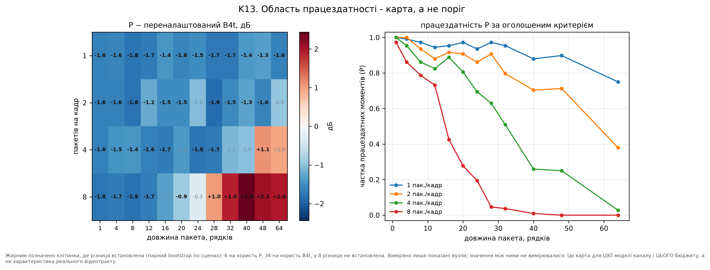</a><br>
<b>K13. Карта області працездатності.</b> Довжина × частота пакетів. Замість
одного порога — сітка з інтервалом різниці в кожній клітинці; перетин
вказаний як дужка між <b>виміряними</b> вузлами.</td>
<td><a href="results/natural/figures/K12.png">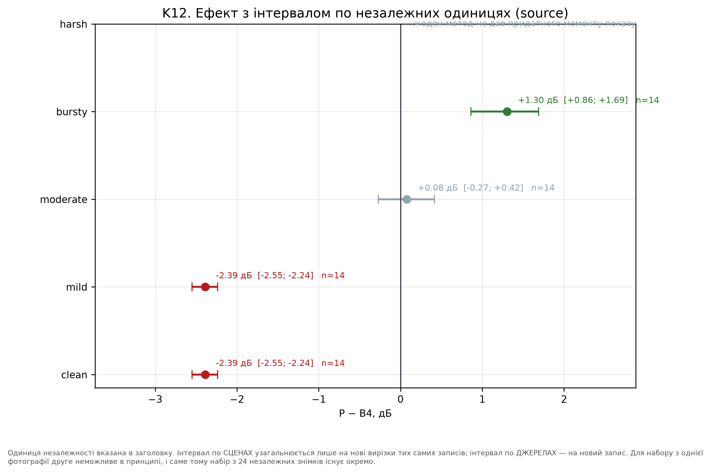</a><br>
<b>K12. 24 незалежні джерела.</b> Ефект з інтервалом по вихідних
фотографіях, а не по вирізках з однієї. Це єдиний інтервал, який має право
узагальнюватися на новий запис.</td>
</tr>
<tr>
<td><a href="results/main/figures/K09.png">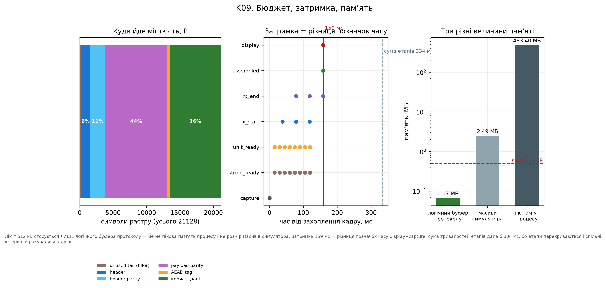</a><br>
<b>K09. Бюджет, затримка, пам'ять.</b> Куди йде кожен символ растру, чому
затримка 159 мс, а не 334, і чому «512 кБ» — це не пікова пам'ять.</td>
<td><a href="results/main/figures/K10.png">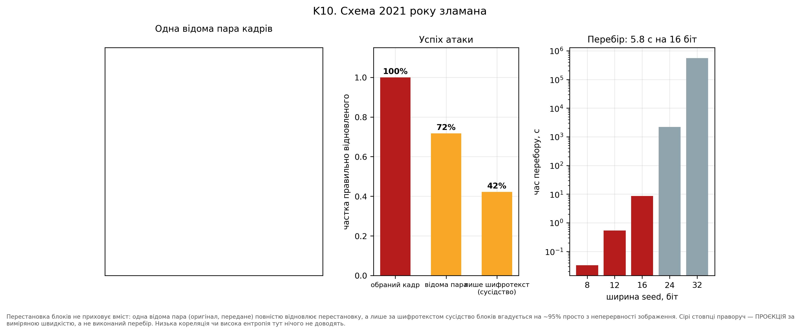</a><br>
<b>K10. Атаки на реконструкцію B1 зі статичною перестановкою.</b> Одна відома пара кадрів відновлює
перестановку повністю; лише за шифротекстом сусідство вгадується на ~95%.</td>
</tr>
</table>

### Перенесення: три набори, дві різні одиниці незалежності

Конфігурації **не переналаштовувались** під природні дані — вони ті самі, що й
для синтетичних. Це перевірка перенесення, а не новий добір.

Різниця `P − B4`, PSNR усього показаного кадру (жирним — встановлено після
поправки Holm):

| Канал | Синтетичні, 20 сцен | Одна фотографія, 17 вирізок | **24 незалежні знімки**, 14 тестових |
| --- | --- | --- | --- |
| `clean` | **-3,45 дБ [-3,89; -2,93]** | **-2,33 дБ [-2,46; -2,19]** | **-2,39 дБ [-2,55; -2,24]** |
| `mild` | **-3,45 дБ [-3,89; -2,93]** | **-2,33 дБ [-2,46; -2,19]** | **-2,39 дБ [-2,55; -2,24]** |
| `moderate` | -0,27 дБ [-0,72; +0,23] | -0,18 дБ [-0,52; +0,22] | +0,08 дБ [-0,27; +0,42] |
| `bursty` | **+1,50 дБ [+0,65; +2,44]** | **+0,91 дБ [+0,48; +1,40]** | **+1,30 дБ [+0,86; +1,69]** |
| `harsh` | немає даних | немає даних | немає даних |

Знак, набір каналів і висновок збігаються на всіх трьох наборах: виграш лише на
пакетних пошкодженнях, програш на чистому каналі.

Але `B4` тут — **вихідна** схема, зі слабшим транспортом. Ось те саме
порівняння з базою, якій дано ті самі параметри транспорту й **не дано** жодного
з двох запропонованих механізмів:

| Канал | Синтетичні | Одна фотографія | 24 незалежні знімки |
| --- | --- | --- | --- |
| `clean` | **-1,53 дБ [-1,95; -1,09]** | **-1,07 дБ [-1,16; -0,98]** | **-1,18 дБ [-1,32; -1,02]** |
| `mild` | **-1,53 дБ [-1,95; -1,09]** | **-1,07 дБ [-1,16; -0,98]** | **-1,18 дБ [-1,32; -1,02]** |
| `moderate` | **-1,48 дБ [-1,89; -1,06]** | **-0,91 дБ [-1,02; -0,79]** | **-1,02 дБ [-1,23; -0,80]** |
| `bursty` | **-1,19 дБ [-1,64; -0,80]** | **-0,76 дБ [-0,98; -0,56]** | **-0,36 дБ [-0,64; -0,06]** |
| `harsh` | немає даних | немає даних | немає даних |

**Переналаштована база перевершує запропоновану схему в кожному каналі кожного
з трьох наборів.** Це і є головний результат, і він тримається тоді, коли
невизначеність рахується не по вирізках з однієї фотографії, а по чотирнадцяти
різних знімках різних камер — тобто коли інтервал справді має право стосуватися
нового запису.

---

## ✅ Тести

```bash
run.bat test          # або ./run.sh test
PYTHONPATH=src python -m pytest tests -q
```

| Набір | Що перевіряє |
| --- | --- |
| `tests/test_crypto.py` | AEAD, HKDF, nonce, епохи, вікно повторів |
| `tests/test_pipeline.py` | наскрізний тракт, складання кадру, FEC |
| `tests/test_regressions.py` | по одній регресії на дефекти **F01–F13** |
| `tests/test_regressions_f09_f18.py` | дефекти **F09–F18** + знайдені під час прогонів |

Кожна регресія **падає на коді до виправлення** — це не тести-заглушки.
Зведений журнал обох раундів рецензування з відтвореними експлойтами:
[docs/revision_history.md](docs/revision_history.md).

Окремо — **35 перевірок протоколу** (мутація кожного семантичного поля, межі
парсера, повтори, зрив стану). Поле, мутація якого не змінює AAD, вважається
**провалом**, а не пропуском:

```bash
avsec protocol-check --config configs/research_main.yaml
```

---

## 🧾 Висновки

Повний аналіз результатів, що з цього випливає і чого не випливає:
**[docs/conclusions.md](docs/conclusions.md)**.

Коротко:

1. **Схема 2021 року не дає захисту** і додатково погіршує стійкість до
   пакетних пошкоджень порівняно з простим аналоговим передаванням.
2. **Гібридна архітектура працює**: AEAD над аналоговим трактом дає
   автентифіковане відео за модельної затримки 159 мс і буфера 68 кБ.
3. **Перевага запропонованої схеми обмежена режимом** пакетних пошкоджень і
   здебільшого пояснюється параметрами транспорту, а не двома запропонованими
   механізмами.
4. **Компроміс розміщення спостерігається в усіх досліджених конфігураціях.**
5. **Апаратних вимірювань немає** — усе вище є модель.

---

## 🗺 Структура репозиторію

```
avsec/
├─ run.bat, run.sh            запуск без налаштування
├─ requirements*.txt          залежності
├─ configs/                   плани прогонів (YAML)
│   ├─ analysis_plan.yaml       статистичний план, зафіксований ДО прогону
│   ├─ research_main.yaml       E02: 20 синтетичних сцен
│   ├─ research_drone.yaml      E12: 17 вирізок з ОДНІЄЇ фотографії
│   └─ research_natural.yaml    E14: 24 НЕЗАЛЕЖНІ фотографії, по 1 кліпу
├─ data/real/
│   ├─ curonian_spit_epha_dune.jpg   камерний оригінал (Free Art License)
│   └─ sources.json             реєстр 24 джерел: URL, ліцензія, автор, sha256
├─ src/avsec/
│   ├─ crypto/                AEAD, HKDF, стан сеансу, епохи
│   ├─ framing/               заголовок v2, CRC, розбір
│   ├─ source_coding/         DCT/JPEG, смуги, кілька описів
│   ├─ fec/                   Reed–Solomon, блокування, стирання
│   ├─ damage.py              клітинки → байти → RS-слова; звірка з декодером
│   ├─ interleaving/          sequential | block | diagonal | random | BAWP
│   ├─ modem/                 растровий модем + модель CVBS 625/50
│   ├─ channel/               спотворення рівня A, траси каналу
│   ├─ transmitter.py         тракт передавача
│   ├─ receiver/
│   │   ├─ __init__.py        тракт приймача
│   │   └─ sessions.py        реєстр допустимості сеансів + кеш ключів
│   ├─ sources/
│   │   ├─ drone.py           17 послідовностей з однієї фотографії
│   │   └─ natural.py         24 незалежні джерела, по одному кліпу
│   ├─ baselines/             B0a…B4, B4t, P
│   ├─ attacks/               криптоаналіз перестановок
│   ├─ matrix.py              матричний runner (resume, повнота, усі моменти)
│   ├─ statistics.py          єдиний шлях агрегування
│   ├─ analysis.py            ефекти, CI, тести, Holm по оголошеній сім'ї
│   ├─ verify.py              перерахунок кожного твердження з таблиць
│   ├─ figures.py, figures_key.py   G01–G43, K01–K13
│   ├─ publish.py             генерація документації
│   └─ ui/                    веб-інтерфейс
├─ scripts/                   довгі прогони, добір джерел, скріншоти, курація
├─ tests/                     регресії на кожен дефект (F01–F18, R01–R12)
├─ docs/
│   ├─ claims.md              кожне твердження → таблиця, що його підтримує
│   ├─ related_work.md        чотири напрями, і що саме тут нове
│   └─ ...                    протокол, архітектура, висновки, журнал дефектів
└─ results/{main,drone,natural}/   курована добірка: таблиці + усі рисунки
```

---

## 🚫 Межі застосовності результатів

* **Немає жодного вимірювання на фізичному обладнанні.** Немає передавача,
  приймача, плати захоплення. Слова «дешевий», «низька наскрізна затримка на
  реальному тракті» до цієї роботи **не застосовні**.
* Немає моделі радіочастотного FM-тракту; рівень B — композитний сигнал у
  основній смузі.
* **Переналаштована база `B4t` перевершує запропоновану схему в кожному каналі
  кожного з трьох наборів даних.** Це виміряно і показано, а не обійдено.
* **Запропоновані механізми (MDC + BAWP) не покращують наскрізну якість** у
  перевіреному бюджеті — і не є самостійним доповненням до базової схеми: при
  вихідному розмірі одиниці вони взагалі не вміщуються в бюджет, тобто
  застосовні лише після тих самих змін транспорту, які й дають увесь виграш.
  Заявка звужується до виміряних меж, контрприкладів і карти умов.
* Дві з двадцяти синтетичних сцен (`grid_fast`, `text_fast`) **не вміщуються**
  у спільний бюджет для цифрових методів; це властивість обраного профілю, і
  такі моменти показу тепер рахуються проти методу, а не зникають з обліку.
* Перевага BAWP над глибоким блочним перемежуванням **не однозначна**, а в
  перевіреному бюджеті ще й ні на що не впливає: на 16-рядковому пакеті обидві
  схеми відновлюються повністю.
* Карта умов (§E15) описує **цю** модель каналу і **цей** бюджет. Одного
  універсального порога не існує: він залежить і від частоти пакетів, і від
  їхньої довжини.
* Правильна інтеграція AEAD, підтверджена перевірками, **не доводить**
  відсутності інших помилок протоколу.
* Ані низька кореляція, ані висока ентропія, ані NPCR/UACI **не є доказом
  конфіденційності** — і тут вони так не використовуються.

Повний перелік обмежень, згрупований за розділами дослідження, —
[docs/limitations.md](docs/limitations.md).

---

## 📚 Документація

| Документ | Про що |
| --- | --- |
| [docs/README.md](docs/README.md) | **карта документації** — усі файли за групами і рекомендований порядок читання |
| [ROADMAP.md](ROADMAP.md) | стан реалізації, програма досліджень, відкриті задачі |

**Постановка задачі та об'єкт дослідження**

| Документ | Призначення |
| --- | --- |
| [docs/reconstruction_2021.md](docs/reconstruction_2021.md) | **основний документ завдання**: реконструкція, випробування на зображеннях, криптоаналіз, модифікації |
| [docs/methods.md](docs/methods.md) | **каталог усіх схем**: будова, параметри й результати кожної з десяти |
| [docs/related_work.md](docs/related_work.md) | суміжні напрями та визначення внеску роботи |
| [docs/threat_model.md](docs/threat_model.md) | модель загроз і межі гарантій |
| [docs/substitution_b2s.md](docs/substitution_b2s.md) | **схема `B2s`**: заміна значень пікселів разом із перестановкою блоків |
| [docs/galois_sbox.md](docs/galois_sbox.md) | обчислювана таблиця замін над GF(2⁸): звірка з AES, виміряні властивості |

**Будова системи**

| Документ | Призначення |
| --- | --- |
| [docs/architecture.md](docs/architecture.md) | рівні моделі, зіставлення A↔B, спільний бюджет |
| [docs/protocol.md](docs/protocol.md) | формат кадру, AEAD, епохи, реєстр сеансів |

**Організація експерименту**

| Документ | Призначення |
| --- | --- |
| [docs/datasets.md](docs/datasets.md) | паспорт трьох наборів даних: походження, ліцензії, межі узагальнення |
| [docs/experiments.md](docs/experiments.md) | протокол експериментів і статистична обробка |
| [docs/programme.md](docs/programme.md) | стан досліджень E01–E15, зокрема невиконаних |
| [docs/hardware.md](docs/hardware.md) | вимоги до стенда для E11 |

**Результати**

| Документ | Призначення |
| --- | --- |
| [docs/results.md](docs/results.md) | усі таблиці, згенеровані з одного `run_id` |
| [docs/figures.md](docs/figures.md) | вісім основних рисунків і повний каталог зі статусом |
| [docs/conclusions.md](docs/conclusions.md) | висновки за дослідницькими питаннями |
| [docs/claims.md](docs/claims.md) | реєстр перевірюваних тверджень: вид і джерело перевірки |

**Обмеження, термінологія, історія**

| Документ | Призначення |
| --- | --- |
| [docs/limitations.md](docs/limitations.md) | **зведені межі застосовності результатів** |
| [docs/glossary.md](docs/glossary.md) | терміни, скорочення та програмні ідентифікатори |
| [docs/revision_history.md](docs/revision_history.md) | журнал двох раундів рецензування: 30 дефектів і їхній вплив |
| [docs/historical_results.md](docs/historical_results.md) | числа попередніх редакцій, окремо від поточних |
| [CHANGELOG.md](CHANGELOG.md) | версійована історія змін |

---

## ⚖ Ліцензія та атрибуція

Код — **MIT**.

Фотографія `data/real/curonian_spit_epha_dune.jpg` — © A.Savin,
[Free Art License 1.3](https://artlibre.org/licence/lal/en/),
джерело [Wikimedia Commons](https://commons.wikimedia.org/wiki/File:Curonian_Spit_NP_05-2017_img17_aerial_view_at_Epha_Dune.jpg).
Атрибуція подорожує з даними в кожному маніфесті, який пише цей репозиторій.

Криптографічні примітиви беруться з `cryptography`, Reed–Solomon — з `reedsolo`;
вони тут не переписуються.
