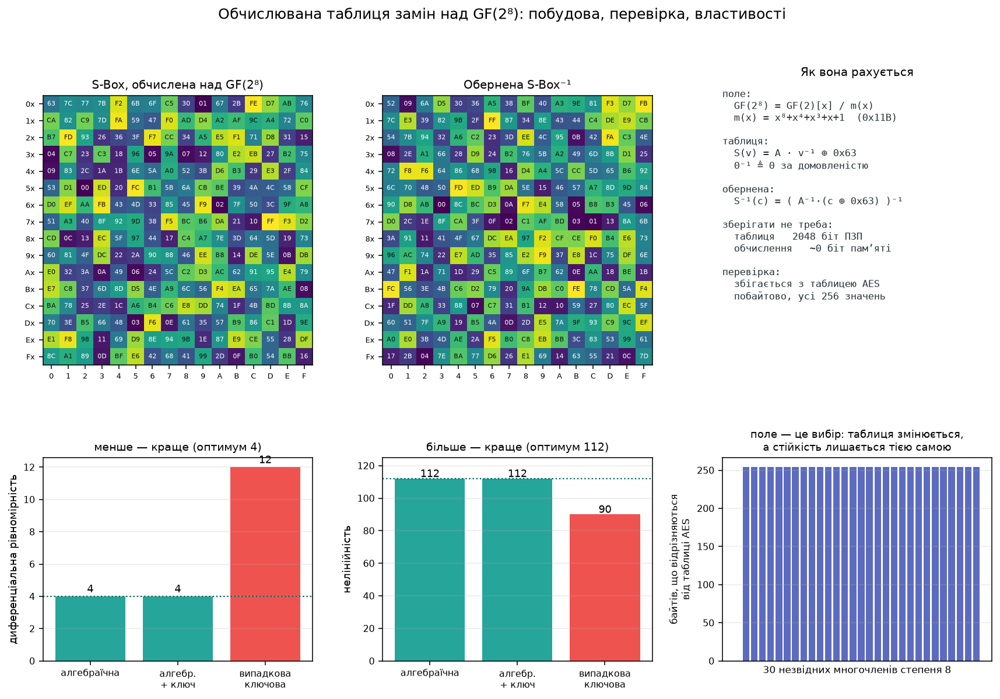

# Обчислювана таблиця замін над полем GF(2⁸)

<!-- DOCNAV -->
> **Призначення документа.** Другий спосіб побудувати таблицю замін: не зберігати її, а обчислювати за правилом у скінченному полі. Арифметика поля, звірка з опублікованою таблицею AES, виміряні криптографічні властивості обох конструкцій і межа їх застосовності.
>
> **Цільовий читач.** Читач, який зіставляє ключову випадкову таблицю з алгебраїчною і визначає, коли яка доречна.
>
> **Пов'язані документи:** [схема B2s](substitution_b2s.md) · [модель загроз](threat_model.md) · [словник термінів](glossary.md) · [реєстр тверджень](claims.md) · [карта документації](README.md)
<!-- /DOCNAV -->

<!-- TOC -->
<details>
<summary><b>Зміст</b></summary>

- [1. Постановка: два різні способи мати таблицю](#1-постановка-два-різні-способи-мати-таблицю)
- [2. Поле GF(2⁸)](#2-поле-gf2⁸)
  - [2.1 Незвідний і примітивний: різні властивості](#21-незвідний-і-примітивний-різні-властивості)
  - [2.2 Побудова таблиці](#22-побудова-таблиці)
- [3. Перевірка: звірка з опублікованою таблицею AES](#3-перевірка-звірка-з-опублікованою-таблицею-aes)
- [4. Вибір многочлена: 30 полів, одна стійкість](#4-вибір-многочлена-30-полів-одна-стійкість)
- [5. Криптографічні властивості: виміряно](#5-криптографічні-властивості-виміряно)
  - [5.1 Що вимірюється](#51-що-вимірюється)
  - [5.2 Результати](#52-результати)
  - [5.3 Розподіл для випадкових таблиць](#53-розподіл-для-випадкових-таблиць)
- [6. Куди подівся ключ](#6-куди-подівся-ключ)
- [7. Зберігати чи обчислювати](#7-зберігати-чи-обчислювати)
- [8. Та сама алгебра тричі в цьому проєкті](#8-та-сама-алгебра-тричі-в-цьому-проєкті)
- [9. Висновки](#9-висновки)
- [10. Порядок відтворення](#10-порядок-відтворення)

</details>
<!-- /TOC -->

## 1. Постановка: два різні способи мати таблицю

Схема [`B2s`](substitution_b2s.md) будує таблицю замін ключовим перемішуванням
алфавіту `0…255`. Така таблиця секретна, і її **треба зберігати**: 256 байтів.
Для програми це нічого не важить.

Класична альтернатива — **обчислювати** таблицю за правилом у скінченному полі,
не тримаючи її в пам'яті. Обидва способи дають бієкцію, але вони мають різні
властивості, і плутати їх небезпечно:

| | Ключова випадкова (поточна в `B2s`) | Алгебраїчна (як в AES) |
| --- | --- | --- |
| Звідки береться | перемішування, виведене **з ключа** | обчислюється за фіксованою формулою |
| Секретна | **так** | **ні — надрукована в стандарті** |
| Зберігати | обов'язково, 2048 біт | не потрібно |
| Стійкість до аналізу | яка випала при розіграші | **доведена теоремою** |

> [!IMPORTANT]
> **Обчислювана таблиця — це фіксована таблиця.** Якщо формула дає її без
> ключа, ту саму формулу застосує й зловмисник. Конфіденційність в AES дає
> **додавання раундових ключів**, а не S-box. Схема, яка підставляє таблицю
> AES замість ключової випадкової і більше нічого не змінює, отримує **публічну
> заміну** й не отримує таємниці взагалі.
>
> Як повернути ключ на місце — [розділ 6](#6-куди-подівся-ключ).

**Реалізація:** [`src/avsec/galois.py`](../src/avsec/galois.py) — арифметика поля
й побудова таблиці; [`src/avsec/sbox_analysis.py`](../src/avsec/sbox_analysis.py)
— вимірювання властивостей. **Стенд:**
[`src/avsec/galois_lab.py`](../src/avsec/galois_lab.py), команда `run.bat gf-lab`.

> [!NOTE]
> **Походження чисел документа.** Прогін `avsec gf-lab`, run_id
> `fe45d509310b99d4`, коміт `fd2dea6`, робоче дерево чисте. Середовище:
> Python 3.12.10, NumPy 2.5.3. Повні таблиці — у
> [`results/gf_sbox/`](../results/gf_sbox).

---

## 2. Поле GF(2⁸)

Байт розглядається не як число, а як **многочлен над GF(2)**: біти є
коефіцієнтами при степенях `x`. Байт `0x53 = 0b01010011` — це
`x⁶ + x⁴ + x + 1`.

Додавання таких многочленів — порозрядне XOR, без перенесень. Множення дає
многочлен вищого степеня, тому його зводять за модулем незвідного многочлена
восьмого степеня. Результат — поле з 256 елементів:

```text
   GF(2⁸)  =  GF(2)[x] / m(x),      m(x) = x⁸ + x⁴ + x³ + x + 1   (0x11B)

   додавання:   a ⊕ b                      порозрядне XOR
   множення:    a · b  mod  m(x)           безперенесене множення + зведення
   обернений:   a⁻¹ таке, що a · a⁻¹ = 1   існує для всіх a ≠ 0
```

<details><summary>LaTeX</summary>

```math
\mathrm{GF}(2^8)=\mathrm{GF}(2)[x]/\langle m(x)\rangle,\qquad
m(x)=x^{8}+x^{4}+x^{3}+x+1
```

</details>

### 2.1 Незвідний і примітивний: різні властивості

Дві властивості, які легко сплутати, і в цьому проєкті обидві використовуються:

| Властивість | Кого стосується | Що гарантує | Де вжито |
| --- | --- | --- | --- |
| **Незвідний** многочлен | многочлена `m(x)` | фактор-кільце є **полем**: кожен ненульовий елемент має обернений | GF(2⁸) для таблиці замін, GF(256) для Ріда — Соломона |
| **Примітивний** елемент | елемента поля `α` | степені `α` пробігають **усі 255** ненульових елементів | генератор логарифмів тут, генератор коду в RS, максимальний період LFSR |

Реалізація не припускає ані того, ані іншого:

* незвідність перевіряється пробним діленням на всі многочлени степеня до
  `deg/2` (`is_irreducible`); спроба побудувати поле на звідному многочлені
  **відхиляється з помилкою**, а не мовчки дає кільце з дільниками нуля;
* примітивний елемент **шукається перебором** (`_find_generator`), бо не
  кожен елемент примітивний. Для `0x11B` знайдено `α = 0x03`, і його порядок
  дорівнює 255.

### 2.2 Побудова таблиці

```text
   S(v)  =  A · v⁻¹  ⊕  0x63          0⁻¹ ≜ 0 за домовленістю

   A — циркулянтне афінне перетворення над GF(2), записане як XOR обертів:
   S(v) = t ⊕ rotl(t,1) ⊕ rotl(t,2) ⊕ rotl(t,3) ⊕ rotl(t,4) ⊕ 0x63,  t = v⁻¹

   обернена:
   S⁻¹(c) = ( rotl(c,1) ⊕ rotl(c,3) ⊕ rotl(c,6) ⊕ 0x05 )⁻¹
```

<details><summary>LaTeX</summary>

```math
S(v)=A\,v^{-1}\oplus 0\mathrm{x}63,\qquad
S^{-1}(c)=\bigl(A^{-1}(c\oplus 0\mathrm{x}63)\bigr)^{-1}
```

</details>

Два кроки, і кожен має свою роль:

1. **Взяття оберненого** — єдина нелінійна операція. Саме вона дає стійкість
   до диференціального й лінійного криптоаналізу
   ([розділ 5](#5-криптографічні-властивості-виміряно)).
2. **Афінне перетворення** — прибирає нерухомі точки й ламає надто просту
   алгебраїчну форму, яку мало б чисте взяття оберненого.

Нуль оберненого не має: у полі `0` не оборотний. Домовленість `0⁻¹ = 0` є
**частиною специфікації**, а не недоглядом.

<p align="center">
  
</p>

<sub><b>Рис. 1.</b> Угорі — обчислена таблиця, обернена до неї й правило
обчислення. Унизу — виміряні властивості трьох конструкцій і вплив вибору
многочлена. Дані: <a href="img/gf_aes_sbox.csv">gf_aes_sbox.csv</a>,
<a href="img/gf_properties.csv">gf_properties.csv</a>,
<a href="img/gf_polynomial_sweep.csv">gf_polynomial_sweep.csv</a>. Прогін
<code>fe45d509310b99d4</code>, коміт <code>fd2dea6</code>.</sub>

---

## 3. Перевірка: звірка з опублікованою таблицею AES

Реалізація арифметики поля правильна тоді й лише тоді, коли вона відтворює
таблицю, яку надрукував хтось інший. Це найсильніша доступна перевірка, і вона
стоїть окремим тестом.

| Перевірка | Результат |
| --- | --- |
| Обчислена таблиця збігається з опублікованою таблицею AES | **так, усі 256 байтів** |
| Перший байт, що відрізняється | немає |
| Обернена таблиця відновлює кожне значення | **так** |
| Многочлен `0x11B` незвідний | так |
| Знайдений генератор `α = 0x03` примітивний | так, порядок 255 |

<sub>Джерело: `results/gf_sbox/gf_sbox.json` → `verification`. Регресія —
`tests/test_galois.py::test_the_computed_table_is_the_published_aes_sbox`.</sub>

Додатково перевірено окремими тестами: кожен ненульовий елемент має обернений,
множення комутативне, `0⁻¹ = 0` за домовленістю, оберт байта переносить старші
біти в молодші, а не зсуває.

---

## 4. Вибір многочлена: 30 полів, одна стійкість

Незвідних многочленів восьмого степеня над GF(2) рівно **30**. Кожен задає
своє представлення поля, тобто **свою таблицю**. Стенд будує всі 30 і міряє їх:

| Величина | Результат по 30 многочленах |
| --- | --- |
| Диференціальна рівномірність | **4 в усіх 30** |
| Нелінійність | **112 в усіх 30** |
| Таблиця збігається з AES | лише в 1 із 30 (в `0x11B`) |
| Байтів відмінності від таблиці AES | від 0 до 254 |
| Нерухомих точок | 0, 1 або 2 залежно від многочлена; нуль — у 13 із 30 |

<sub>Джерело: <a href="img/gf_polynomial_sweep.csv">gf_polynomial_sweep.csv</a>.</sub>

Висновок, якого не можна отримати міркуванням:

> **Поле — це вибір представлення, а не джерело стійкості.** Таблиця змінюється
> майже повністю (до 254 байтів із 256), а диференціальна рівномірність і
> нелінійність не змінюються **взагалі**. Вони походять від операції взяття
> оберненого, а не від того, яким многочленом задано поле.

Що таки залежить від вибору — **нерухомі точки**. Афінна стала `0x63` підібрана
так, щоб їх не було саме для `0x11B`; для інших многочленів із тією самою
сталою їх може бути одна або дві. Це пояснює, чому афінний шар є частиною
специфікації, а не косметикою.

---

## 5. Криптографічні властивості: виміряно

### 5.1 Що вимірюється

```text
   диференціальна рівномірність
      DU = max over a≠0, b:  # { v : S(v ⊕ a) ⊕ S(v) = b }
      менше — краще; 4 — оптимум, досяжний взяттям оберненого на 8 бітах

   нелінійність
      NL = 2⁷ − (1/2) · max |W(a,b)|,   W — перетворення Уолша — Адамара
      більше — краще; 112 — те, що дає взяття оберненого

   алгебраїчний степінь
      найвищий степінь АНФ серед компонентних функцій; 7 — максимум для
      перестановки на 8 бітах

   лавинний ефект
      середня кількість вихідних бітів, що змінюються від зміни одного
      вхідного; ідеал — 4 з 8
```

<details><summary>LaTeX</summary>

```math
\mathrm{DU}=\max_{a\neq 0,\;b}\bigl|\{v: S(v\oplus a)\oplus S(v)=b\}\bigr|,
\qquad
\mathrm{NL}=2^{n-1}-\tfrac12\max_{a,\,b\neq 0}\bigl|W_S(a,b)\bigr|
```

</details>

### 5.2 Результати

| Таблиця | DU | NL | Степінь | Нерухомі точки | Лавина | Зберігати |
| --- | ---: | ---: | ---: | ---: | ---: | --- |
| **Алгебраїчна** (публічна, як в AES) | **4** | **112** | 7 | **0** | 4,04 | **обчислюється** |
| **Алгебраїчна + ключове забілювання** | **4** | **112** | 7 | 3 | 4,04 | 16 біт ключа |
| Ключова випадкова (поточна в `B2s`) | 12 | 90 | 7 | 1 | 4,01 | 2048 біт таблиці |

<sub>Джерело: <a href="img/gf_properties.csv">gf_properties.csv</a>. Оптимум для
цієї конструкції — DU = 4, NL = 112.</sub>

Два результати варто назвати окремо:

1. **Алгебраїчна таблиця досягає оптимуму точно.** DU = 4 і NL = 112 — це не
   вдалий розіграш, а властивість операції взяття оберненого. Той самий
   результат повторюється для всіх 30 представлень поля.
2. **Ключове забілювання зберігає ці числа точно.** `S_k(v) = S(v ⊕ k₁) ⊕ k₂` є
   **афінно еквівалентним** перетворенням, тож DU і NL не можуть змінитися. Це
   доведено алгебраїчно й підтверджено вимірюванням у трьох різних контекстах
   (`tests/test_galois.py::test_key_whitening_preserves_the_properties_exactly`).
   Побічний ефект: забілювання повертає нерухомі точки (3 замість 0) — на DU і
   NL це не впливає, але сказати про це слід.

### 5.3 Розподіл для випадкових таблиць

Одна ключова таблиця нічого не доводить про конструкцію: наступний ключ дасть
інший розіграш. Тому стенд будує **64** випадкові таблиці й міряє розкид:

| Величина | Мінімум | Медіана | Максимум | Алгебраїчна |
| --- | ---: | ---: | ---: | ---: |
| Диференціальна рівномірність (менше краще) | 10 | 12 | 16 | **4** |
| Нелінійність (більше краще) | 84 | 92 | 96 | **112** |

<sub>Джерело: `results/gf_sbox/gf_sbox.json` → `random_table_distribution`,
64 вибірки, фіксоване початкове значення генератора.</sub>

**Найкраща з 64 випадкових таблиць гірша за алгебраїчну за обома показниками:**
10 проти 4 і 96 проти 112. Це і є різниця між «у середньому» і «точно».

---

## 6. Куди подівся ключ

Алгебраїчна таблиця публічна, тож сама по собі вона нічого не приховує. Ключ
повертається туди, де йому місце в блоковому шифрі:

```text
   S_k(v)  =  S( v ⊕ k_вх )  ⊕  k_вих

   S        — публічна обчислювана таблиця
   k_вх, k_вих — два байти, виведені з ключа сеансу для цього контексту
```

<details><summary>LaTeX</summary>

```math
S_k(v)=S\bigl(v\oplus k_{\mathrm{in}}\bigr)\oplus k_{\mathrm{out}}
```

</details>

Контекстом є та сама трійка, що й для випадкової таблиці: ідентифікатор сеансу,
номер кадру, номер блока ([`substitution_b2s.md §2.2`](substitution_b2s.md#22-режими-зміни-таблиці)).
Тому `B2s` працює на будь-якій із двох конструкцій — параметр `source`.

**Що це дає і чого не дає.** Перетворення лишається ключовим: без `k_вх` і
`k_вих` відновити відображення не можна. Але простір ключового матеріалу тут
`2¹⁶` на контекст проти `256!` у випадкової таблиці. Для окремої таблиці це
менше; на практиці це не є вузьким місцем, бо ключ сеансу однаково має 256
бітів, а перебір `2¹⁶` варіантів **однієї** таблиці не дає нічого, поки
невідомі таблиці решти блоків і сама перестановка.

Головне ж застереження лишається тим самим, що й для випадкової таблиці: **одна
відома пара кадрів відновлює і перестановку, і таблиці того кадру**
([`substitution_b2s.md §5.2`](substitution_b2s.md#52-атака-за-відомою-парою-з-урахуванням-заміни)).
Кращі DU і NL цього не змінюють, бо ця атака не є ні диференціальною, ні
лінійною — вона зіставляє плитки за інваріантом.

---

## 7. Зберігати чи обчислювати

| | Зберігати таблицю | Обчислювати |
| --- | --- | --- |
| Пам'ять | 2048 біт на таблицю | 0 |
| У режимі `block`, 192 блоки × 3 канали | 576 таблиць = **1,18 Мбіт** | 0 |
| Програмна вартість | одне звернення до масиву | кілька операцій у полі |
| Апаратна вартість | ПЗП + дешифратор адреси, окрема копія на кожен паралельний S-box | комбінаційна схема |

Для програми 256 байтів не є проблемою — і саме тому в `B2s` за замовчуванням
стоїть випадкова таблиця. Різниця виявляється у двох місцях:

1. **Апаратна реалізація.** У чипі таблиця — це ПЗП; раунд, якому потрібні
   шістнадцять паралельних S-box, платить за шістнадцять копій. Компактні
   реалізації рахують обернений через вежу підполів `GF(((2²)²)²)` і вкладаються
   приблизно в сотню вентилів.
2. **Режим `block` цього проєкту.** 576 таблиць на кадр — це вже 1,18 Мбіт,
   який треба виводити з ключа щокадрово. Обчислювана конструкція знімає і
   пам'ять, і час виведення: лишаються два байти ключа на контекст.

---

## 8. Та сама алгебра тричі в цьому проєкті

| Де | Що саме | Яка властивість потрібна |
| --- | --- | --- |
| `B1`, регістр зсуву | многочлен `x¹⁶ + x¹⁵ + x¹³ + x⁴ + 1` над GF(2) | **примітивний** — інакше період менший за `2¹⁶ − 1` |
| `B3`, `B4`, Рід — Соломон | код над **GF(256)** | незвідний многочлен для поля, примітивний елемент як генератор коду |
| `B2s`, таблиця замін | обернений у **GF(2⁸)** | незвідний многочлен; примітивний елемент — для таблиці логарифмів |

Це те саме поле в кодуванні, у шифруванні та в генераторі послідовності — і
різні його властивості потрібні в різних місцях.

---

## 9. Висновки

1. **Арифметику поля реалізовано й перевірено.** Обчислена таблиця збігається з
   опублікованою таблицею AES побайтово — усі 256 значень.
2. **Алгебраїчна конструкція краща за випадкову за обома показниками
   стійкості**: DU 4 проти 12, NL 112 проти 90. Найкраща з 64 випадкових
   таблиць дає 10 і 96, тобто гірше за обома.
3. **Вибір многочлена змінює таблицю, а не стійкість.** Усі 30 незвідних
   многочленів дають DU = 4 і NL = 112; таблиці при цьому відрізняються майже
   повністю.
4. **Обчислювана таблиця публічна.** Секретність дає ключове забілювання
   `S(v ⊕ k₁) ⊕ k₂`, яке зберігає DU і NL точно — це афінна еквівалентність.
5. **Кращі DU і NL не усувають атаку за відомою парою.** Та атака не є ні
   диференціальною, ні лінійною; вона працює з інваріантом упорядкованої
   гістограми. Заміна конструкції таблиці не змінює висновків
   [`substitution_b2s.md §5`](substitution_b2s.md#5-криптоаналіз).

**Що з цього випливає для схеми.** Алгебраїчна таблиця доречна там, де таблиць
багато (режим `block`, три канали) або де реалізація апаратна. Вона **не**
вирішує тих проблем `B2s`, які походять не від таблиці: ні відсутності
автентичності, ні відновлення перестановки з однієї відомої пари, ні втрати
стійкості до похибок в аналоговому тракті.

---

## 10. Порядок відтворення

```bash
run.bat gf-lab
```

Звірка з таблицею AES, повні таблиці, властивості трьох конструкцій, розподіл
для 64 випадкових таблиць, прогін по всіх 30 незвідних многочленах і ті самі
атаки проти `B2s` на обох джерелах таблиць. Результат — у
[`results/gf_sbox/`](../results/gf_sbox). Тривалість — близько хвилини.

```bash
python -m pytest tests/test_galois.py -q
```

26 тестів: незвідність, примітивність, властивості множення, збіг із таблицею
AES, збереження DU і NL при ключовому забілюванні, оборотність `B2s` на
алгебраїчних таблицях.
