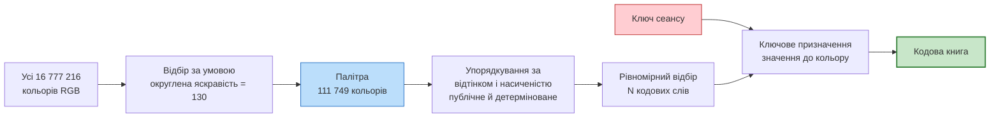
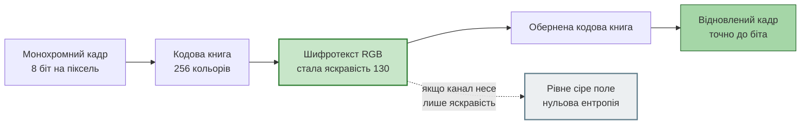
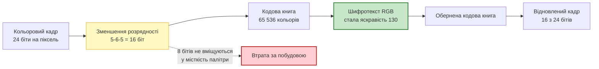

# Шифрування зі сталою яскравістю: монохромний і кольоровий шляхи

<!-- DOCNAV -->
> **Призначення документа.** Відтворення й вимірювання схеми, у якій шифротекст обмежено умовою сталої яскравості кожного пікселя. Підрахунок місткості, обидва шляхи окремо, витік за площинами, стійкість до похибки та межі застосовності.
>
> **Цільовий читач.** Читач, який оцінює, що дає обмеження на яскравість шифротексту і за яких умов воно застосовне.
>
> **Пов'язані документи:** [каталог схем](methods.md) · [схема B2s](substitution_b2s.md) · [таблиця замін над GF(2⁸)](galois_sbox.md) · [будова системи](architecture.md) · [межі застосовності](limitations.md)
<!-- /DOCNAV -->

<!-- TOC -->
<details>
<summary><b>Зміст</b></summary>

- [1. Постановка](#1-постановка)
  - [1.1 Чому однакові числа дають різну яскравість](#11-чому-однакові-числа-дають-різну-яскравість)
  - [1.2 Формулювання схеми](#12-формулювання-схеми)
- [2. Місткість: число, з якого випливає решта](#2-місткість-число-з-якого-випливає-решта)
  - [2.1 Підрахунок](#21-підрахунок)
  - [2.2 Розгортка за рівнями яскравості](#22-розгортка-за-рівнями-яскравості)
  - [2.3 Наслідок для двох шляхів](#23-наслідок-для-двох-шляхів)
- [3. Будова перетворення](#3-будова-перетворення)
  - [3.1 Палітра й кодова книга](#31-палітра-й-кодова-книга)
  - [3.2 Монохромний шлях](#32-монохромний-шлях)
  - [3.3 Кольоровий шлях](#33-кольоровий-шлях)
- [4. Результати: монохромний шлях](#4-результати-монохромний-шлях)
- [5. Результати: кольоровий шлях](#5-результати-кольоровий-шлях)
- [6. Спостерігач, який бачить лише яскравість](#6-спостерігач-який-бачить-лише-яскравість)
- [7. Що насправді приховано: атаки за площинами](#7-що-насправді-приховано-атаки-за-площинами)
- [8. Стійкість до похибки амплітуди](#8-стійкість-до-похибки-амплітуди)
- [9. Висновки](#9-висновки)
- [10. Порядок відтворення](#10-порядок-відтворення)

</details>
<!-- /TOC -->

## 1. Постановка

### 1.1 Чому однакові числа дають різну яскравість

Око не однаково чутливе до трьох основних кольорів. Сприйнята яскравість
пікселя за рекомендацією BT.601 дорівнює зваженій сумі:

```text
   Y  =  0,299 · R  +  0,587 · G  +  0,114 · B
```

<details><summary>LaTeX</summary>

```math
Y = 0{,}299\,R + 0{,}587\,G + 0{,}114\,B
```

</details>

Коефіцієнти відрізняються більш ніж уп'ятеро: зелений при значенні `0x80`
виглядає значно яскравішим за синій при тому самому `0x80`. Це та сама
причина, через яку три світлодіоди на одній напрузі потребують трьох різних
резисторів — однаковий струм не дає однакової видимої яскравості.

### 1.2 Формулювання схеми

Схема будується безпосередньо на цьому зважуванні: шифротекст обмежується
умовою

```text
   Y(R, G, B)  =  Y₀  =  const      для КОЖНОГО пікселя
```

Одне рівняння на три невідомі задає площину в просторі RGB. Зашифрований
піксель лежить на цій площині, і в нього лишається **два ступені свободи**, у
яких і зберігається повідомлення.

Наслідок, який і робить схему цікавою: спостерігач, що бачить лише яскравість —
монохромний сенсор, чорно-білий монітор або монохромний аналоговий тракт,
змодельований у цьому проєкті, — отримує **рівне сіре поле**.

**Реалізація:** [`src/avsec/luma_balance.py`](../src/avsec/luma_balance.py).
**Стенд:** [`src/avsec/luma_lab.py`](../src/avsec/luma_lab.py), команда
`run.bat luma-lab`.

> [!IMPORTANT]
> **Походження чисел документа.** Прогін `avsec luma-lab`, run_id
> `fe45d509310b99d4`, коміт `ad0e7d7`, робоче дерево чисте. Середовище:
> Python 3.12.10, NumPy 2.5.3, SciPy 1.18.1. Кадр 256×192, сцена `village` з
> аерофотографії. Повні таблиці — у [`results/luma/`](../results/luma).

---

## 2. Місткість: число, з якого випливає решта

### 2.1 Підрахунок

Множина 8-бітних кольорів, округлена яскравість яких дорівнює заданому рівню,
скінченна, і її можна перелічити точно перебором усіх 16 777 216 трійок.

| Величина | Значення |
| --- | ---: |
| Рівень яскравості з найбільшою місткістю | **130** |
| Кольорів із цією яскравістю | **111 749** |
| Місткість одного пікселя | **16,77 біта** |
| Найбільший степінь двійки нижче місткості | 2¹⁶ = 65 536 |
| Придатних бітів на піксель | **16** |

<sub>Джерело: `results/luma/luma.json` → `capacity`.</sub>

### 2.2 Розгортка за рівнями яскравості

Місткість залежить від обраного рівня: біля країв діапазону площина перетинає
куб RGB по малій області, у середині — по великій.

| Рівень `Y₀` | Кольорів | Місткість, біт | Вистачає для 8 біт | для 24 біт |
| ---: | ---: | ---: | :---: | :---: |
| 0 | 7 | 2,81 | **ні** | ні |
| 8 | 1 806 | 10,82 | так | ні |
| 16 | 6 810 | 12,73 | так | ні |
| 24 | 15 017 | 13,87 | так | ні |
| **130** | **111 749** | **16,77** | **так** | **ні** |
| 224 | 24 681 | 14,59 | так | ні |
| 240 | 6 009 | 12,55 | так | ні |
| 248 | 1 410 | 10,46 | так | ні |

<sub>Повна розгортка: <a href="img/luma_capacity_sweep.csv">luma_capacity_sweep.csv</a>.</sub>

Для чорного рівня місткість становить лише 7 кольорів — навіть монохромне
зображення туди не вміщується. Ось чому рівень є параметром, а не константою.

### 2.3 Наслідок для двох шляхів

```text
   монохромне джерело:   8 біт на піксель  ≤  16,77  →  вміщується із запасом
   кольорове джерело:   24 біти на піксель >  16,77  →  НЕ вміщується
```

Це не обмеження реалізації, а підрахунок точок ґратки: жодне хитріше кодування
його не обходить. Саме тому шляхи реалізовано **двома окремими класами**, а не
одним із прапорцем — це дві різні ситуації, одна без втрат, друга з втратами за
побудовою.

---

## 3. Будова перетворення

### 3.1 Палітра й кодова книга



Поділ на публічну структуру й ключову частину той самий, що й в алгебраїчній
таблиці замін ([galois_sbox.md §6](galois_sbox.md#6-куди-подівся-ключ)):

* **відбір** кодових слів публічний і рівномірний за впорядкуванням палітри,
  щоб сусідні кодові слова лишалися якомога далі одне від одного в просторі
  RGB — це визначає стійкість до похибки;
* **призначення** значень повідомлення конкретним кольорам виводиться з ключа
  сеансу, і саме воно є секретом.

### 3.2 Монохромний шлях



256 значень, 111 749 доступних кольорів. Кожне значення дістає власний колір,
відображення є бієкцією, відновлення точне.

### 3.3 Кольоровий шлях



Оскільки 24 біти не вміщуються, розрядність каналів зменшується **до**
шифрування. Це робить втрату явною й вимірюваною окремо від роботи самого
шифру.

---

## 4. Результати: монохромний шлях

| Кадр | Точне відновлення | Ентропія яскравості джерела, біт | Ентропія яскравості шифротексту, біт | Рівнів яскравості вжито |
| ---: | :---: | ---: | ---: | ---: |
| 0 | **так** | 6,8507 | **0,0** | **1** |
| 1 | **так** | 6,9637 | **0,0** | **1** |
| 2 | **так** | 7,0516 | **0,0** | **1** |

<sub>Джерело: <a href="img/luma_monochrome.csv">luma_monochrome.csv</a>.</sub>

Три незалежні кадри, три підтвердження: відновлення побітово точне, а яскравість
шифротексту використовує **рівно один** округлений рівень із 256 можливих.
Ентропія цієї площини дорівнює нулю при 6,85–7,05 біта в оригіналі.

**Похибка квантування, названа прямо.** Неокруглена яскравість шифротексту
лежить у межах [129,50; 130,49] із середньоквадратичним відхиленням 0,256–0,284.
Ця залишкова варіація — наслідок того, що RGB є цілочисловим: точно однакової
яскравості в 8-бітній сітці досягти неможливо. Після округлення до рівня вона
зникає.

<p align="center">
  
</p>

<sub><b>Рис. 1.</b> Угорі монохромний шлях, унизу кольоровий. Панель 3 обох
рядків — це весь сигнал, який дістається монохромного тракту: рівне сіре поле.
Повідомлення живе в панелі 4. Прогін <code>fe45d509310b99d4</code>, коміт
<code>ad0e7d7</code>.</sub>

---

## 5. Результати: кольоровий шлях

| Бітів збережено | Усього біт | Втрачено | Кодових слів | Шифр додає власні втрати | PSNR відновлення | PSNR самого лише квантування |
| --- | ---: | ---: | ---: | :---: | ---: | ---: |
| 5-6-5 | 16 | 8 | 65 536 | **ні** | **40,34 дБ** | 40,34 дБ |
| 5-5-5 | 15 | 9 | 32 768 | **ні** | 39,16 дБ | 39,16 дБ |
| 4-4-4 | 12 | 12 | 4 096 | **ні** | 33,01 дБ | 33,01 дБ |

<sub>Джерело: <a href="img/luma_colour.csv">luma_colour.csv</a>. Яскравість
шифротексту в усіх трьох режимах використовує один рівень, ентропія 0,0 біта.</sub>

Два стовпці збігаються до другого знака в усіх трьох рядках, і це головне
твердження розділу: **шифр не додає жодної власної втрати**. Уся різниця з
оригіналом дорівнює втраті від зменшення розрядності, тобто наслідку
недостатньої місткості палітри. Це підтверджено й точною рівністю: відновлений
кадр **побітово збігається** з квантованим оригіналом.

Той самий «цікавий ефект», про який ішлося: кольорове зображення не можна
зашифрувати зі сталою яскравістю без втрат. За 8-бітної глибини воно віддає
третину своїх бітів.

---

## 6. Спостерігач, який бачить лише яскравість

Аналоговий тракт, змодельований у цьому проєкті, є **монохромним за
побудовою**: у ньому немає піднесучої кольору, спалаху й чергування фази PAL
([architecture.md](architecture.md)). Він переносить яскравість і більше нічого.

| Величина | Значення |
| --- | ---: |
| Ентропія яскравості вихідного кадру | 6,8507 біта |
| Ентропія яскравості шифротексту | **0,0 біта** |
| Різних значень яскравості в шифротексті | **1** |
| Кореляція яскравості шифротексту з оригіналом | **0,0** |
| PSNR спроби розшифрувати з самої лише яскравості | 7,86 дБ |

<sub>Джерело: `results/luma/luma.json` → `luma_only_observer`.</sub>

Рядок із нульовою ентропією не є оцінкою: площина яскравості має рівно одне
значення, тому за означенням несе нуль бітів. Канал, який переносить лише
яскравість, донесе з цього шифротексту **нуль інформації** — і законному
приймачеві теж. Спроба розшифрувати з однієї яскравості дає 7,86 дБ, тобто шум.

**Практичний наслідок.** Схема потребує тракту з кольором: композитного з
піднесучою або компонентного. У поточній моделі каналу вона непрацездатна, і це
не недолік схеми, а невідповідність між нею та каналом.

---

## 7. Що насправді приховано: атаки за площинами

Стала яскравість приховує яскравість. Питання, на яке треба відповісти
вимірюванням, — чи приховує вона **структуру**.

Щоб це перевірити, до кадру спершу застосовано перестановку блоків схеми `B2`,
а вже потім обмеження на яскравість. Далі безключова атака збирання за
сумісністю меж спрямована по черзі на кожну площину того самого шифротексту.

Додано **контроль**, без якого вимірювання було б хибним. Ключова кодова книга
сама є заміною: вона відображає сусідні значення в неспоріднені кольори й тому
руйнує неперервність і в площинах кольоровості. Щоб відокремити внесок сталої
яскравості від внеску ключа, той самий дослід повторено з **упорядкованою**
кодовою книгою, де значення `v` дістає `v`-й колір публічного впорядкування
палітри, тобто сусідні значення лишаються сусідніми кольорами.

| Площина | Кодова книга | Правильних сусідств | σ площини | Кореляція з оригіналом |
| --- | --- | ---: | ---: | ---: |
| `B2`: перемішана яскравість | — | **28,09 %** | 31,090 | +0,0369 |
| `B2l`: яскравість | ключова | 0,56 % | **0,000** | 0,0000 |
| `B2l`: Cb | ключова | 0,56 % | 73,000 | −0,0116 |
| `B2l`: Cr | ключова | 1,12 % | 72,818 | +0,0081 |
| `B2l`: яскравість | впорядкована | 0,56 % | **0,000** | 0,0000 |
| `B2l`: Cb | **впорядкована** | **5,06 %** | 48,196 | +0,0331 |
| `B2l`: Cr | **впорядкована** | **8,43 %** | 52,645 | +0,0223 |

<sub>Джерело: <a href="img/luma_plane_attacks.csv">luma_plane_attacks.csv</a>.
Рівень випадкового розкладання — 1/192 ≈ 0,52 %.</sub>

Три висновки, які дає саме наявність контролю:

1. **Площина яскравості порожня за обох кодових книг.** Її середньоквадратичне
   відхилення дорівнює **точно нулю**, атака дає 0,56 % — рівень випадкового
   розкладання. Це властивість самого обмеження, а не ключа.
2. **За ключової кодової книги площини кольоровості теж на рівні випадкового**
   (0,56 % і 1,12 %). Але це заслуга ключового призначення, а не сталої
   яскравості.
3. **За впорядкованої кодової книги кольоровість витікає**: 5,06 % і 8,43 %,
   тобто в 10–16 разів вище за випадковий рівень. Отже, **стала яскравість сама
   по собі структуру не приховує** — вона лише прибирає канал яскравості.

Слід відзначити й те, що навіть упорядкований варіант дає помітно менше за
28,09 % у `B2`. Причина в тому, що впорядкування палітри за відтінком не є
лінійною функцією значення, тож частина неперервності руйнується й без ключа.

<p align="center">
  
</p>

<sub><b>Рис. 2.</b> Ліворуч — місткість палітри залежно від рівня яскравості з
порогами для 8 і 24 бітів. Посередині — безключова атака за площинами одного
шифротексту. Праворуч — стійкість до похибки амплітуди. Дані:
<a href="img/luma_capacity_sweep.csv">luma_capacity_sweep.csv</a>,
<a href="img/luma_plane_attacks.csv">luma_plane_attacks.csv</a>,
<a href="img/luma_noise_tolerance.csv">luma_noise_tolerance.csv</a>.</sub>

---

## 8. Стійкість до похибки амплітуди

Шифротекст спотворено адитивним гауссовим шумом і розшифровано за **найближчим
кодовим словом**.

| σ, рівнів | Пікселів відновлено точно | PSNR | Придатне за порогом 20 дБ |
| ---: | ---: | ---: | :---: |
| 0,0 | 100,00 % | точно | **так** |
| 0,5 | 99,56 % | 34,13 дБ | **так** |
| 1,0 | 98,32 % | 26,46 дБ | **так** |
| 2,0 | 93,64 % | 20,65 дБ | **так** |
| 4,0 | 77,05 % | 15,54 дБ | ні |
| 8,0 | 45,31 % | 12,10 дБ | ні |

<sub>Джерело: <a href="img/luma_noise_tolerance.csv">luma_noise_tolerance.csv</a>.</sub>

**Порівняння з таблицею замін `B2s` є показовим.** Там похибка в один рівень
перетворювалася на похибку в 85 рівнів, і жоден профіль каналу не давав 20 дБ
([substitution_b2s.md §6.1](substitution_b2s.md#61-механізм-підсилення-похибки)).
Тут схема витримує σ = 2 рівні й лишається придатною.

Причина в розмірності. Таблиця замін `B2s` діє на **одновимірному** алфавіті:
сусідні значення розкидані, і найближче значення не є найімовірнішим
відправленим. Кодова книга тут живе у **тривимірному** просторі RGB, а кодові
слова відібрано рівномірно по палітрі, тож між ними є відстань, і декодування
за найближчим її використовує. Це не властивість сталої яскравості як такої, а
наслідок відбору кодових слів із запасом за відстанню.

---

## 9. Висновки

**Що відтворено.** Схему, описану викладачем, реалізовано й виміряно: шифротекст
має сталу яскравість у кожному пікселі, монохромний спостерігач бачить рівне
сіре поле, розшифрування для монохромного джерела точне до біта.

**Що додало вимірювання понад опис:**

1. **Місткість обмежена й обчислена точно** — 111 749 кольорів, 16,77 біта на
   піксель на найкращому рівні. Звідси випливають обидва наступні пункти.
2. **Монохромне джерело вміщується, кольорове ні.** Колір віддає 8 бітів із 24;
   це підрахунок точок ґратки, а не недолік реалізації. Виміряна ціна —
   40,34 дБ у режимі 5-6-5.
3. **Шифр не додає власних втрат.** Відновлений кольоровий кадр побітово
   збігається з квантованим оригіналом; уся різниця — у зменшенні розрядності.
4. **Ентропія яскравості шифротексту дорівнює нулю.** Не «мала», а нуль: у
   площині рівно одне значення.

**Що обмежує застосування:**

1. **Стала яскравість приховує яскравість, а не структуру.** Контроль із
   упорядкованою кодовою книгою показує витік 5,06 % і 8,43 % правильних
   сусідств у площинах кольоровості. Приховування структури в повній схемі
   забезпечує ключове призначення кольорів, а не обмеження на яскравість.
2. **Схема несумісна з монохромним трактом цього проєкту.** Канал переносить
   лише яскравість, а яскравість шифротексту несе нуль бітів. Потрібен тракт із
   кольором.
3. **Це перцептивне приховування, а не криптографічна гарантія.** Автентичності
   схема не дає; відома пара кадрів відновлює кодову книгу так само, як
   відновлює таблицю замін у `B2s`.

**Місце в ланцюжку.** Обмеження на яскравість є доповненням до заміни й
перестановки, а не заміною їм. Його доречно розглядати там, де важливо, щоб
**монохромний** спостерігач не бачив нічого: чорно-білий сенсор, фотографія
екрана, паралельний монохромний канал.

---

## 10. Порядок відтворення

```bash
run.bat luma-lab
```

Підрахунок місткості за всіма рівнями, обидва шляхи, спостерігач із яскравістю,
атаки за площинами з контролем, стійкість до похибки, зображення й два рисунки.
Результат — у [`results/luma/`](../results/luma). Тривалість — близько хвилини.

```bash
python -m pytest tests/test_luma_balance.py -q
```

19 регресійних тестів навколо тверджень цього документа, зокрема двох
незручних: що кольоровий шлях **не** може бути без втрат і що приховування
стосується лише яскравості.
