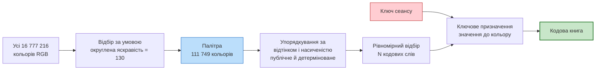
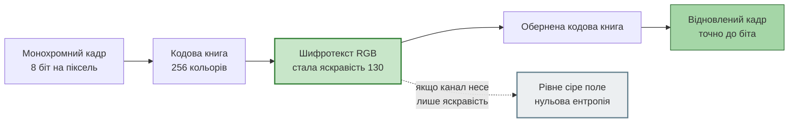
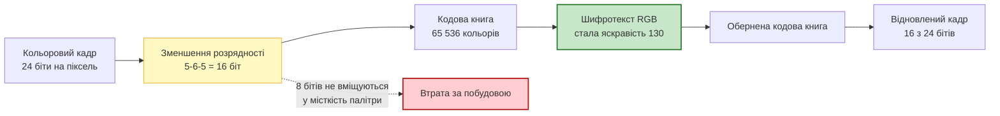
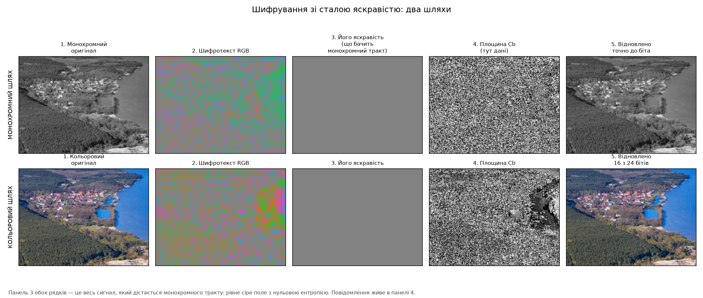
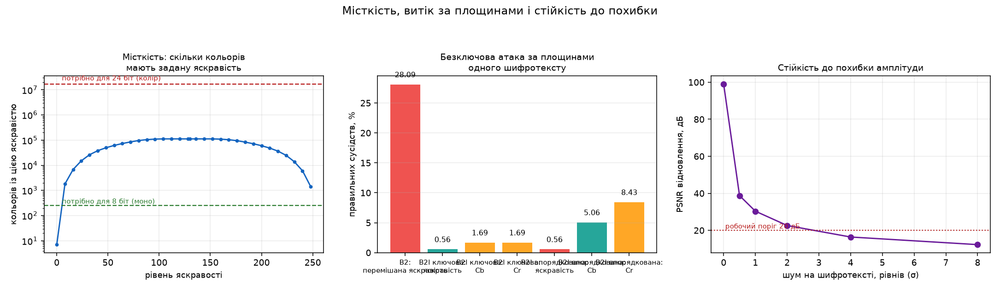
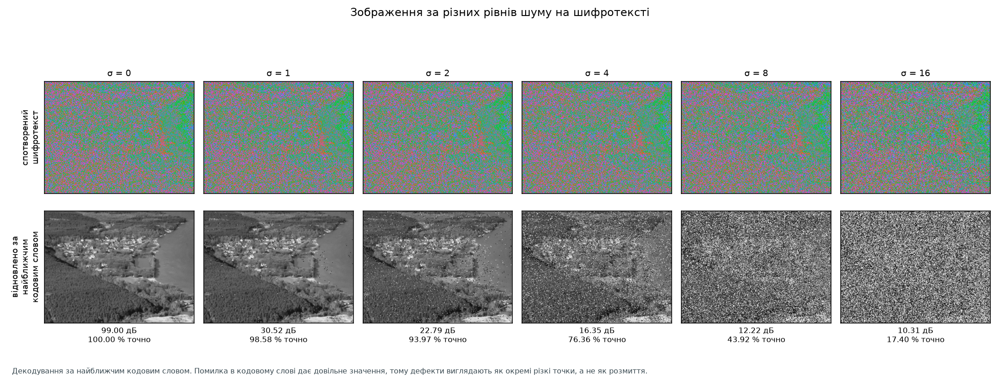
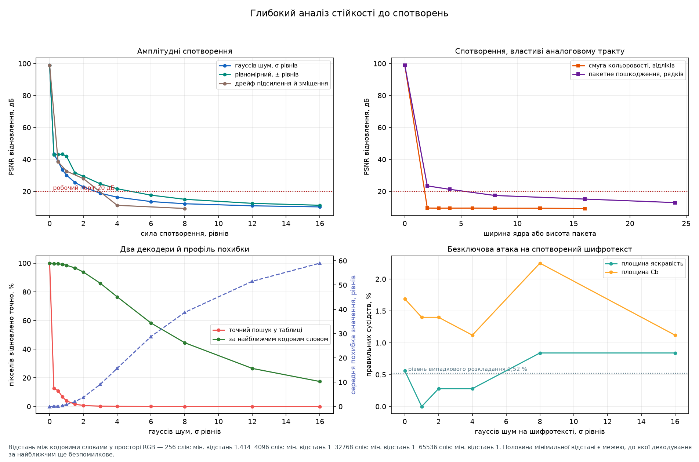
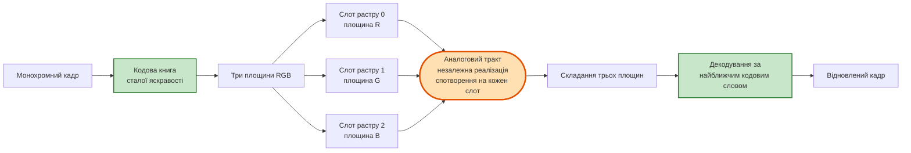
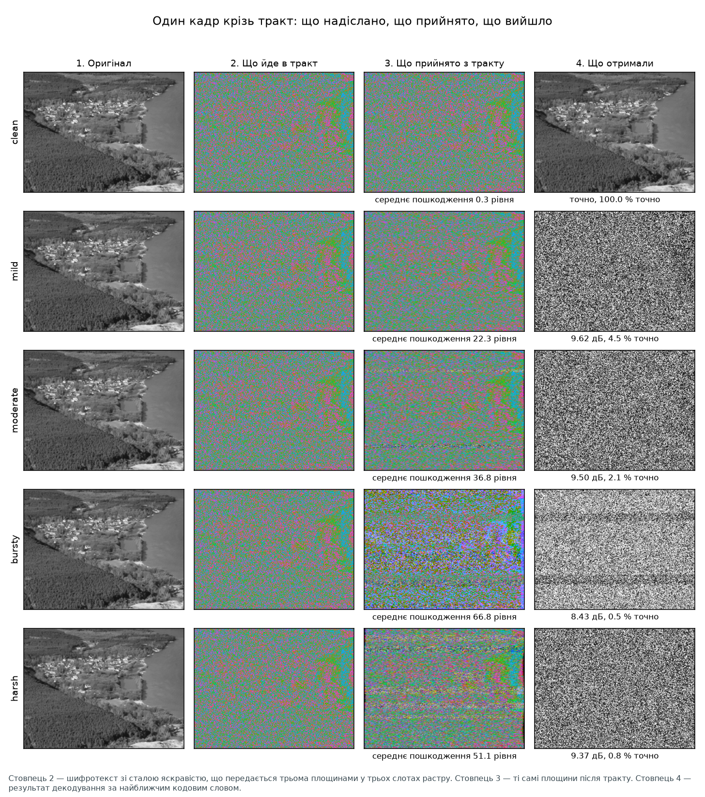
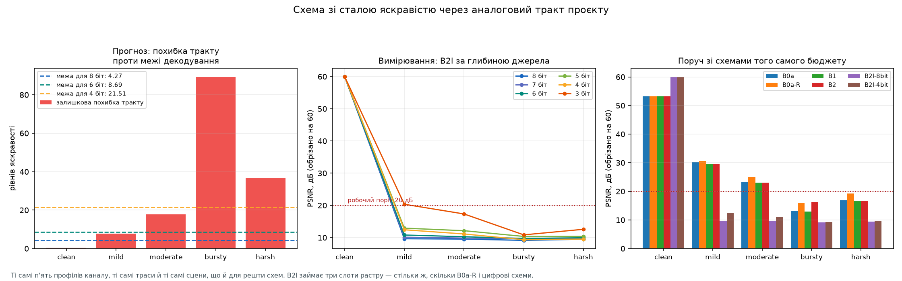

# Шифрування зі сталою яскравістю: монохромний і кольоровий шляхи

<!-- DOCNAV -->
> **Призначення документа.** Відтворення й вимірювання схеми, у якій шифротекст обмежено умовою сталої яскравості кожного пікселя. Підрахунок місткості, обидва шляхи окремо, витік за площинами, стійкість до похибки та межі застосовності.
>
> **Цільовий читач.** Читач, який оцінює, що дає обмеження на яскравість шифротексту і за яких умов воно застосовне.
>
> **Пов'язані документи:** [каталог схем](methods.md) · [схема B2s](substitution_b2s.md) · [таблиця замін над GF(2⁸)](galois_sbox.md) · [будова системи](architecture.md) · [межі застосовності](limitations.md)
<!-- /DOCNAV -->

<!-- TOC -->
<details>
<summary><b>Зміст</b></summary>

- [1. Постановка](#1-постановка)
  - [1.1 Чому однакові числа дають різну яскравість](#11-чому-однакові-числа-дають-різну-яскравість)
  - [1.2 Формулювання схеми](#12-формулювання-схеми)
- [2. Місткість: число, з якого випливає решта](#2-місткість-число-з-якого-випливає-решта)
  - [2.1 Підрахунок](#21-підрахунок)
  - [2.2 Розгортка за рівнями яскравості](#22-розгортка-за-рівнями-яскравості)
  - [2.3 Наслідок для двох шляхів](#23-наслідок-для-двох-шляхів)
- [3. Будова перетворення](#3-будова-перетворення)
  - [3.1 Палітра й кодова книга](#31-палітра-й-кодова-книга)
  - [3.2 Монохромний шлях](#32-монохромний-шлях)
  - [3.3 Кольоровий шлях](#33-кольоровий-шлях)
- [4. Результати: монохромний шлях](#4-результати-монохромний-шлях)
- [5. Результати: кольоровий шлях](#5-результати-кольоровий-шлях)
- [6. Спостерігач, який бачить лише яскравість](#6-спостерігач-який-бачить-лише-яскравість)
- [7. Що насправді приховано: атаки за площинами](#7-що-насправді-приховано-атаки-за-площинами)
- [8. Стійкість до спотворень](#8-стійкість-до-спотворень)
  - [8.1 Що визначає стійкість: відстань між кодовими словами](#81-що-визначає-стійкість-відстань-між-кодовими-словами)
  - [8.2 Два декодери](#82-два-декодери)
  - [8.3 Амплітудні спотворення](#83-амплітудні-спотворення)
  - [8.4 Обмеження смуги кольоровості](#84-обмеження-смуги-кольоровості)
  - [8.5 Пакетні пошкодження](#85-пакетні-пошкодження)
  - [8.6 Зображення за різних рівнів шуму](#86-зображення-за-різних-рівнів-шуму)
  - [8.7 Атаки на спотворений шифротекст](#87-атаки-на-спотворений-шифротекст)
  - [8.8 Зведення](#88-зведення)
- [9. Прогін через аналоговий тракт проєкту](#9-прогін-через-аналоговий-тракт-проєкту)
  - [9.1 Як кольоровий шифротекст потрапляє в монохромний тракт](#91-як-кольоровий-шифротекст-потрапляє-в-монохромний-тракт)
  - [9.2 Один кадр крізь тракт](#92-один-кадр-крізь-тракт)
  - [9.3 Прогноз із геометрії кодової книги](#93-прогноз-із-геометрії-кодової-книги)
  - [9.4 Вимірювання за пʼятьма профілями](#94-вимірювання-за-пʼятьма-профілями)
  - [9.5 Прогноз не справдився: розклад профілю](#95-прогноз-не-справдився-розклад-профілю)
  - [9.6 Чому фільтр руйнує, а зсув ні](#96-чому-фільтр-руйнує-а-зсув-ні)
- [10. Висновки](#10-висновки)
- [11. Порядок відтворення](#11-порядок-відтворення)

</details>
<!-- /TOC -->

## 1. Постановка

### 1.1 Чому однакові числа дають різну яскравість

Око не однаково чутливе до трьох основних кольорів. Сприйнята яскравість
пікселя за рекомендацією BT.601 дорівнює зваженій сумі:

```text
   Y  =  0,299 · R  +  0,587 · G  +  0,114 · B
```

<details><summary>LaTeX</summary>

```math
Y = 0{,}299\,R + 0{,}587\,G + 0{,}114\,B
```

</details>

Коефіцієнти відрізняються більш ніж уп'ятеро: зелений при значенні `0x80`
виглядає значно яскравішим за синій при тому самому `0x80`. Це та сама
причина, через яку три світлодіоди на одній напрузі потребують трьох різних
резисторів — однаковий струм не дає однакової видимої яскравості.

### 1.2 Формулювання схеми

Схема будується безпосередньо на цьому зважуванні: шифротекст обмежується
умовою

```text
   Y(R, G, B)  =  Y₀  =  const      для КОЖНОГО пікселя
```

Одне рівняння на три невідомі задає площину в просторі RGB. Зашифрований
піксель лежить на цій площині, і в нього лишається **два ступені свободи**, у
яких і зберігається повідомлення.

Наслідок, який і робить схему цікавою: спостерігач, що бачить лише яскравість —
монохромний сенсор, чорно-білий монітор або монохромний аналоговий тракт,
змодельований у цьому проєкті, — отримує **рівне сіре поле**.

**Реалізація:** [`src/avsec/luma_balance.py`](../src/avsec/luma_balance.py).
**Стенд:** [`src/avsec/luma_lab.py`](../src/avsec/luma_lab.py), команда
`run.bat luma-lab`.

> [!IMPORTANT]
> **Походження чисел документа.** Прогін `avsec luma-lab`, run_id
> `fe45d509310b99d4`, коміт `a3c7bfd`, робоче дерево чисте. Середовище:
> Python 3.12.10, NumPy 2.5.3, SciPy 1.18.1. Кадр 256×192, сцена `village` з
> аерофотографії. Повні таблиці — у [`results/luma/`](../results/luma).

---

## 2. Місткість: число, з якого випливає решта

### 2.1 Підрахунок

Множина 8-бітних кольорів, округлена яскравість яких дорівнює заданому рівню,
скінченна, і її можна перелічити точно перебором усіх 16 777 216 трійок.

| Величина | Значення |
| --- | ---: |
| Рівень яскравості з найбільшою місткістю | **130** |
| Кольорів із цією яскравістю | **111 749** |
| Місткість одного пікселя | **16,77 біта** |
| Найбільший степінь двійки нижче місткості | 2¹⁶ = 65 536 |
| Придатних бітів на піксель | **16** |

<sub>Джерело: `results/luma/luma.json` → `capacity`.</sub>

### 2.2 Розгортка за рівнями яскравості

Місткість залежить від обраного рівня: біля країв діапазону площина перетинає
куб RGB по малій області, у середині — по великій.

| Рівень `Y₀` | Кольорів | Місткість, біт | Вистачає для 8 біт | для 24 біт |
| ---: | ---: | ---: | :---: | :---: |
| 0 | 7 | 2,81 | **ні** | ні |
| 8 | 1 806 | 10,82 | так | ні |
| 16 | 6 810 | 12,73 | так | ні |
| 24 | 15 017 | 13,87 | так | ні |
| **130** | **111 749** | **16,77** | **так** | **ні** |
| 224 | 24 681 | 14,59 | так | ні |
| 240 | 6 009 | 12,55 | так | ні |
| 248 | 1 410 | 10,46 | так | ні |

<sub>Повна розгортка: <a href="img/luma_capacity_sweep.csv">luma_capacity_sweep.csv</a>.</sub>

Для чорного рівня місткість становить лише 7 кольорів — навіть монохромне
зображення туди не вміщується. Ось чому рівень є параметром, а не константою.

### 2.3 Наслідок для двох шляхів

```text
   монохромне джерело:   8 біт на піксель  ≤  16,77  →  вміщується із запасом
   кольорове джерело:   24 біти на піксель >  16,77  →  НЕ вміщується
```

Це не обмеження реалізації, а підрахунок точок ґратки: жодне хитріше кодування
його не обходить. Саме тому шляхи реалізовано **двома окремими класами**, а не
одним із прапорцем — це дві різні ситуації, одна без втрат, друга з втратами за
побудовою.

---

## 3. Будова перетворення

### 3.1 Палітра й кодова книга



Поділ на публічну структуру й ключову частину той самий, що й в алгебраїчній
таблиці замін ([galois_sbox.md §6](galois_sbox.md#6-куди-подівся-ключ)):

* **відбір** кодових слів публічний і рівномірний за впорядкуванням палітри,
  щоб сусідні кодові слова лишалися якомога далі одне від одного в просторі
  RGB — це визначає стійкість до похибки;
* **призначення** значень повідомлення конкретним кольорам виводиться з ключа
  сеансу, і саме воно є секретом.

### 3.2 Монохромний шлях



256 значень, 111 749 доступних кольорів. Кожне значення дістає власний колір,
відображення є бієкцією, відновлення точне.

### 3.3 Кольоровий шлях



Оскільки 24 біти не вміщуються, розрядність каналів зменшується **до**
шифрування. Це робить втрату явною й вимірюваною окремо від роботи самого
шифру.

---

## 4. Результати: монохромний шлях

| Кадр | Точне відновлення | Ентропія яскравості джерела, біт | Ентропія яскравості шифротексту, біт | Рівнів яскравості вжито |
| ---: | :---: | ---: | ---: | ---: |
| 0 | **так** | 6,8507 | **0,0** | **1** |
| 1 | **так** | 6,9637 | **0,0** | **1** |
| 2 | **так** | 7,0516 | **0,0** | **1** |

<sub>Джерело: <a href="img/luma_monochrome.csv">luma_monochrome.csv</a>.</sub>

Три незалежні кадри, три підтвердження: відновлення побітово точне, а яскравість
шифротексту використовує **рівно один** округлений рівень із 256 можливих.
Ентропія цієї площини дорівнює нулю при 6,85–7,05 біта в оригіналі.

**Похибка квантування, названа прямо.** Неокруглена яскравість шифротексту
лежить у межах [129,50; 130,49] із середньоквадратичним відхиленням 0,269–0,294.
Ця залишкова варіація — наслідок того, що RGB є цілочисловим: точно однакової
яскравості в 8-бітній сітці досягти неможливо. Після округлення до рівня вона
зникає.

<p align="center">
  
</p>

<sub><b>Рис. 1.</b> Угорі монохромний шлях, унизу кольоровий. Панель 3 обох
рядків — це весь сигнал, який дістається монохромного тракту: рівне сіре поле.
Повідомлення живе в панелі 4. Прогін <code>fe45d509310b99d4</code>, коміт
<code>a3c7bfd</code>.</sub>

---

## 5. Результати: кольоровий шлях

| Бітів збережено | Усього біт | Втрачено | Кодових слів | Шифр додає власні втрати | PSNR відновлення | PSNR самого лише квантування |
| --- | ---: | ---: | ---: | :---: | ---: | ---: |
| 5-6-5 | 16 | 8 | 65 536 | **ні** | **40,34 дБ** | 40,34 дБ |
| 5-5-5 | 15 | 9 | 32 768 | **ні** | 39,16 дБ | 39,16 дБ |
| 4-4-4 | 12 | 12 | 4 096 | **ні** | 33,01 дБ | 33,01 дБ |

<sub>Джерело: <a href="img/luma_colour.csv">luma_colour.csv</a>. Яскравість
шифротексту в усіх трьох режимах використовує один рівень, ентропія 0,0 біта.</sub>

Два стовпці збігаються до другого знака в усіх трьох рядках, і це головне
твердження розділу: **шифр не додає жодної власної втрати**. Уся різниця з
оригіналом дорівнює втраті від зменшення розрядності, тобто наслідку
недостатньої місткості палітри. Це підтверджено й точною рівністю: відновлений
кадр **побітово збігається** з квантованим оригіналом.

Той самий «цікавий ефект», про який ішлося: кольорове зображення не можна
зашифрувати зі сталою яскравістю без втрат. За 8-бітної глибини воно віддає
третину своїх бітів.

---

## 6. Спостерігач, який бачить лише яскравість

Аналоговий тракт, змодельований у цьому проєкті, є **монохромним за
побудовою**: у ньому немає піднесучої кольору, спалаху й чергування фази PAL
([architecture.md](architecture.md)). Він переносить яскравість і більше нічого.

| Величина | Значення |
| --- | ---: |
| Ентропія яскравості вихідного кадру | 6,8507 біта |
| Ентропія яскравості шифротексту | **0,0 біта** |
| Різних значень яскравості в шифротексті | **1** |
| Кореляція яскравості шифротексту з оригіналом | **0,0** |
| PSNR спроби розшифрувати з самої лише яскравості | 7,86 дБ |

<sub>Джерело: `results/luma/luma.json` → `luma_only_observer`.</sub>

Рядок із нульовою ентропією не є оцінкою: площина яскравості має рівно одне
значення, тому за означенням несе нуль бітів. Канал, який переносить лише
яскравість, донесе з цього шифротексту **нуль інформації** — і законному
приймачеві теж. Спроба розшифрувати з однієї яскравості дає 7,86 дБ, тобто шум.

**Практичний наслідок.** Схема потребує тракту з кольором: композитного з
піднесучою або компонентного. У поточній моделі каналу вона непрацездатна, і це
не недолік схеми, а невідповідність між нею та каналом.

---

## 7. Що насправді приховано: атаки за площинами

Стала яскравість приховує яскравість. Питання, на яке треба відповісти
вимірюванням, — чи приховує вона **структуру**.

Щоб це перевірити, до кадру спершу застосовано перестановку блоків схеми `B2`,
а вже потім обмеження на яскравість. Далі безключова атака збирання за
сумісністю меж спрямована по черзі на кожну площину того самого шифротексту.

Додано **контроль**, без якого вимірювання було б хибним. Ключова кодова книга
сама є заміною: вона відображає сусідні значення в неспоріднені кольори й тому
руйнує неперервність і в площинах кольоровості. Щоб відокремити внесок сталої
яскравості від внеску ключа, той самий дослід повторено з **упорядкованою**
кодовою книгою, де значення `v` дістає `v`-й колір публічного впорядкування
палітри, тобто сусідні значення лишаються сусідніми кольорами.

| Площина | Кодова книга | Правильних сусідств | σ площини | Кореляція з оригіналом |
| --- | --- | ---: | ---: | ---: |
| `B2`: перемішана яскравість | — | **28,09 %** | 31,090 | +0,0369 |
| `B2l`: яскравість | ключова | 0,56 % | **0,000** | 0,0000 |
| `B2l`: Cb | ключова | 1,69 % | 76,471 | −0,0022 |
| `B2l`: Cr | ключова | 1,69 % | 73,963 | −0,0043 |
| `B2l`: яскравість | впорядкована | 0,56 % | **0,000** | 0,0000 |
| `B2l`: Cb | **впорядкована** | **5,06 %** | 48,196 | +0,0331 |
| `B2l`: Cr | **впорядкована** | **8,43 %** | 52,645 | +0,0223 |

<sub>Джерело: <a href="img/luma_plane_attacks.csv">luma_plane_attacks.csv</a>.
Рівень випадкового розкладання — 1/192 ≈ 0,52 %.</sub>

Три висновки, які дає саме наявність контролю:

1. **Площина яскравості порожня за обох кодових книг.** Її середньоквадратичне
   відхилення дорівнює **точно нулю**, атака дає 0,56 % — рівень випадкового
   розкладання. Це властивість самого обмеження, а не ключа.
2. **За ключової кодової книги площини кольоровості майже порожні** (по
   1,69 % за випадкового рівня 0,52 %). Залишок утричі перевищує випадковий
   рівень, тобто повного приховування немає, але він у 3–5 разів менший, ніж
   за впорядкованої книги. Цей виграш дає ключове призначення кодових слів, а
   не саме обмеження на яскравість.
3. **За впорядкованої кодової книги кольоровість витікає**: 5,06 % і 8,43 %,
   тобто в 10–16 разів вище за випадковий рівень. Отже, **стала яскравість сама
   по собі структуру не приховує** — вона лише прибирає канал яскравості.

Слід відзначити й те, що навіть упорядкований варіант дає помітно менше за
28,09 % у `B2`. Причина в тому, що впорядкування палітри за відтінком не є
лінійною функцією значення, тож частина неперервності руйнується й без ключа.

<p align="center">
  
</p>

<sub><b>Рис. 2.</b> Ліворуч — місткість палітри залежно від рівня яскравості з
порогами для 8 і 24 бітів. Посередині — безключова атака за площинами одного
шифротексту. Праворуч — стійкість до похибки амплітуди. Дані:
<a href="img/luma_capacity_sweep.csv">luma_capacity_sweep.csv</a>,
<a href="img/luma_plane_attacks.csv">luma_plane_attacks.csv</a>,
<a href="img/luma_noise_tolerance.csv">luma_noise_tolerance.csv</a>.</sub>

---

## 8. Стійкість до спотворень

Перший вимір стійкості охоплював одне спотворення й один декодер. Цього
недостатньо, щоб судити про придатність до реального тракту, з трьох причин:
аналоговий тракт не лише додає шум, а й звужує смугу кольоровості значно
сильніше за смугу яскравості; стійкість визначається відстанню між кодовими
словами, а вона різна для двох шляхів; і шум руйнує саму властивість сталої
яскравості, тож питання про витік доводиться ставити заново.

### 8.1 Що визначає стійкість: відстань між кодовими словами

Декодування за найближчим кодовим словом відновлює значення правильно доти,
доки спотворення не перенесло точку ближче до чужого слова. Межею є **половина
мінімальної відстані** між словами.

| Кодових слів | Мінімальна відстань | Медіанна | Середня | Межа безпомилковості |
| ---: | ---: | ---: | ---: | ---: |
| **256** (монохромний шлях) | **1,414** | **8,544** | 9,117 | 0,707 |
| 4 096 | 1,000 | 2,236 | 2,319 | 0,500 |
| 32 768 | 1,000 | 1,000 | 1,121 | 0,500 |
| **65 536** (кольоровий шлях) | **1,000** | **1,000** | 1,014 | 0,500 |

<sub>Евклідова відстань у просторі RGB. Джерело:
<a href="img/luma_codeword_spacing.csv">luma_codeword_spacing.csv</a>.</sub>

Мінімальна відстань змінюється мало, а **медіанна падає у 8,5 раза**: від 8,544
до 1,000. Це і є кількісна відмінність двох шляхів. Монохромний шлях бере 256
слів зі 111 749 і має простір між ними; кольоровий бере 65 536, тобто більш ніж
половину палітри, і слова стоять упритул. Кольоровий шлях крихкіший за
побудовою, і це видно без окремого досліду.

### 8.2 Два декодери

Той самий шифротекст, ті самі спотворення, два способи розшифрування.

| Гауссів шум, σ | Точний пошук у таблиці | За найближчим кодовим словом | Різниця |
| ---: | ---: | ---: | ---: |
| 0,00 | 100,00 % | 100,00 % | — |
| **0,25** | **12,68 %** | **99,78 %** | **87,1 в. п.** |
| 1,00 | 3,90 % | 98,50 % | 94,6 в. п. |
| 2,00 | 0,72 % | 93,79 % | 93,1 в. п. |
| 4,00 | 0,10 % | 76,50 % | 76,4 в. п. |
| 8,00 | 0,02 % | 44,47 % | 44,4 в. п. |

<sub>Частка пікселів, відновлених точно. Джерело:
<a href="img/luma_noise_deep.csv">luma_noise_deep.csv</a>.</sub>

Точний пошук розсипається одразу: вже за σ = 0,25 рівня він відновлює 12,68 %
пікселів, бо шифротекст майже ніде не збігається з кодовим словом побайтово.
Декодування за найближчим у той самий момент дає 99,78 %. **Це рішення
проєктування вартістю 87 відсоткових пунктів**, і воно не є очевидним доти,
доки обидва варіанти не виміряно.

### 8.3 Амплітудні спотворення

| σ або сила, рівнів | Гауссів шум | Рівномірний | Дрейф підсилення й зміщення |
| ---: | ---: | ---: | ---: |
| 0,5 | 38,86 дБ | 43,19 дБ | 38,52 дБ |
| 1,0 | 30,15 дБ | 42,01 дБ | 32,68 дБ |
| 2,0 | **22,81 дБ** | 29,51 дБ | 27,97 дБ |
| 4,0 | 16,38 дБ | **21,65 дБ** | **11,29 дБ** |
| 8,0 | 12,27 дБ | 15,06 дБ | 9,32 дБ |

<sub>PSNR відновлення за найближчим кодовим словом. Робочий поріг дослідження —
20 дБ.</sub>

Гауссів шум долає поріг між σ = 2 і σ = 3. Рівномірний шум тієї самої
номінальної сили менш шкідливий, бо не має довгих хвостів: він тримається до
±4 рівнів. Дрейф підсилення й зміщення поводиться інакше — до сили 2 він
майже нешкідливий (27,97 дБ), а між 2 і 4 обвалюється до 11,29 дБ. Причина в
тому, що дрейф є **систематичним** зсувом усієї палітри: доки він менший за
половину відстані між словами, найближче слово лишається правильним для всіх
пікселів одразу; щойно він її перевищує, помиляються теж усі одразу.

> [!NOTE]
> **Уточнення до рядка про дрейф.** Ці вимірювання накладають спотворення
> просто на масив шифротексту, оминаючи приймач. На справжньому тракті носій
> оцінює й компенсує підсилення та зміщення під час синхронізації, тому там
> дрейф виявився **нешкідливим**: див. розклад у
> [9.5](#95-прогноз-не-справдився-розклад-профілю). Синтетичне число лишається
> правильним для випадку, коли компенсації немає, але воно не описує поведінку
> в тракті цього проєкту.

### 8.4 Обмеження смуги кольоровості

Це найважливіший рядок розділу для практичного застосування.

| Ширина ядра, відліків | Пікселів відновлено точно | PSNR |
| ---: | ---: | ---: |
| 0 (без обмеження) | 100,00 % | точно |
| **2** | **6,66 %** | **9,56 дБ** |
| 3 | 1,58 % | 9,47 дБ |
| 4 | 0,89 % | 9,50 дБ |
| 8 | 0,39 % | 9,45 дБ |
| 16 | 0,32 % | 9,29 дБ |

<sub>Горизонтальне згладжування площин `Cb` і `Cr` ковзним середнім; площина
яскравості не змінюється.</sub>

Ядро завширшки **два відліки** знищує схему: 6,66 % відновлених пікселів і
9,56 дБ. Причина безпосередня: повідомлення живе виключно в кольоровості, а
згладжування усереднює сусідні кодові слова, які не мають між собою нічого
спільного. Середнє двох неспоріднених кольорів не є жодним із них і зазвичай
навіть не належить палітрі.

Практичний наслідок серйозний. У композитному відеосигналі смуга кольоровості
менша за смугу яскравості приблизно вчетверо, і це властивість стандарту, а не
дефект тракту. Отже, **схема несумісна не лише з монохромним трактом цього
проєкту, а й із композитним кольоровим** без окремих заходів: потрібен
компонентний тракт або пряме передавання кодових слів як даних.

### 8.5 Пакетні пошкодження

| Висота пакета, рядків | Пікселів відновлено точно | PSNR |
| ---: | ---: | ---: |
| 2 | 95,85 % | 23,42 дБ |
| 4 | 93,24 % | 21,26 дБ |
| 8 | 83,39 % | 17,42 дБ |
| 16 | 75,07 % | 15,16 дБ |
| 24 | 54,86 % | 12,96 дБ |

Пакетне пошкодження поводиться інакше за амплітудний шум: воно знищує рядки
повністю, але **не чіпає решти кадру**. Тому втрати зростають приблизно
пропорційно до частки пошкоджених рядків, а не лавиноподібно. До чотирьох
рядків схема лишається придатною за робочим порогом.

Тут помітно й те, що точний пошук і пошук за найближчим дають майже однакові
числа (93,24 % проти 93,23 % за чотирьох рядків): непошкоджені пікселі
збігаються з кодовими словами точно, а пошкоджені втрачені за будь-якого
декодера.

### 8.6 Зображення за різних рівнів шуму

<p align="center">
  
</p>

<sub><b>Рис. 3.</b> Угорі — спотворений шифротекст, унизу — відновлення за
найближчим кодовим словом. Прогін <code>fe45d509310b99d4</code>, коміт
<code>a3c7bfd</code>.</sub>

| σ | PSNR | Пікселів точно | Вигляд |
| ---: | ---: | ---: | --- |
| 0 | точно | 100,00 % | без відмінностей від оригіналу |
| 1 | 30,52 дБ | 98,58 % | поодинокі різкі точки |
| 2 | 22,79 дБ | 93,97 % | помітний «сніг», сюжет читається повністю |
| 4 | 16,35 дБ | 76,36 % | щільний «сніг», великі об'єкти ще впізнавані |
| 8 | 12,22 дБ | 43,92 % | сюжет ледве вгадується |
| 16 | 10,31 дБ | 17,40 % | зображення не читається |

<sub>Джерело: <a href="img/luma_noise_strip.csv">luma_noise_strip.csv</a>.
У рядку σ = 0 середньоквадратична похибка дорівнює нулю, тож PSNR нескінченний.
Таблиця пише «точно», а не скінченну сталу: підміна нескінченного PSNR
значенням на кшталт 99 дБ була окремим виправленим дефектом цього проєкту
(F18), і в CSV це значення лишається як службовий маркер.</sub>

Характер дефектів варто відзначити окремо: це **окремі різкі точки**, а не
розмиття й не блочні артефакти. Кодова книга не має структури порядку, тож
помилка в кодовому слові дає не близьке, а довільне значення. Середня похибка
значення зростає з 0,07 рівня за σ = 0,25 до 59,00 рівня за σ = 16 — тобто
кожна окрема помилка є повною втратою пікселя, а падіння якості визначається
їхньою **кількістю**, а не величиною.

### 8.7 Атаки на спотворений шифротекст

Шум руйнує властивість, на якій побудовано схему: площина яскравості перестає
бути сталою. Кількість використаних рівнів зростає з **1** до **84** за
σ = 16. Це ставить питання заново — чи не з'являється витік разом із варіацією.

| σ | Площина | σ площини | Кореляція з оригіналом | Правильних сусідств |
| ---: | --- | ---: | ---: | ---: |
| 0 | яскравість | **0,000** | 0,0000 | 0,56 % |
| 0 | Cb | 76,471 | −0,0022 | 1,69 % |
| 1 | яскравість | 0,803 | +0,0064 | 0,00 % |
| 2 | яскравість | 1,405 | −0,0008 | 0,28 % |
| 4 | яскравість | 2,712 | +0,0059 | 0,28 % |
| 8 | яскравість | 5,369 | −0,0029 | 0,84 % |
| 16 | яскравість | 10,597 | +0,0004 | 0,84 % |
| 16 | Cb | 59,828 | −0,0021 | 1,12 % |

<sub>Рівень випадкового розкладання — 1/192 ≈ 0,52 %. Джерело:
<a href="img/luma_noise_attacks.csv">luma_noise_attacks.csv</a>.</sub>

**Витоку не виникає.** Середньоквадратичне відхилення площини яскравості
зростає з нуля до 10,597, але кореляція з вихідним кадром лишається в межах
±0,007, а безключова атака дає від 0,00 до 0,84 % правильних сусідств — тобто
коливається навколо випадкового рівня 0,52 % без тенденції.

Причина проста й варта окремого формулювання: властивість сталої яскравості
руйнує **шум**, а шум не залежить від повідомлення. Варіація, що з'явилася в
площині яскравості, є варіацією шуму, а не зображення. Спостерігач бачить не
сюжет, а завади.

<p align="center">
  
</p>

<sub><b>Рис. 4.</b> Ліворуч угорі — амплітудні спотворення, праворуч угорі —
спотворення аналогового тракту, ліворуч унизу — два декодери й профіль похибки,
праворуч унизу — безключова атака на спотворений шифротекст. Дані:
<a href="img/luma_noise_deep.csv">luma_noise_deep.csv</a>,
<a href="img/luma_noise_attacks.csv">luma_noise_attacks.csv</a>,
<a href="img/luma_codeword_spacing.csv">luma_codeword_spacing.csv</a>.</sub>

### 8.8 Зведення

| Спотворення | Межа придатності за порогом 20 дБ | Характер відмови |
| --- | --- | --- |
| Гауссів шум | σ ≈ 2 рівні | поступовий, окремі точки |
| Рівномірний шум | ±4 рівні | поступовий |
| Дрейф підсилення й зміщення | сила 2 | **раптовий**: між 2 і 4 падіння на 16,7 дБ |
| **Смуга кольоровості** | **не долає порога взагалі** | **раптовий**: ядро 2 відліки дає 9,56 дБ |
| Пакетне пошкодження | 4 рядки | пропорційний частці рядків |

Схема витримує помірний амплітудний шум і помірні пакетні пошкодження, але
непридатна там, де звужено смугу кольоровості, а систематичний дрейф має різкий
поріг замість плавної деградації.

## 9. Прогін через аналоговий тракт проєкту

Розділ 8 накладав спотворення просто на масив шифротексту. Це відповідає на
питання, скільки амплітудної похибки поглинає кодова книга, але не на питання,
що з нею зробить **тракт, який моделює цей проєкт**, — а саме воно вирішує
придатність.

### 9.1 Як кольоровий шифротекст потрапляє в монохромний тракт



Тракт переносить один растр яскравості на слот і не має піднесучої кольору.
Кольоровий шифротекст передається **трьома площинами у трьох слотах растру** —
тих самих, які `B0a-R` витрачає на повтор, а цифрові схеми на транспортні
одиниці. Бюджет, траси й сцени однакові з рештою схем, тож числа порівнянні
безпосередньо.

Наслідок, який слід відзначити: кожна площина йде своїм слотом, отже зустрічає
**незалежну** реалізацію спотворення. Три складові пікселя зміщуються
незалежно, і точка рухається в усіх трьох напрямах простору RGB одразу.

### 9.2 Один кадр крізь тракт

<p align="center">
  
</p>

<sub><b>Рис. 5.</b> Стовпець 1 — вихідний кадр. Стовпець 2 — шифротекст зі
сталою яскравістю, що передається трьома площинами у трьох слотах растру.
Стовпець 3 — ті самі площини, як їх прийняв приймач. Стовпець 4 — результат
декодування за найближчим кодовим словом. Прогін <code>fe45d509310b99d4</code>,
коміт <code>a3c7bfd</code>.</sub>

| Профіль | Середнє пошкодження площин | Пікселів відновлено точно | PSNR |
| --- | ---: | ---: | ---: |
| `clean` | 0,3 рівня | **100,00 %** | **точно** |
| `mild` | 22,3 рівня | 4,47 % | 9,62 дБ |
| `moderate` | 36,8 рівня | 2,07 % | 9,50 дБ |
| `bursty` | 66,8 рівня | 0,51 % | 8,43 дБ |
| `harsh` | 51,1 рівня | 0,77 % | 9,37 дБ |

<sub>Джерело: <a href="img/luma_tract_example.csv">luma_tract_example.csv</a>.
Пошкодження площин виміряно як середня абсолютна різниця між надісланим і
прийнятим шифротекстом.</sub>

Рисунок показує суть без жодних обчислень: у рядку `clean` четвертий стовпець
не відрізняється від першого, у решті рядків він є шумом. Третій стовпець
пояснює чому — уже в `mild` шифротекст помітно змінений, а кодова книга не має
запасу на таку зміну.

### 9.3 Прогноз із геометрії кодової книги

Перед вимірюванням можна зробити перевірюваний прогноз. Залишкову похибку
тракту вимірюємо окремо, незахищеною схемою `B0a`; межу декодування знаємо з
відстані між кодовими словами. Якщо відмова є проблемою відстані, то зменшення
глибини джерела має посунути поріг у передбачуваний бік.

| Профіль | Залишкова похибка тракту, RMS | Медіана | 95-й процентиль | Максимум |
| --- | ---: | ---: | ---: | ---: |
| `clean` | **0,56** | 0,00 | 1,00 | 1 |
| `mild` | 7,77 | 5,00 | 15,00 | 71 |
| `moderate` | 17,77 | 9,00 | 31,00 | 217 |
| `bursty` | 89,30 | 22,00 | 181,00 | 251 |
| `harsh` | 36,90 | 20,00 | 77,00 | 235 |

<sub>Виміряно схемою `B0a` на одній площині яскравості: це властивість каналу
й носія, а не шифру. Джерело:
<a href="img/luma_tract_residual_error.csv">luma_tract_residual_error.csv</a>.</sub>

| Глибина джерела | Кодових слів | Медіанна відстань | Межа декодування |
| ---: | ---: | ---: | ---: |
| 8 біт | 256 | 8,544 | 4,27 |
| 7 біт | 128 | 13,247 | 6,62 |
| 6 біт | 64 | 17,378 | 8,69 |
| 5 біт | 32 | 31,972 | 15,99 |
| 4 біти | 16 | 43,012 | 21,51 |
| 3 біти | 8 | 92,738 | 46,37 |

**Прогноз:** 8 біт проходять лише `clean`; 6 біт мали б пройти `mild` (межа
8,69 проти 7,77); 3 біти мали б пройти навіть `harsh` (межа 46,37 проти 36,90).

### 9.4 Вимірювання за пʼятьма профілями

PSNR, дБ. «Точно» означає побітове відновлення відносно джерела відповідної
глибини.

| Схема | Межа | `clean` | `mild` | `moderate` | `bursty` | `harsh` |
| --- | ---: | ---: | ---: | ---: | ---: | ---: |
| `B0a` | — | 53,20 | 30,32 | 23,25 | 13,21 | 16,87 |
| `B0a-R` | — | 53,20 | 30,65 | 24,96 | 15,88 | 19,20 |
| `B1` | — | 53,20 | 29,60 | 23,03 | 12,95 | 16,66 |
| `B2` | — | 53,20 | 29,65 | 23,02 | 16,24 | 16,69 |
| `B2l` 8 біт | 4,27 | **точно** | 9,65 | 9,54 | 9,14 | 9,49 |
| `B2l` 7 біт | 6,62 | **точно** | 10,12 | 9,85 | 9,65 | 9,67 |
| `B2l` 6 біт | 8,69 | **точно** | 10,80 | 10,27 | 9,73 | 9,95 |
| `B2l` 5 біт | 15,99 | **точно** | 12,93 | 12,14 | 10,36 | 10,37 |
| `B2l` 4 біти | 21,51 | **точно** | 12,43 | 11,13 | 9,35 | 9,54 |
| `B2l` 3 біти | 46,37 | **точно** | **20,35** | 17,34 | 10,85 | 12,58 |

<sub>Джерело: <a href="img/luma_analog_tract.csv">luma_analog_tract.csv</a>.
Той самий бюджет трьох слотів, ті самі траси, та сама сцена.</sub>

Два спостереження, перше — несподіване на користь схеми.

**На чистому каналі `B2l` відновлює кадр точно, тоді як `B0a`, `B1` і `B2`
дають 53,20 дБ.** Декодування за найближчим кодовим словом працює як
квантувач: воно усуває похибку округлення носія (RMS 0,56 рівня), бо притягує
прийняту точку до найближчого дозволеного кольору. Схема виявилася **точнішою
за незахищене передавання** там, де канал чистий.

**На всіх інших профілях схема не долає порога 20 дБ, крім одного випадку**:
3 біти в `mild` дають рівно 20,35 дБ.

### 9.5 Прогноз не справдився: розклад профілю

Прогноз із розділу 9.2 не підтвердився. Для 3 бітів межа декодування становить
46,37 рівня проти 7,77 виміряних у `mild` — запас у шість разів, — а результат
дорівнює лише 20,35 дБ. Отже амплітудна похибка **не є** головною причиною
відмови, і замість здогадів причину треба виміряти.

Для цього до чистого каналу додано по одному спотворенню профілю `mild`, кожне
на своїй силі. `B0a` йде поруч як опора: вона показує, скільки коштує кожне
спотворення схемі, яка не залежить від точних значень пікселів.

| Додано до чистого каналу | `B0a` | `B2l` 8 біт | `B2l` 5 біт | `B2l` 3 біти |
| --- | ---: | ---: | ---: | ---: |
| без спотворень | 53,20 | **точно** | **точно** | **точно** |
| підсилення й зміщення | 50,37 | **точно** | **точно** | **точно** |
| шум | 41,09 | 19,24 | **точно** | **точно** |
| **фільтр нижніх частот** | 32,28 | **9,68** | **11,04** | **24,52** |
| зсув растру | 37,75 | 10,40 | 14,00 | **точно** |
| джитер рядків | 41,95 | 12,49 | 20,75 | 41,15 |
| усе разом (профіль `mild`) | 30,09 | 9,61 | 10,99 | 20,76 |

<sub>Джерело: <a href="img/luma_tract_ablation.csv">luma_tract_ablation.csv</a>.</sub>

Рядки читаються однозначно:

* **підсилення й зміщення нешкідливі** для всіх глибин. Носій оцінює й
  компенсує їх під час синхронізації, тому систематичний дрейф до декодера не
  доходить. Це виправляє висновок синтетичного досліду
  [8.3](#83-амплітудні-спотворення), який компенсацію оминав;
* **шум** долається вже на 5 бітах: відновлення точне;
* **зсув растру** долається на 3 бітах: відновлення точне;
* **джитер рядків** на 3 бітах дає 41,15 дБ, тобто практично долається;
* **фільтр нижніх частот не долається жодною глибиною**: 9,68 дБ для 8 бітів і
  24,52 дБ для 3 бітів. Це єдине спотворення, яке лишається згубним.

Отже причина відмови в тракті одна, і це не амплітуда.

### 9.6 Чому фільтр руйнує, а зсув ні

Різниця між двома класами спотворень принципова, і вона пояснює всю таблицю.

```text
   шум, зсув, джитер:   ПЕРЕМІЩУЮТЬ точку в просторі кодових слів
                        → більша відстань між словами компенсує зсув
                        → зменшення глибини джерела допомагає

   фільтр:              ЗМІШУЄ сусідні кодові слова
                        → середнє двох неспоріднених слів не є жодним із них
                        → відстань не допомагає, бо результат не лежить
                          поблизу жодного правильного слова
```

Зсув растру переносить піксель на місце сусіда: прийнята точка збігається з
**чужим, але дозволеним** кодовим словом. Якщо глибина мала, сусідні пікселі
квантованого джерела часто мають те саме слово, тому зсув нешкідливий — саме це
й дає «точно» для 3 бітів.

Фільтр натомість обчислює середнє кількох сусідніх значень. Кодова книга не має
структури порядку, тож середнє двох її слів — це колір, який зазвичай не
належить палітрі взагалі й лежить далеко від обох. Збільшення відстані між
словами тут не рятує: воно лише збільшує відстань, на яку середнє відходить.

<p align="center">
  
</p>

<sub><b>Рис. 6.</b> Ліворуч — залишкова похибка тракту проти межі декодування
для трьох глибин. Посередині — виміряний результат за глибиною джерела.
Праворуч — поруч зі схемами того самого бюджету. Прогін
<code>fe45d509310b99d4</code>, коміт <code>a3c7bfd</code>.</sub>

**Практичний висновок.** Схема зі сталою яскравістю придатна для тракту без
фільтрації: цифрового каналу, компонентного з'єднання або будь-якого шляху, де
значення передаються як дані. У композитному тракті вона непридатна, і причина
не в шумі, а в обмеженні смуги — тому ані сильніший сигнал, ані менша глибина
джерела її не рятують.

---

## 10. Висновки

**Що відтворено.** Схему, описану викладачем, реалізовано й виміряно: шифротекст
має сталу яскравість у кожному пікселі, монохромний спостерігач бачить рівне
сіре поле, розшифрування для монохромного джерела точне до біта.

**Що додало вимірювання понад опис:**

1. **Місткість обмежена й обчислена точно** — 111 749 кольорів, 16,77 біта на
   піксель на найкращому рівні. Звідси випливають обидва наступні пункти.
2. **Монохромне джерело вміщується, кольорове ні.** Колір віддає 8 бітів із 24;
   це підрахунок точок ґратки, а не недолік реалізації. Виміряна ціна —
   40,34 дБ у режимі 5-6-5.
3. **Шифр не додає власних втрат.** Відновлений кольоровий кадр побітово
   збігається з квантованим оригіналом; уся різниця — у зменшенні розрядності.
4. **Ентропія яскравості шифротексту дорівнює нулю.** Не «мала», а нуль: у
   площині рівно одне значення.

5. **Стійкість визначає відстань між кодовими словами.** Монохромний шлях
   має медіанну відстань 8,544, кольоровий — 1,000; звідси випливає, що
   кольоровий шлях крихкіший, без окремого досліду.
6. **Декодування за найближчим кодовим словом дає 87 відсоткових пунктів**
   проти точного пошуку в таблиці вже за σ = 0,25 рівня.

7. **На чистому каналі схема точніша за незахищене передавання.** `B2l`
   відновлює кадр побітово, тоді як `B0a`, `B1` і `B2` дають 53,20 дБ:
   декодування за найближчим кодовим словом усуває похибку округлення носія.

**Що обмежує застосування:**

1. **Стала яскравість приховує яскравість, а не структуру.** Контроль із
   упорядкованою кодовою книгою показує витік 5,06 % і 8,43 % правильних
   сусідств у площинах кольоровості. Приховування структури в повній схемі
   забезпечує ключове призначення кольорів, а не обмеження на яскравість.
2. **Схема несумісна з монохромним трактом цього проєкту.** Канал переносить
   лише яскравість, а яскравість шифротексту несе нуль бітів. Потрібен тракт із
   кольором.
3. **Це перцептивне приховування, а не криптографічна гарантія.** Автентичності
   схема не дає; відома пара кадрів відновлює кодову книгу так само, як
   відновлює таблицю замін у `B2s`.
4. **Схема не витримує звуження смуги кольоровості.** Ядро завширшки два
   відліки дає 9,56 дБ. Оскільки в композитному сигналі смуга кольоровості
   вужча за смугу яскравості приблизно вчетверо за стандартом, обмеження
   стосується не лише монохромного тракту.
5. **У тракті цього проєкту схема не долає порога 20 дБ на жодному профілі,
   крім одного випадку** (3 біти в `mild`, 20,35 дБ). Причина одна й виміряна
   розкладом профілю: **фільтр нижніх частот**. Шум, зсув растру й джитер
   рядків долаються зменшенням глибини джерела, фільтр — ні.
6. **Зменшення глибини джерела не є універсальним засобом.** Воно збільшує
   відстань між кодовими словами й тому допомагає проти спотворень, що
   *переміщують* точку, і не допомагає проти тих, що *змішують* сусідні слова.

**Місце в ланцюжку.** Обмеження на яскравість є доповненням до заміни й
перестановки, а не заміною їм. Його доречно розглядати там, де важливо, щоб
**монохромний** спостерігач не бачив нічого: чорно-білий сенсор, фотографія
екрана, паралельний монохромний канал.

---

## 11. Порядок відтворення

```bash
run.bat luma-lab
```

Підрахунок місткості за всіма рівнями, обидва шляхи, спостерігач із яскравістю,
атаки за площинами з контролем, п'ять видів спотворень, відстань між кодовими
словами, атаки на спотворений шифротекст, смуга зображень за рівнями шуму,
прогін через аналоговий тракт за пʼятьма профілями й шістьма глибинами
джерела, розклад профілю за спотвореннями й пʼять рисунків. Результат — у [`results/luma/`](../results/luma). Тривалість —
близько трьох хвилин.

```bash
python -m pytest tests/test_luma_balance.py -q
```

Регресійні тести навколо тверджень цього документа, зокрема трьох незручних:
що кольоровий шлях **не** може бути без втрат, що приховування стосується лише
яскравості, і що звуження смуги кольоровості руйнує схему.
