# Каталог схем: будова, параметри та результати вимірювань

<!-- DOCNAV -->
> **Призначення документа.** Систематичний опис усіх схем передавання, реалізованих у дослідженні: принцип дії, параметри, властивості захисту та результати вимірювань у спільному прогоні.
>
> **Цільовий читач.** Читач, якому потрібні відомості про одну схему — її будову або її числові результати — без читання решти документації.
>
> **Пов'язані документи:** [завдання ISITIA 2021](reconstruction_2021.md) · [схема B2s](substitution_b2s.md) · [схема B2l](luma_balance.md) · [будова системи](architecture.md) · [протокол](protocol.md) · [таблиці результатів](results.md) · [межі застосовності](limitations.md)
<!-- /DOCNAV -->

<!-- TOC -->
<details>
<summary><b>Зміст</b></summary>

- [1. Склад набору схем](#1-склад-набору-схем)
  - [1.1 Логіка побудови набору](#11-логіка-побудови-набору)
  - [1.2 Родовід схем](#12-родовід-схем)
  - [1.3 Умови коректності порівняння](#13-умови-коректності-порівняння)
  - [1.4 Класифікація за властивостями захисту](#14-класифікація-за-властивостями-захисту)
- [2. Аналогові схеми передавання зображення](#2-аналогові-схеми-передавання-зображення)
  - [2.1 B0a — передавання без обробки](#21-b0a--передавання-без-обробки)
  - [2.2 B0a-R — передавання з повторенням кадру](#22-b0a-r--передавання-з-повторенням-кадру)
- [3. Схеми, що діють у просторі зображення](#3-схеми-що-діють-у-просторі-зображення)
  - [3.1 B1 — реконструкція схеми ISITIA 2021](#31-b1--реконструкція-схеми-isitia-2021)
  - [3.2 B2 — перестановка з криптографічним генератором](#32-b2--перестановка-з-криптографічним-генератором)
  - [3.3 B2s — перестановка разом із заміною значень](#33-b2s--перестановка-разом-із-заміною-значень)
  - [3.4 B2l — шифрування зі сталою яскравістю](#34-b2l--шифрування-зі-сталою-яскравістю)
- [4. Цифровий транспорт без криптографічного захисту](#4-цифровий-транспорт-без-криптографічного-захисту)
  - [4.1 B0d — цифровий тракт без шифрування](#41-b0d--цифровий-тракт-без-шифрування)
  - [4.2 B0d-W — цифровий тракт із публічним вибілюванням](#42-b0d-w--цифровий-тракт-із-публічним-вибілюванням)
- [5. Схеми з автентифікованим шифруванням](#5-схеми-з-автентифікованим-шифруванням)
  - [5.1 Спільний криптографічний профіль](#51-спільний-криптографічний-профіль)
  - [5.2 B3 — автентифіковане шифрування кадру](#52-b3--автентифіковане-шифрування-кадру)
  - [5.3 B4 — автентифіковане шифрування посегментно](#53-b4--автентифіковане-шифрування-посегментно)
  - [5.4 B4t — переналаштована контрольна схема](#54-b4t--переналаштована-контрольна-схема)
  - [5.5 P — запропонована схема](#55-p--запропонована-схема)
- [6. Зведені результати вимірювань](#6-зведені-результати-вимірювань)
  - [6.1 Якість успішних передавань](#61-якість-успішних-передавань)
  - [6.2 Доступність і працездатність](#62-доступність-і-працездатність)
  - [6.3 Автентифіковане покриття](#63-автентифіковане-покриття)
  - [6.4 Бюджет каналу](#64-бюджет-каналу)
  - [6.5 Попарні різниці якості](#65-попарні-різниці-якості)
- [7. Методологічні застереження до таблиць](#7-методологічні-застереження-до-таблиць)
- [8. Порядок відтворення](#8-порядок-відтворення)

</details>
<!-- /TOC -->

## 1. Склад набору схем

Набір містить десять схем передавання. Вісім із них є **контрольними**: вони
існують не як альтернативи, а як засіб ізолювати внесок однієї конкретної
зміни. Дві — `B1` і `P` — є предметом дослідження: перша відтворює схему
вихідної публікації, друга є запропонованим вдосконаленням.

Окрім цих десяти, каталог описує ще дві схеми, які до матриці спільного прогону
**не входять**, бо мають власні стенди й власні умови вимірювання:
`B2s` ([3.3](#33-b2s--перестановка-разом-із-заміною-значень)) і
`B2l` ([3.4](#34-b2l--шифрування-зі-сталою-яскравістю)). Їхні числа не можна
зіставляти з таблицями розділу 6 безпосередньо; кожен підрозділ називає своє
джерело окремо.

> [!IMPORTANT]
> **Джерело числових результатів.** Прогін `avsec research`,
> [`results/main/`](../results/main), run_id `fe45d509310b99d4`, коміт
> `2553462`. Кадр 256×192, 20 сцен, 1600 запланованих моментів показу для
> кожної пари «схема × профіль каналу». Набір даних цього прогону —
> **процедурно згенерований**; результати на природних знімках наведено в
> [results.md](results.md).

### 1.1 Логіка побудови набору

Кожна схема виникла з конкретного результату вимірювання попередньої. Нижче
наведено цей ланцюг у порядку, в якому він розгортався; посилання вказують, де
кожен крок описано докладно.

**Крок 1. Потрібна нижня межа.** Щоб оцінити будь-яку схему захисту, необхідно
знати, яку якість дає передавання **без будь-якої обробки**. Цю роль виконує
`B0a` ([2.1](#21-b0a--передавання-без-обробки)): кадр модулюється в растр як є.

**Крок 2. Нижня межа виявилася несправедливою.** `B0a` займає один слот растру
з трьох доступних у спільному бюджеті. Цифрові схеми займають усі три.
Порівняння за таких умов приписало б цифровим схемам перевагу, яка походить не
з їхньої будови, а з обсягу витраченого ресурсу. Тому введено `B0a-R`
([2.2](#22-b0a-r--передавання-з-повторенням-кадру)) — те саме аналогове
передавання, але кадр повторюється в усі три слоти, а приймач поєднує копії за
медіаною. Вимірювання підтвердило потребу в поправці: `B0a-R` перевершує `B0a`
на **4,96 дБ** у профілі `bursty`.

**Крок 3. Предмет відтворення.** `B1`
([3.1](#31-b1--реконструкція-схеми-isitia-2021)) відтворює схему вихідної
публікації: поділ кадру на 192 блоки й перестановка блоків за таблицею,
побудованою з регістра зсуву. Криптоаналіз показав, що одна відома пара кадрів
відновлює таблицю повністю за 0,032 с, а збирання за сумісністю меж відновлює
структуру кадру без ключа взагалі. Вимірювання якості дало другий, незалежний
результат: на пошкодженому каналі `B1` **гірша** за незахищене передавання.

**Крок 4. Перевірка очевидної гіпотези.** Природне пояснення слабкості `B1` —
слабкий генератор: 16-бітний регістр зсуву зі сталою перестановкою. `B2`
([3.2](#32-b2--перестановка-з-криптографічним-генератором)) замінює його
криптографічним генератором, який будує нову таблицю для кожного кадру.
Вимірювання спростувало гіпотезу частково: дві атаки з п'яти зникли, дві інші
дали **тотожні** значення. Різниця якості між `B1` і `B2` статистично
еквівалентна нулю в межах ±0,5 дБ. Отже, слабкість походить не від генератора, а
від того, що захист зводиться до перестановки.

**Крок 5. Перевірка другої гіпотези.** Якщо одного примітиву недостатньо,
логічним продовженням є додати другий. `B2s`
([3.3](#33-b2s--перестановка-разом-із-заміною-значень)) додає ключову заміну
значень пікселів. Вимірювання показало, що безключова атака справді зникає, але
схема стає непридатною для аналогового тракту: таблиця замін не зберігає
близькості значень, тому похибка амплітуди в один рівень перетворюється на
похибку в 85 рівнів.

**Відгалуження від кроку 5. Обмеження на шифротекст замість підміни значень.**
Кроки 3–5 приховують зображення від спостерігача, який бачить увесь сигнал.
Науковий керівник поставив інше питання: чи можна побудувати шифротекст так,
щоб **монохромний** спостерігач не бачив нічого взагалі. `B2l`
([3.4](#34-b2l--шифрування-зі-сталою-яскравістю)) фіксує яскравість кожного
пікселя шифротексту, лишаючи повідомлення в кольоровості. Задачу розв'язано
повністю — ентропія яскравості шифротексту дорівнює **нулю**, — але вимірювання
дало два самостійні результати. По-перше, стала яскравість приховує лише
яскравість: контроль з упорядкованою кодовою книгою показує витік структури в
площинах кольоровості. По-друге, для монохромного тракту цього проєкту схема
непридатна за незалежною від криптографії причиною: канал переносить тільки
яскравість, а її ентропія дорівнює нулю й для законного приймача теж.

**Крок 6. Відокремлення вартості транспорту.** Схеми з криптографією передають
не зображення, а цифровий потік, і цей потік коштує смуги незалежно від
наявності шифрування. Щоб не приписати криптографії втрати, спричинені самим
транспортом, введено `B0d` ([4.1](#41-b0d--цифровий-тракт-без-шифрування)) —
той самий цифровий тракт без автентифікованого шифрування. Додатково введено
`B0d-W` ([4.2](#42-b0d-w--цифровий-тракт-із-публічним-вибілюванням)), щоб
відокремити вирівнювання статистики потоку від власне шифрування.

**Крок 7. Перехід до стандартної криптографії.** `B3`
([5.2](#52-b3--автентифіковане-шифрування-кадру)) захищає кадр автентифікованим
шифруванням цілком, однією одиницею. Це усуває всі п'ять атак розділу 3 і дає
автентичність, але вносить правило «все або нічого»: пошкодження будь-якої
частини кадру відкидає кадр повністю. Доступність у профілі `bursty` впала до
0,627.

**Крок 8. Повернення доступності.** `B4`
([5.3](#53-b4--автентифіковане-шифрування-посегментно)) ділить кадр на
незалежні сегменти, кожен зі своїм тегом автентичності. Пошкоджена одиниця
втрачається сама, решта кадру показується. Доступність у `bursty` зросла з
0,627 до 0,879.

**Крок 9. Виявлення методологічної помилки.** Запропонована схема `P`
порівнювалася з `B4` і показувала перевагу. Проте `P` відрізняється від `B4` не
лише двома запропонованими механізмами, а й трьома параметрами транспорту, які
самі по собі були доступні й для `B4`. Отже, різниця `P − B4` змішувала два
різні внески. Для усунення цієї помилки введено `B4t`
([5.4](#54-b4t--переналаштована-контрольна-схема)) — схему з **тими самими**
параметрами транспорту, що й `P`, але **без** обох механізмів.

**Крок 10. Розділення внесків.** Після введення `B4t` порівняння `P − B4t`
вимірює рівно два запропоновані механізми, а `B4t − B4` — параметри транспорту.
Результат: параметри дають **+2,67 дБ**, механізми — **−1,19 дБ**. Контрольна
схема перевершує запропоновану, і це є основним результатом роботи
([5.5](#55-p--запропонована-схема)).

### 1.2 Родовід схем

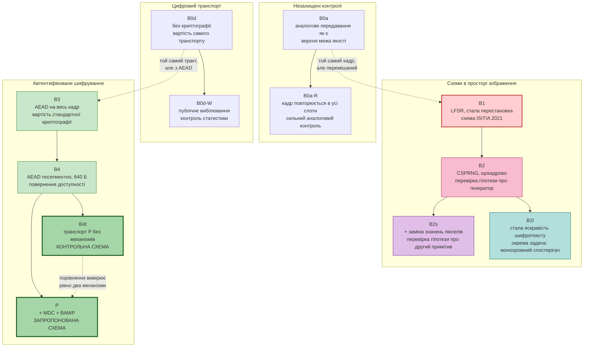

### 1.3 Умови коректності порівняння

Порівняння схем є коректним лише за виконання чотирьох умов. Кожну з них
забезпечено конструктивно, а не декларативно.

**Однаковий бюджет растру.** Усі схеми мають доступ до однакової кількості
слотів растру, однакової частоти й однакової геометрії. Схема, яка не заповнює
доступні слоти, не отримує переваги за рахунок незайнятого ресурсу; саме тому
існує `B0a-R`.

**Незалежність каналу від схеми.** Реалізація пошкоджень задається трійкою
«сцена, повторення, профіль каналу» і не залежить від того, яку схему
вимірюють. Дві схеми, що займають той самий часовий слот, зустрічають
**однакове** пошкодження. Без цієї умови парне порівняння не є парним.

**Облік усіх запланованих моментів показу.** Рядок результату записується для
кожного запланованого моменту показу, а не лише для успішних. Схема не може
покращити середнє тим, що не обробила складні сцени: такі моменти зараховуються
проти неї як відмова з названою причиною.

**Оголошена одиниця незалежності.** Інтервали обчислюються кластерним bootstrap
за сценами (10 000 перевибірок, фіксоване початкове значення генератора). Кадри,
повторення й реалізації каналу незалежними одиницями не є.

### 1.4 Класифікація за властивостями захисту

| Схема | Що передається каналом | Конфіденційність | Автентичність | Цілісність |
| --- | --- | --- | --- | --- |
| `B0a` | зображення | немає | немає | немає |
| `B0a-R` | зображення, тричі | немає | немає | немає |
| `B1` | перемішане зображення | **відновлюється атакою** | немає | немає |
| `B2` | перемішане зображення | слабка | немає | немає |
| `B2s` | перемішане й замінене | слабка | немає | немає |
| `B2l` | кольоровий кадр сталої яскравості | перцептивна, ключова кодова книга | немає | немає |
| `B0d` | цифровий потік | немає | немає | лише завадостійкий код |
| `B0d-W` | вибілений потік | немає, послідовність публічна | немає | лише завадостійкий код |
| `B3` | шифрований потік | AEAD | AEAD, на кадр | тег 128 біт |
| `B4` | шифрований потік | AEAD | AEAD, на одиницю | тег на кожну одиницю |
| `B4t` | шифрований потік | AEAD | AEAD, на одиницю | тег на кожну одиницю |
| `P` | шифрований потік | AEAD | AEAD, на одиницю | тег на кожну одиницю |

<p align="center">
  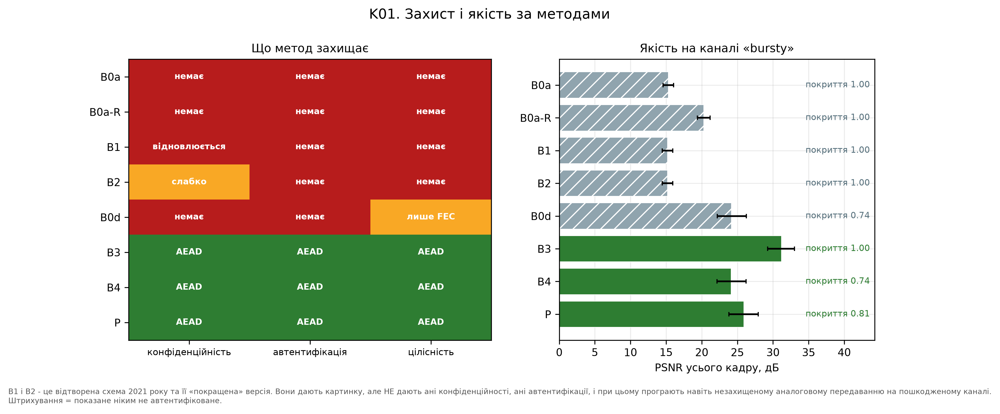
</p>

<sub><b>Рис. 1.</b> Ліворуч — властивості захисту, праворуч — якість у профілі
`bursty` з довірчими інтервалами. Штрихування позначає, що показане зображення
не є автентифікованим. Дані:
<a href="img/methods_protection_quality.csv">methods_protection_quality.csv</a>,
прогін <code>fe45d509310b99d4</code>, коміт <code>2553462</code>.</sub>

---

## 2. Аналогові схеми передавання зображення

### 2.1 B0a — передавання без обробки

**Призначення в дослідженні.** Встановлює верхню межу досяжної якості та нижню
межу захисту. Будь-яка схема, що обробляє кадр, порівнюється з цим значенням.

**Принцип дії.** Кадр перетворюється на растр модулятором без проміжної
обробки: значення яскравості пікселя стає рівнем сигналу у відповідній комірці
растру. Приймач виконує пошук синхронізації, оцінює підсилення та зміщення
тракту й відновлює масив пікселів зворотним перетворенням. Кодування джерела,
завадостійкого кодування та криптографії немає.

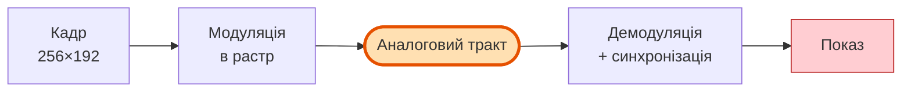

**Параметри.**

| Параметр | Значення |
| --- | --- |
| Слотів растру зайнято | 1 з 3 |
| Кодування джерела | відсутнє |
| Завадостійке кодування | відсутнє |
| Криптографія | відсутня |

**Результати вимірювань.**

| Показник | `clean` | `mild` | `moderate` | `bursty` | `harsh` |
| --- | ---: | ---: | ---: | ---: | ---: |
| Якість успішних передавань, дБ | 55,22 | 29,19 | 21,48 | 15,32 | 15,49 |
| Доступність | 1,000 | 1,000 | 1,000 | 1,000 | 0,950 |
| Частка працездатних моментів | 1,000 | 0,999 | 0,705 | 0,102 | 0,018 |
| Автентифіковане покриття | 1,000 | 1,000 | 1,000 | 1,000 | 1,000 |

**Аналіз.** Значення 55,22 дБ у профілі `clean` є верхньою межею для всього
дослідження: жодна схема не може перевищити якість передавання без обробки на
непошкодженому каналі. Деградація при погіршенні каналу монотонна й швидка: від
55,22 до 15,32 дБ.

Доступність дорівнює одиниці в чотирьох профілях із п'яти. Це значення не є
показником надійності: схема не виконує жодної перевірки й виводить пошкоджений
кадр як нормальний. Щойно застосовано робочий критерій (покриття ≥ 0,9 і
якість ≥ 20 дБ), частка працездатних моментів у профілі `bursty` становить
0,102. Розбіжність між доступністю 1,000 і працездатністю 0,102 є прямим
наслідком відсутності контролю якості на приймачі.

Значення автентифікованого покриття 1,000 означає лише факт виведення
зображення; перевіряти в цій схемі нічого.

**Що лишається нерозв'язаним.** Схема займає один слот растру з трьох. Оскільки
цифрові схеми займають усі три, пряме порівняння з ними приписало б їм перевагу
за рахунок незайнятого ресурсу.

### 2.2 B0a-R — передавання з повторенням кадру

**Призначення в дослідженні.** Сильний аналоговий контроль. Усуває нерівність
бюджету, виявлену під час аналізу `B0a` (дефект F15).

**Принцип дії.** Той самий кадр модулюється й передається в усіх доступних
слотах растру. Приймач отримує до трьох копій, спотворених **незалежними**
реалізаціями пошкоджень, і поєднує їх поелементно за медіаною. Медіана з трьох
значень стійка до одного викиду, тому пакетне пошкодження, що влучило в одну
копію, на результат не впливає.

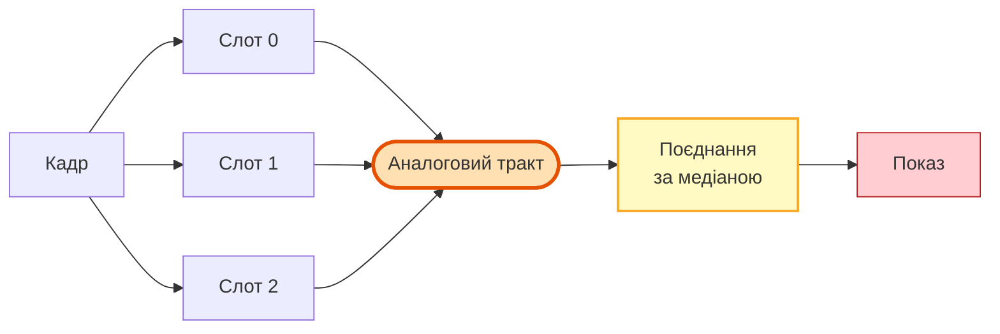

**Параметри.**

| Параметр | Значення |
| --- | --- |
| Слотів растру зайнято | 3 з 3 |
| Правило поєднання копій | медіана (`b0ar_combine`) |
| Криптографія | відсутня |

**Результати вимірювань.**

| Показник | `clean` | `mild` | `moderate` | `bursty` | `harsh` |
| --- | ---: | ---: | ---: | ---: | ---: |
| Якість успішних передавань, дБ | 55,22 | 29,53 | 23,93 | 20,28 | 18,62 |
| Доступність | 1,000 | 1,000 | 1,000 | 1,000 | 1,000 |
| Частка працездатних моментів | 1,000 | 1,000 | 0,856 | 0,531 | 0,333 |
| Автентифіковане покриття | 1,000 | 1,000 | 1,000 | 1,000 | 1,000 |

**Аналіз.** Приріст відносно `B0a` зростає з тяжкістю каналу: 0,00 дБ у
`clean`, 0,34 дБ у `mild`, 2,45 дБ у `moderate`, **4,96 дБ** у `bursty` і
**3,13 дБ** у `harsh`. Це узгоджується з механізмом: на непошкодженому каналі
три однакові копії не дають нової інформації, а зі зростанням щільності
пошкоджень медіанне поєднання усуває дедалі більшу частку викидів.

У профілі `harsh` частка працездатних моментів `B0a-R` становить 0,333 —
**найвище значення серед усіх десяти схем**, включно з усіма цифровими. При
цьому схема не забезпечує ані конфіденційності, ані автентичності.

**Методологічний наслідок.** Наявність `B0a-R` змінює тлумачення всіх подальших
результатів: цифрові схеми слід порівнювати не з `B0a`, а з цим контролем.
Порівняння з `B0a` завищувало б їхню перевагу.

---

## 3. Схеми, що діють у просторі зображення

### 3.1 B1 — реконструкція схеми ISITIA 2021

**Призначення в дослідженні.** Предмет відтворення. Схема реалізує принцип,
описаний у вихідній публікації, і є об'єктом криптоаналізу.

**Принцип дії.** Кадр ділиться на сітку 12×16, що дає 192 прямокутні блоки.
Блоки нумеруються рядково. Регістр зсуву з лінійним зворотним зв'язком породжує
послідовність станів, з якої тасуванням Фішера — Єйтса будується перестановка
192 елементів. Блок з індексом `π(b)` вихідного кадру записується на позицію `b`
переданого кадру. Перемішаний кадр модулюється в растр як звичайне зображення.
Приймач застосовує обернену перестановку.

Перестановка є бієкцією, тому за відсутності спотворень відновлення точне.
Значення пікселів при цьому не змінюються: перестановка переміщує блоки, але не
перетворює їхній вміст.

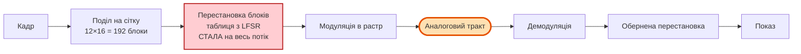

**Параметри.** Вихідна публікація не визначає більшості з них; кожне значення
нижче є параметром реконструкції й не приписується оригінальній роботі.

| Параметр | Значення | Джерело |
| --- | --- | --- |
| Сітка блоків | 12×16 = 192 | вихідна публікація |
| Початкові стани регістра в дослідах | 44257, 1234, 1111 | вихідна публікація |
| Розрядність регістра | 16 | **параметр реконструкції** |
| Поліном | `x^16 + x^15 + x^13 + x^4 + 1` | **параметр реконструкції** |
| Побудова таблиці | Фішер — Єйтс із вибірковим відхиленням | **параметр реконструкції** |
| Зміна таблиці між кадрами | відсутня, перестановка стала | **параметр реконструкції** |
| Простір початкових станів | 65 535 | наслідок вибору розрядності |

**Результати криптоаналізу.** П'ять атак, докладний опис у
[reconstruction_2021.md, частина 3](reconstruction_2021.md#частина-3-атаки).

| Атака | Знання нападника | Результат | Час |
| --- | --- | --- | ---: |
| Обраний кадр | обирає вхідний кадр | відновлення таблиці повністю, 1,000 | 0,0012 с |
| Відома пара | одна пара кадрів | відновлення таблиці повністю, 1,000 | 0,032 с |
| Перебір початкових станів | одна пара кадрів, параметри | заданий стан 44257 визначено | 5,14 с |
| Багатокадрова | лише шифротекст, ≥ 12 кадрів | половина таблиці, 0,5104 проти 0,0052 | 0,0035 с |
| Збирання за межами | **лише шифротекст, один кадр** | 94,94 % сусідств, 0,00 % абсолютних позицій | 0,084 с |

**Результати вимірювань якості.**

| Показник | `clean` | `mild` | `moderate` | `bursty` | `harsh` |
| --- | ---: | ---: | ---: | ---: | ---: |
| Якість успішних передавань, дБ | 55,22 | 28,19 | 20,70 | 15,21 | 15,02 |
| Доступність | 1,000 | 1,000 | 1,000 | 1,000 | 0,950 |
| Частка працездатних моментів | 1,000 | 0,999 | 0,628 | 0,095 | 0,006 |

**Аналіз.** У профілі `clean` значення збігається з `B0a` (55,22 дБ), що
підтверджує бієктивність перетворення: за відсутності спотворень перестановка
втрат не вносить.

У решті профілів `B1` дає **нижчу** якість за незахищене передавання: 28,19
проти 29,19 дБ у `mild`, 20,70 проти 21,48 у `moderate`, 15,21 проти 15,32 у
`bursty`. Причина полягає у взаємодії перестановки з геометричними
спотвореннями тракту. Приймач оцінює зсув растру з похибкою. Для `B0a` ця
похибка зміщує зображення цілком і локально зберігає його структуру. Для `B1`
та сама похибка зсуває межі блоків, після чого обернена перестановка розносить
спотворені крайові смуги по всьому кадру: локальна похибка перетворюється на
глобальну.

Отже, схема має дві вади одночасно: конфіденційності вона не забезпечує, а
якість порівняно з відсутністю обробки погіршує.

**Що лишається нерозв'язаним.** Природним поясненням слабкості є 16-бітний
регістр зі сталою перестановкою. Цю гіпотезу перевіряє наступна схема.

### 3.2 B2 — перестановка з криптографічним генератором

**Призначення в дослідженні.** Перевірка гіпотези про те, що слабкість `B1`
спричинена властивостями генератора.

**Принцип дії.** Геометрія перетворення тотожна `B1`: та сама сітка 12×16, той
самий рядковий обхід, та сама бієктивна перестановка блоків. Відрізняється лише
спосіб побудови таблиці. Замість регістра зсуву використано потоковий шифр
ChaCha20: ключ виводиться з майстер-секрету для сеансу, а контекст містить
ідентифікатор сеансу та номер кадру. Таблиця будується **заново для кожного
кадру**, а простір ключів становить `2^256` замість 65 535.

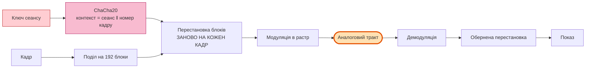

**Результати криптоаналізу.** Ті самі атаки, той самий вміст, та сама сітка.

| Атака | `B1` | `B2` | Зміна |
| --- | ---: | ---: | --- |
| Відома пара | 1,000 | 1,000 | **відсутня** |
| Збирання за межами, сусідства | 35,67 % | 35,67 % | **відсутня** |
| Збирання за межами, PSNR | 15,40 дБ | 15,40 дБ | **відсутня** |
| Багатокадрова | 0,5104 | 0,0000 | атаку усунено |
| Перебір ключа | 65 535, стан знайдено | `2^256`, не застосовний | атаку усунено |

Значення 0,0000 для багатокадрової атаки слід читати разом із рівнем
випадкового вгадування 0,0052: результат не просто гірший, він **нижчий за
випадковий**.

**Результати вимірювань якості.**

| Показник | `clean` | `mild` | `moderate` | `bursty` | `harsh` |
| --- | ---: | ---: | ---: | ---: | ---: |
| Якість успішних передавань, дБ | 55,22 | 28,18 | 20,62 | 15,20 | 14,96 |
| Доступність | 1,000 | 1,000 | 1,000 | 1,000 | 0,950 |
| Частка працездатних моментів | 1,000 | 0,999 | 0,617 | 0,092 | 0,005 |

**Аналіз.** Різниця якості `B1 − B2` за метрикою `psnr_full` у профілі `bursty`
становить **+0,003 дБ** за 95 % довірчого інтервалу [−0,016; +0,021]. Процедура
TOST підтверджує **еквівалентність у межах ±0,5 дБ**. Це очікуваний результат:
обидві схеми виконують перестановку 192 блоків, а властивості перестановки як
перетворення від способу її побудови не залежать.

Криптоаналітичний результат розділяє атаки на два класи. Атаки, що
використовують властивості **генератора** — перебір початкового стану та
дисперсійний відбиток за повторенням таблиці, — усунено повністю. Атаки, що
працюють із **самою перестановкою** — зіставлення плиток за відомою парою й
збирання за сумісністю меж, — дали тотожні значення: не близькі, а однакові до
другого знака.

**Висновок ланцюга.** Заміна генератора є необхідною й недостатньою. Слабкість
походить не з того, як будується таблиця, а з того, що захист зводиться до
переміщення незмінених блоків.

**Що лишається нерозв'язаним.** Якщо одного примітиву недостатньо, наступним
кроком є додавання другого примітиву іншого типу.

### 3.3 B2s — перестановка разом із заміною значень

**Призначення в дослідженні.** Перевірка гіпотези про те, що поєднання двох
класичних примітивів — перестановки та заміни — усуває виявлені вразливості.

Схема не входить до матриці спільного прогону: вона має власний стенд і власний
документ, [substitution_b2s.md](substitution_b2s.md). Тут наведено стислий
виклад.

**Принцип дії.** Перед перестановкою кожне значення яскравості `0…255`
замінюється за ключовою бієктивною таблицею розміром 16×16 = 256 записів.
Таблиця виводиться з ключа сеансу; залежно від режиму вона одна на сеанс, одна
на кадр або окрема для кожного з 192 блоків. У термінах Шеннона перестановка
забезпечує розсіювання, заміна — заплутування.

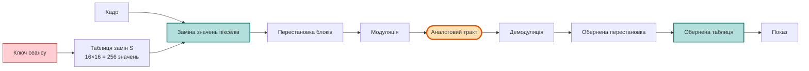

**Результати.**

| Показник | `B2` | `B2s` |
| --- | ---: | ---: |
| Збирання за межами, сусідства | 35,67 % | **0,28 %** |
| Відома пара з урахуванням заміни | 1,000 | **1,000** |
| Якість, профіль `clean` | 53,19 дБ | **14,49 дБ** |
| Якість, профіль `bursty` | 13,89 дБ | 9,59 дБ |

**Аналіз.** Безключову атаку усунено: частка правильних сусідств падає у 127
разів, до рівня випадкового розкладання. Проте атака за відомою парою
зберігається повністю. Причина в тому, що заміна є бієкцією на значеннях, отже
вона переставляє стовпчики гістограми плитки й **не змінює її впорядкованої
гістограми**. Зіставлення плиток за цим інваріантом відновлює перестановку за
45 мс у всіх режимах заміни.

Втрата якості має точну причину, виміряну окремо. Таблиця замін не зберігає
близькості значень: сусідні значення вона розкидає по всьому алфавіту. Похибка
амплітуди в один рівень після оберненої таблиці дає похибку в **85,08** рівня —
стільки ж, скільки дають дві незалежні рівномірні величини. Тому робочого
порогу 20 дБ схема не досягає в жодному профілі каналу, включно з найчистішим.

**Висновок ланцюга.** Заміна в просторі значень пікселів усуває безключову
атаку, але робить схему непридатною для аналогового тракту. Це вказує, що
заміну слід застосовувати до цифрового потоку під захистом завадостійкого коду,
а не до значень пікселів, тобто веде до схем розділу 5.

### 3.4 B2l — шифрування зі сталою яскравістю

**Призначення в дослідженні.** Схеми `B1`, `B2` і `B2s` приховують зображення
від того, хто бачить **увесь** сигнал. Ця схема відповідає на інше питання:
чи можна побудувати шифротекст так, щоб спостерігач, який бачить лише
**яскравість**, не отримав нічого взагалі — рівне сіре поле замість зображення.
Це обмеження на сам шифротекст, а не механізм заплутування.

Питання поставлено не всередині ланцюга `B1 → B2 → B2s`, а зовні: його
сформулював науковий керівник. Тому схема є відгалуженням, а не наступним
кроком, і має власний стенд та власний документ —
[luma_balance.md](luma_balance.md). Тут наведено виклад, узгоджений за складом
із рештою розділів каталогу.

> [!IMPORTANT]
> **Джерело числових результатів цього підрозділу.** Прогін `avsec luma-lab`,
> [`results/luma/`](../results/luma), run_id `ed61a8d81b2a58c2`, коміт
> `7fd685c`. Це **окремий стенд**: одна сцена, один кадр на профіль каналу,
> без повторень і без довірчих інтервалів. Числа цього підрозділу не належать
> до матриці спільного прогону й не порівнюються з таблицями розділу 6
> безпосередньо; порівняння з `B0a`, `B1` і `B2` наведено нижче тому, що ці
> схеми перепрогнано на тому самому стенді, у тих самих умовах.

**Принцип дії.** Яскравість за BT.601 визначається як
`Y = 0,299·R + 0,587·G + 0,114·B`. Схема фіксує її значення `L = 130` для
**кожного** пікселя шифротексту. Множина 8-бітних кольорів із цією яскравістю
містить 111 749 елементів, тобто 16,77 біта на піксель — це і є місткість
каналу, що лишається після накладеного обмеження.

Побудова кодової книги розділена так само, як в алгебраїчному S-блоці
([galois_sbox.md](galois_sbox.md)): **вибір** кодових слів публічний, **ключ**
стоїть там, де потрібна таємність.

1. З палітри рівномірно за її впорядкуванням вибирають `N` кодових слів. Крок
   вибору публічний, тому слова лишаються настільки віддаленими одне від
   одного, наскільки дозволяє палітра.
2. Ключова перестановка сеансу призначає значенням повідомлення `0…N−1` ці
   кодові слова. Саме це призначення є таємницею.
3. Приймач декодує **за найближчим кодовим словом**, а не точним пошуком у
   таблиці: аналоговий тракт змінює значення, тож побайтовий збіг зникає вже за
   найменшого шуму.

Монохромний шлях бере `N = 256` і є **бієкцією**: 8 бітів джерела вміщуються в
16,77 біта палітри, відновлення точне до біта. Кольоровий шлях потребує
`N = 2²⁴`, чого палітра не має, тому джерело зводиться до RGB 5-6-5 і
`N = 65 536`; 8 бітів із 24 втрачаються за побудовою, а не через реалізацію.

Аналоговий тракт цього проєкту монохромний, тому кольоровий шифротекст
передається **трьома площинами в трьох слотах растру** — тих самих, які `B0a-R`
витрачає на повторення кадру. Бюджет однаковий, але кожна площина зустрічає
**незалежну** реалізацію пошкодження.

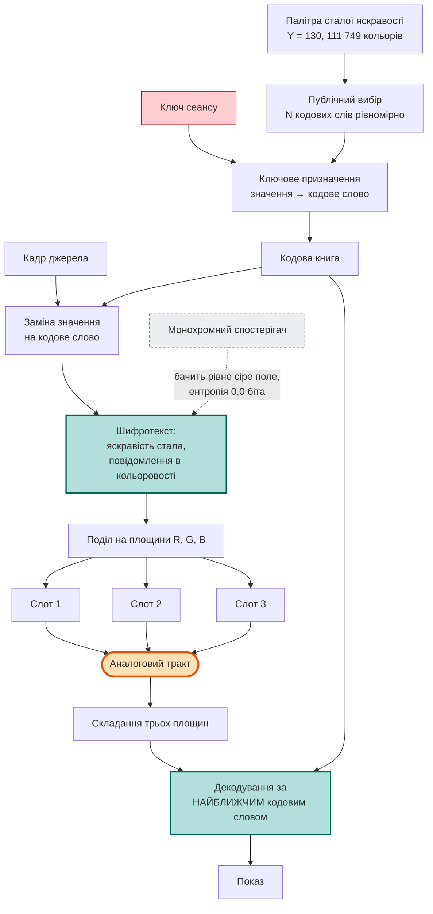

**Параметри.**

| Параметр | Значення |
| --- | --- |
| Рівень яскравості шифротексту `L` | 130 (обраний розгорткою за всіма 256 рівнями) |
| Місткість палітри | 111 749 кольорів = 16,77 біта на піксель |
| Кодових слів, монохромний шлях | 256, відновлення точне до біта |
| Кодових слів, кольоровий шлях | 65 536, джерело зведено до RGB 5-6-5 |
| Досліджені глибини джерела | 8, 7, 6, 5, 4, 3 біти |
| Декодер | найближче кодове слово в метриці RGB |
| Слотів растру | 3, по одній колірній площині на слот |
| Автентичність, цілісність | немає |

**Результати вимірювань.** Спершу властивості самого шифротексту.

| Показник | Значення |
| --- | ---: |
| Ентропія яскравості вихідного кадру | 6,8507 біта |
| Ентропія яскравості шифротексту | **0,0 біта** |
| Різних значень яскравості в шифротексті | **1** |
| Кореляція яскравості шифротексту з оригіналом | **0,0** |
| PSNR спроби розшифрувати з самої лише яскравості | 7,86 дБ |
| Монохромне відновлення без каналу | **точне до біта** |
| Кольорове відновлення без каналу, RGB 5-6-5 | 40,34 дБ (стільки ж дає саме квантування) |

Далі — прогін через аналоговий тракт, PSNR у децибелах. `B0a`, `B1` і `B2`
перепрогнано на цьому ж стенді, щоб порівняння було в однакових умовах.

| Схема | `clean` | `mild` | `moderate` | `bursty` | `harsh` |
| --- | ---: | ---: | ---: | ---: | ---: |
| `B0a` | 53,20 | 30,32 | 23,25 | 13,21 | 16,87 |
| `B1` | 53,20 | 29,60 | 23,03 | 12,95 | 16,66 |
| `B2` | 53,20 | 29,65 | 23,02 | 16,24 | 16,69 |
| `B2l`, 8 біт джерела | **точно** | 9,65 | 9,54 | 9,14 | 9,49 |
| `B2l`, 5 бітів джерела | **точно** | 12,93 | 12,14 | 10,36 | 10,37 |
| `B2l`, 3 біти джерела | **точно** | 20,35 | 17,34 | 10,85 | 12,58 |

<sub>Джерело: <a href="../results/luma/analog_tract.csv">analog_tract.csv</a>.
«Точно» означає нульову середньоквадратичну похибку, тобто нескінченний PSNR.</sub>

Третя таблиця називає причину відмови. До чистого каналу додано по одному
спотворенню профілю `mild`, кожне окремо.

| Додане спотворення | `B0a` | `B2l`, 8 біт | `B2l`, 5 бітів | `B2l`, 3 біти |
| --- | ---: | ---: | ---: | ---: |
| шум | 41,09 | 19,24 | **точно** | **точно** |
| зсув растру | 37,75 | 10,40 | 14,00 | **точно** |
| джитер рядків | 41,95 | 12,49 | 20,75 | 41,15 |
| фільтр нижніх частот | 32,28 | 9,68 | 11,04 | 24,52 |

<sub>Джерело: <a href="../results/luma/tract_ablation.csv">tract_ablation.csv</a>.</sub>

**Аналіз.** Результати розпадаються на три твердження, кожне з яких виміряне
окремо.

*Поставлену задачу розв'язано повністю.* Площина яскравості шифротексту містить
**рівно одне** значення, отже несе нуль бітів за означенням, а не «мало».
Монохромний спостерігач бачить рівне сіре поле незалежно від сюжету й від
ключа. На чистому каналі схема до того ж **точніша за незахищене передавання**:
`B2l` відновлює кадр побітово, тоді як `B0a`, `B1` і `B2` дають 53,20 дБ.
Причина в декодуванні за найближчим словом: воно усуває похибку округлення
носія, притягуючи прийняте значення до найближчої дозволеної точки.

*Стала яскравість приховує яскравість, а не структуру.* Це твердження
потребувало контролю, без якого вимірювання було б хибним: ключова кодова книга
сама є заміною, тому руйнує неперервність і в площинах кольоровості. Дослід
повторено з **упорядкованою** кодовою книгою, де значення `v` дістає `v`-й
колір публічного впорядкування. Безключова атака збирання за сумісністю меж
тоді дає 5,06 % і 8,43 % правильних сусідств у площинах `Cb` і `Cr` проти
1,69 % за ключової книги й 0,52 % випадкового рівня. Отже конфіденційність
забезпечує ключове призначення кольорів, а не обмеження на яскравість; саме
обмеження прибирає лише канал яскравості.

*У тракті цього проєкту схема непридатна, і причина не амплітудна.* Робочого
порогу 20 дБ вона не долає в жодному профілі, крім одного випадку — 3 біти
джерела в `mild`, 20,35 дБ. Прогноз за відстанню між кодовими словами
передбачав протилежне: за 3 бітів межа безпомилковості становить 46,37 рівня
проти виміряної похибки тракту 7,77 рівня в `mild`. Прогноз не справдився, і
розклад профілю за спотвореннями показує чому. Шум, зсув растру й джитер рядків
зменшенням глибини джерела долаються; **фільтр нижніх частот не долається
жодною глибиною** — 9,68 дБ для 8 бітів і 24,52 дБ для 3 бітів. Механізм
відмінності виміряно окремо: спотворення, які *переміщують* точку, компенсуються
більшою відстанню між кодовими словами, а фільтр *змішує* сусідні кодові слова,
і середнє двох із них є законною точкою палітри, що належить третьому,
неспорідненому значенню. Розгорнутий виклад — у
[luma_balance.md, розділ 8.8](luma_balance.md#88-чому-спотворення-діють-саме-так).

**Що лишається нерозв'язаним.** Схема не дає ні автентичності, ні цілісності:
підміна шифротексту не виявляється. Відома пара кадрів відновлює кодову книгу
так само, як відома пара відновлює таблицю замін у `B2s`, тому приховування є
перцептивним, а не криптографічною гарантією. Кольорове джерело схема передає
з втратою 8 бітів із 24 — це наслідок місткості палітри й реалізацією не
усувається.

**Висновок ланцюга.** Обмеження на шифротекст розв'язує рівно ту задачу, яку
поставлено: прибирає канал яскравості цілком. Воно не замінює перестановки й
заміни, а доповнює їх, і доречне там, де істотно, щоб саме **монохромний**
спостерігач не бачив нічого — чорно-білий сенсор, фотографія екрана,
паралельний монохромний канал. Для тракту, змодельованого в цьому дослідженні,
схема непридатна за незалежною від криптографії причиною: канал переносить лише
яскравість, а яскравість цього шифротексту несе нуль бітів.

---

## 4. Цифровий транспорт без криптографічного захисту

### 4.1 B0d — цифровий тракт без шифрування

**Призначення в дослідженні.** Відокремлює вартість цифрового транспорту від
вартості криптографії. Без цієї схеми втрати, спричинені стисненням і
накладними витратами кадрування, помилково приписувалися б шифруванню.

**Принцип дії.** Кадр ділиться на горизонтальні смуги, кожна смуга кодується
дискретним косинусним перетворенням із квантуванням. Отриманий сегмент
розміщується в транспортній одиниці разом із заголовком. Одиниця захищається
кодом Ріда — Соломона над GF(256), символи розкладаються перемежувачем і
модулюються в комірки растру. Приймач виконує зворотну послідовність: пошук
синхронізації, демодуляція зі стиранням, обернене перемежування, декодування
коду, розбір заголовка, збирання кадру.

Криптографічних перетворень немає. Цілісність забезпечує лише завадостійкий
код, і ця цілісність **не є криптографічною**: навмисна підміна, узгоджена з
кодом, не виявляється.

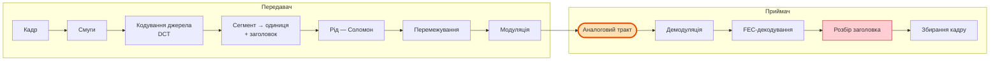

**Параметри.**

| Параметр | Значення |
| --- | --- |
| Висота смуги | 24 рядки |
| Кодек | DCT, якість 12 |
| Корисні дані одиниці | 640 Б |
| Довжина одиниці в каналі | 1288 Б |
| Одиниць на растр | 4 |
| Корисна швидкість | 0,512 Мбіт/с |
| Перемежувач | блочний, глибина 278 |

**Результати вимірювань.**

| Показник | `clean` | `mild` | `moderate` | `bursty` | `harsh` |
| --- | ---: | ---: | ---: | ---: | ---: |
| Якість успішних передавань, дБ | 31,54 | 31,54 | 28,74 | 24,17 | не визначено |
| Доступність | 0,950 | 0,950 | 0,946 | 0,881 | 0,000 |
| Частка працездатних моментів | 0,950 | 0,950 | 0,711 | 0,406 | 0,000 |
| Автентифіковане покриття | 1,000 | 1,000 | 0,907 | 0,744 | — |

**Аналіз.** Цифровий транспорт обмежує якість зверху значенням 31,54 дБ проти
55,22 дБ у `B0a`. Різниця в 23,68 дБ є вартістю стиснення й від стану каналу не
залежить.

Натомість характер деградації якісно інший. Значення в `clean` і `mild`
збігаються з точністю до другого знака, тобто завадостійкий код повністю
компенсує помірні спотворення. Далі якість спадає до 24,17 дБ у `bursty`.
Порівняння з `B0a` у тому самому профілі (15,32 дБ) дає перевагу 8,85 дБ,
порівняння з `B0a-R` (20,28 дБ) — перевагу 3,89 дБ. Друге число є коректною
оцінкою, бо обидві схеми витрачають однаковий бюджет.

У профілі `harsh` доступність дорівнює нулю: приймач не знаходить
синхронізації, тому жодного кадру не доставлено й умовна якість не визначена.
Це не властивість криптографії — `B0d` криптографії не має.

Значення `capacity: 80` у переліку відмов означає, що для вісімдесяти моментів
показу закодований кадр не вмістився у виділений растр. Це властивість обраного
профілю кодування, а не каналу: той самий тип відмови присутній і в профілі
`clean`.

### 4.2 B0d-W — цифровий тракт із публічним вибілюванням

**Призначення в дослідженні.** Відокремлює вирівнювання статистики потоку від
власне шифрування. Без цієї схеми різницю між `B0d` і захищеними схемами можна
було б помилково пояснити зміною статистичних властивостей сигналу.

**Принцип дії.** Тракт тотожний `B0d`. Відмінність полягає в тому, що перед
модуляцією дані додаються за модулем 2 з псевдовипадковою послідовністю, яка є
**публічною**: вона не залежить від жодного ключа й може бути відтворена
будь-ким. Результат має статистичні властивості, близькі до рівномірних, але
конфіденційності не забезпечує: зловмисник відтворює послідовність і знімає
вибілювання.

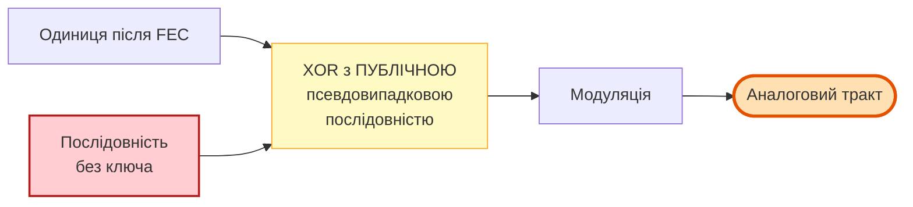

> [!WARNING]
> **Схема не входить до опублікованого прогону.** Її реалізовано, і вона
> доступна через конфігурацію, проте перелік методів прогону `results/main`
> містить дев'ять схем без `B0d-W`. Числових результатів для неї не існує, і
> наводити їх у цьому документі не можна. Для отримання результатів необхідно
> додати `B0d-W` до параметра `methods` у конфігурації та перезапустити
> матрицю.

**Аналіз.** Схема має методологічне призначення й кандидатом на застосування не
є. Вона фіксує розрізнення, яке легко втратити: рівномірний розподіл значень у
каналі є **наслідком** шифрування, але не є його **ознакою**. Публічне
вибілювання дає перше й не дає другого. Те саме застереження стосується
показників, що вимірюють лише розподіл, — кореляції, ентропії, NPCR і UACI.

---

## 5. Схеми з автентифікованим шифруванням

### 5.1 Спільний криптографічний профіль

Три схеми цього розділу мають тотожний криптографічний профіль; відрізняються
вони лише гранулярністю захисту та параметрами транспорту.

| Складова | Реалізація |
| --- | --- |
| Шифрування з автентифікацією | ChaCha20-Poly1305, RFC 8439 |
| Виведення ключів | HKDF-SHA256 від майстер-секрету; контекст містить ідентифікатор сеансу, епоху, потік і напрям |
| Nonce | префікс 4 Б із виведення ключа, далі лічильник 8 Б |
| Лічильник | монотонний, резервується наперед у довговічному стані |
| Асоційовані дані | поля заголовка, 52 Б із 56 |
| Свіжість | лічильник у межах автентифікованого контексту |
| Тег цілісності | 128 біт |

Пройдено **35 із 35** протокольних перевірок: повтор прийнятої одиниці,
змінений шифротекст, змінений тег, урізаний шифротекст, підміна кожного
автентифікованого поля заголовка окремо. Поле, мутація якого не змінює
результату перевірки, зараховується як **провал**, а не як пропуск.

Докладний опис — [protocol.md](protocol.md).

### 5.2 B3 — автентифіковане шифрування кадру

**Призначення в дослідженні.** Встановлює вартість переходу від перестановки до
стандартної криптографії за найпростішої гранулярності.

**Принцип дії.** Кадр кодується джерельним кодеком і розміщується в **одній**
транспортній одиниці. Ця одиниця шифрується та автентифікується цілком. Приймач
перевіряє тег; за розбіжності відкидається весь кадр, оскільки часткова
перевірка автентичності неможлива за побудовою. Поведінка визначається правилом
«все або нічого».

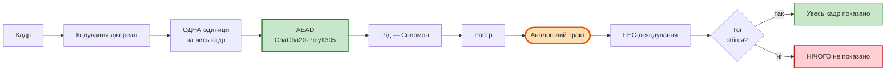

**Параметри.** Збігаються з `B0d`: одиниця 640 Б, довжина в каналі 1288 Б,
чотири одиниці на растр, корисна швидкість 0,512 Мбіт/с. Відмінність полягає в
тому, що кадр становить одну логічну одиницю захисту.

**Результати вимірювань.**

| Показник | `clean` | `mild` | `moderate` | `bursty` | `harsh` |
| --- | ---: | ---: | ---: | ---: | ---: |
| Якість успішних передавань, дБ | 31,18 | 31,18 | 31,19 | 31,18 | не визначено |
| Доступність | 1,000 | 1,000 | 0,795 | 0,627 | 0,000 |
| Частка працездатних моментів | 1,000 | 1,000 | 0,795 | 0,627 | 0,000 |
| Автентифіковане покриття | 1,000 | 1,000 | 1,000 | 1,000 | — |

**Аналіз.** Якість практично не залежить від профілю каналу: 31,18 дБ у `clean`
і 31,18 дБ у `bursty`. Це не є показником стійкості. Величина є **умовною** —
вона усереднюється лише за успішними передаваннями, а правило «все або нічого»
гарантує, що успішно передане є неспотвореним. Уся дія каналу переноситься з
показника якості на показник доступності, яка спадає з 1,000 до 0,627.

Автентифіковане покриття дорівнює 1,000 у всіх профілях і, на відміну від
незахищених схем, тут це змістовне значення: показані пікселі справді пройшли
перевірку тегом.

Порівняння з `B1` у профілі `bursty` є показовим. `B1` має доступність 1,000
проти 0,627 у `B3`, але частку працездатних моментів 0,095 проти 0,627.
Розбіжність пояснюється тим, що `B1` не перевіряє нічого й зараховує собі показ
пошкодженого кадру.

**Що лишається нерозв'язаним.** Гранулярність «одна одиниця на кадр» означає,
що одне пакетне пошкодження знищує кадр повністю.

### 5.3 B4 — автентифіковане шифрування посегментно

**Призначення в дослідженні.** Відновлення доступності, втраченої в `B3`, без
відмови від автентичності.

**Принцип дії.** Кадр ділиться на смуги, смуги — на сегменти. Сегмент є
атомарною одиницею джерельного кодування: він кодується самостійно, без
спільного стану й без залежності від інших сегментів або від попереднього
кадру. Кожен сегмент розміщується в окремій транспортній одиниці з власним
заголовком, власним nonce і власним тегом автентичності.

Приймач перевіряє кожну одиницю незалежно. Одиниця, що не пройшла перевірку,
втрачається сама; решта кадру показується, а втрачені ділянки позначаються в
карті доступності й не зараховуються як отримані дані.

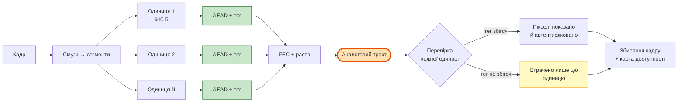

**Параметри.**

| Параметр | Значення |
| --- | --- |
| Висота смуги | 24 рядки |
| Кодек | DCT, якість 12 |
| Описів | 1 |
| Корисні дані одиниці | 640 Б |
| Довжина одиниці в каналі | 1288 Б |
| Парність коду для корисних даних | 96 символів |
| Парність коду для заголовка | 48 символів |
| Одиниць на растр | 4 |
| Корисна швидкість | 0,512 Мбіт/с |
| Перемежувач | блочний, глибина 278 |

**Результати вимірювань.**

| Показник | `clean` | `mild` | `moderate` | `bursty` | `harsh` |
| --- | ---: | ---: | ---: | ---: | ---: |
| Якість успішних передавань, дБ | 31,54 | 31,54 | 27,86 | 24,14 | не визначено |
| Доступність | 0,950 | 0,950 | 0,936 | 0,879 | 0,000 |
| Частка працездатних моментів | 0,950 | 0,950 | 0,654 | 0,404 | 0,000 |
| Автентифіковане покриття | 1,000 | 1,000 | 0,875 | 0,742 | — |

**Аналіз.** Доступність у профілі `bursty` зросла з 0,627 у `B3` до 0,879 —
приріст 0,252. Механізм прямий: пошкодження, що раніше знищувало кадр цілком,
тепер знищує окремі одиниці.

Умовна якість при цьому знизилася. Різниця `B3 − B4` становить **+7,40 дБ** за
95 % довірчого інтервалу [+6,28; +8,53]. Ця різниця не свідчить про перевагу
`B3`: показники вимірюють різне. `B3` виводить кадр рідше, але завжди цілим;
`B4` виводить частіше, включно з кадрами, у яких частину одиниць втрачено, і ці
кадри знижують середнє. Автентифіковане покриття `B4` у `bursty` становить
0,742, тобто чверть пікселів не була отримана.

Сегментація вносить новий клас відмов — `capacity`, 80 випадків: закодований
кадр не вміщується у виділений растр через накладні витрати на заголовок і тег
кожної одиниці.

### 5.4 B4t — переналаштована контрольна схема

**Призначення в дослідженні.** Відокремлення внеску параметрів транспорту від
внеску запропонованих механізмів. Схема введена після виявлення методологічної
помилки в порівнянні (дефект R08).

**Суть виявленої помилки.** Запропонована схема `P` порівнювалася з `B4` і
показувала перевагу. Проте `P` відрізняється від `B4` не лише двома
запропонованими механізмами, а й трьома параметрами транспорту: меншим розміром
одиниці, сильнішим завадостійким кодом і нижчою якістю джерельного кодування.
Ці параметри не є частиною пропозиції — вони були доступні й для `B4`. Отже,
різниця `P − B4` є сумою двох внесків, і приписувати її механізмам не можна.

**Принцип дії.** Схема тотожна `B4` за будовою й тотожна `P` за параметрами
транспорту. Відмінностей від `P` рівно дві, і це саме ті дві речі, які пропонує
робота: кількість описів дорівнює одиниці (множинного опису немає), розміщення
одиниць у растрі блочне (розміщення з урахуванням пакетів немає).

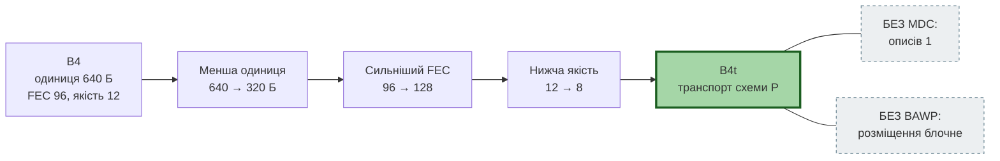

**Параметри.**

| Параметр | `B4` | `B4t` | Зміна |
| --- | --- | --- | --- |
| Корисні дані одиниці | 640 Б | 320 Б | зменшено вдвічі |
| Парність коду | 96 | 128 | посилено |
| Якість джерельного кодування | 12 | 8 | знижено |
| Довжина одиниці в каналі | 1288 Б | 872 Б | — |
| Одиниць на растр | 4 | 6 | — |
| Корисна швидкість | 0,512 Мбіт/с | 0,384 Мбіт/с | втрата чверті |
| Описів | 1 | 1 | без змін |
| Перемежувач | блочний, 278 | блочний, 278 | без змін |

**Результати вимірювань.**

| Показник | `clean` | `mild` | `moderate` | `bursty` | `harsh` |
| --- | ---: | ---: | ---: | ---: | ---: |
| Якість успішних передавань, дБ | 29,62 | 29,62 | 29,10 | 26,81 | не визначено |
| Доступність | 0,950 | 0,950 | 0,949 | 0,939 | 0,000 |
| Частка працездатних моментів | 0,934 | 0,934 | 0,880 | 0,632 | 0,000 |
| Автентифіковане покриття | 1,000 | 1,000 | 0,979 | 0,881 | — |

**Аналіз.** Різниця `B4t − B4` у профілі `bursty` становить **+2,67 дБ** за
95 % довірчого інтервалу [+1,84; +3,58], `p` після поправки Holm дорівнює
0,0005. Вартість визначена точно: корисна швидкість знизилася з 0,512 до
0,384 Мбіт/с, тобто втрачено чверть смуги.

Приріст пояснюється двома узгодженими змінами. Менша одиниця означає, що пакетне
пошкодження знищує вдвічі меншу частку кадру. Сильніший завадостійкий код
означає, що більша частка пошкоджених одиниць виправляється до перевірки тегу.
Обидві зміни зменшують кількість одиниць, які перевірку не пройшли, що
підтверджується автентифікованим покриттям: 0,881 проти 0,742 у `B4`.

Частка працездатних моментів у `bursty` дорівнює 0,632 — **найвище значення
серед усіх цифрових схем** у цьому профілі.

### 5.5 P — запропонована схема

**Призначення в дослідженні.** Предмет заявки на новизну. Схема додає до `B4t`
два механізми, розроблені для протидії пакетним пошкодженням.

**Механізм 1: множинний опис.** Смуга кадру кодується не в один потік, а у два
описи, які є регулярними поліфазними підрешітками: перший опис містить стовпці
з парними індексами, другий — з непарними. Кожен опис самостійно відновлює
грубу версію смуги з половинною роздільністю по горизонталі; два описи разом
дають повну вибірку. Задум полягає в тому, що пакетне пошкодження, яке знищить
одиниці одного опису, залишить смугу відновлюваною з другого. Пропущені відліки
добудовуються детерміновано й завжди позначаються в карті доступності.

**Механізм 2: розміщення з урахуванням пакетів.** Растр ділиться на смуги, і
одиниця опису `d` спрямовується у смугу `d mod G`, де `G` залежить від
кількості описів і розрахункової довжини пакета. Усередині смуги символи
розкладаються за правилом, що розносить послідовні символи одного кодового
слова по різних рядках.

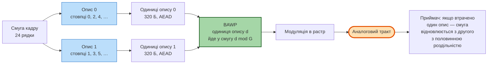

Докладний опис обох механізмів, включно з точними формулами розміщення й
умовами, за яких гарантії виконуються, —
[reconstruction_2021.md §4.5](reconstruction_2021.md#45-будова-запропонованої-схеми-p).

**Параметри.** Збігаються з `B4t`, крім двох: кількість описів дорівнює двом,
перемежувач — BAWP із розрахунковою довжиною пакета 8 рядків.

**Результати вимірювань.**

| Показник | `clean` | `mild` | `moderate` | `bursty` | `harsh` |
| --- | ---: | ---: | ---: | ---: | ---: |
| Якість успішних передавань, дБ | 28,32 | 28,32 | 27,86 | 25,91 | не визначено |
| Доступність | 0,900 | 0,900 | 0,900 | 0,898 | 0,000 |
| Частка працездатних моментів | 0,859 | 0,859 | 0,698 | 0,318 | 0,000 |
| Автентифіковане покриття | 1,000 | 1,000 | 0,956 | 0,809 | — |

**Попередньо зареєстровані порівняння, профіль `bursty`.**

| Порівняння | Різниця, дБ | 95 % CI | `p` після Holm | Висновок |
| --- | ---: | --- | ---: | --- |
| `P − B4` | +1,50 | [+0,65; +2,44] | 0,0030 | перевага `P`, значуще |
| `B4t − B4` | +2,67 | [+1,84; +3,58] | 0,0005 | перевага `B4t`, значуще |
| `B4t − P` | +1,19 | [+0,80; +1,64] | 0,0005 | **перевага `B4t`, значуще** |

**Розклад джерел переваги.** Експеримент E13 послідовно застосовує зміни від
`B4` до `P`, змінюючи рівно одну річ на крок.

| Джерело приросту | дБ |
| --- | ---: |
| Зміни параметрів транспорту | **+4,18** |
| Механізми множинного опису та розміщення | **−1,00** |

**Аналіз.** Перший рядок таблиці порівнянь відтворює початковий результат: `P`
перевершує `B4` на 1,50 дБ. Третій рядок показує, що цей приріст породжений не
механізмами: контрольна схема з тими самими параметрами транспорту, але без
механізмів, перевершує `P` на 1,19 дБ. Розклад E13 дає узгоджену оцінку:
параметри транспорту дають +4,18 дБ, механізми віднімають 1,00 дБ.

Причина від'ємного внеску визначена. Два описи подвоюють кількість одиниць на
ту саму смугу, тому частота відмов за місткістю зростає вдвічі: 160 випадків у
`P` проти 80 у `B4t`. Доступність відповідно нижча: 0,898 проти 0,939.

Додатково встановлено **недопустимість зворотної послідовності модифікацій**.
Якщо додавати множинний опис і розміщення до `B4` **до** зменшення розміру
одиниці, вони не вміщуються в бюджет растру. Отже, запропоновані механізми не є
самостійним доповненням до базової схеми: вони застосовні лише після тих змін
транспорту, які й дають увесь виміряний приріст. Це твердження сильніше за саму
різницю чисел, оскільки воно не залежить від величини ефекту.

**Висновок.** Основний результат дослідження є негативним: у перевіреному
бюджеті, для перевірених реалізацій обох механізмів і для перевіреної моделі
пошкоджень контрольна схема `B4t` перевершує запропоновану `P`. Результат
обмежений цими умовами й не доводить, що множинний опис або розміщення з
урахуванням пакетів не можуть бути корисними за інших умов.

---

## 6. Зведені результати вимірювань

> [!NOTE]
> **Склад таблиць цього розділу.** Наведено десять схем спільного прогону
> `avsec research`. Схеми `B2s` ([3.3](#33-b2s--перестановка-разом-із-заміною-значень))
> і `B2l` ([3.4](#34-b2l--шифрування-зі-сталою-яскравістю)) сюди не входять:
> вони вимірювалися на власних стендах, на одній сцені й без довірчих
> інтервалів. Їхні числа наведено у відповідних підрозділах разом із джерелом
> і **не є** співставними з рядками цих таблиць.

### 6.1 Якість успішних передавань

Метрика `psnr_full`, дБ. Прочерк означає, що в цьому профілі схема не доставила
жодного кадру, тому умовна якість не визначена.

| Схема | `clean` | `mild` | `moderate` | `bursty` | `harsh` |
| --- | ---: | ---: | ---: | ---: | ---: |
| `B0a` | 55,22 | 29,19 | 21,48 | 15,32 | 15,49 |
| `B0a-R` | 55,22 | 29,53 | 23,93 | 20,28 | 18,62 |
| `B1` | 55,22 | 28,19 | 20,70 | 15,21 | 15,02 |
| `B2` | 55,22 | 28,18 | 20,62 | 15,20 | 14,96 |
| `B0d` | 31,54 | 31,54 | 28,74 | 24,17 | — |
| `B3` | 31,18 | 31,18 | 31,19 | 31,18 | — |
| `B4` | 31,54 | 31,54 | 27,86 | 24,14 | — |
| `B4t` | 29,62 | 29,62 | 29,10 | 26,81 | — |
| `P` | 28,32 | 28,32 | 27,86 | 25,91 | — |

### 6.2 Доступність і працездатність

Перше число — доступність, друге — частка моментів показу, що задовольняють
робочий критерій: покриття ≥ 0,9 і якість ≥ 20 дБ.

| Схема | `clean` | `mild` | `moderate` | `bursty` | `harsh` |
| --- | --- | --- | --- | --- | --- |
| `B0a` | 1,000 / 1,000 | 1,000 / 0,999 | 1,000 / 0,705 | 1,000 / 0,102 | 0,950 / 0,018 |
| `B0a-R` | 1,000 / 1,000 | 1,000 / 1,000 | 1,000 / 0,856 | 1,000 / 0,531 | 1,000 / 0,333 |
| `B1` | 1,000 / 1,000 | 1,000 / 0,999 | 1,000 / 0,628 | 1,000 / 0,095 | 0,950 / 0,006 |
| `B2` | 1,000 / 1,000 | 1,000 / 0,999 | 1,000 / 0,617 | 1,000 / 0,092 | 0,950 / 0,005 |
| `B0d` | 0,950 / 0,950 | 0,950 / 0,950 | 0,946 / 0,711 | 0,881 / 0,406 | 0,000 / 0,000 |
| `B3` | 1,000 / 1,000 | 1,000 / 1,000 | 0,795 / 0,795 | 0,627 / 0,627 | 0,000 / 0,000 |
| `B4` | 0,950 / 0,950 | 0,950 / 0,950 | 0,936 / 0,654 | 0,879 / 0,404 | 0,000 / 0,000 |
| `B4t` | 0,950 / 0,934 | 0,950 / 0,934 | 0,949 / 0,880 | 0,939 / 0,632 | 0,000 / 0,000 |
| `P` | 0,900 / 0,859 | 0,900 / 0,859 | 0,900 / 0,698 | 0,898 / 0,318 | 0,000 / 0,000 |

### 6.3 Автентифіковане покриття

Частка пікселів кадру, отриманих з одиниць, які пройшли перевірку AEAD.

| Схема | `clean` | `mild` | `moderate` | `bursty` |
| --- | ---: | ---: | ---: | ---: |
| `B0a`, `B0a-R`, `B1`, `B2` | 1,000 | 1,000 | 1,000 | 1,000 |
| `B0d` | 1,000 | 1,000 | 0,907 | 0,744 |
| `B3` | 1,000 | 1,000 | 1,000 | 1,000 |
| `B4` | 1,000 | 1,000 | 0,875 | 0,742 |
| `B4t` | 1,000 | 1,000 | 0,979 | 0,881 |
| `P` | 1,000 | 1,000 | 0,956 | 0,809 |

> [!WARNING]
> Для `B0a`, `B0a-R`, `B1`, `B2` і `B0d` значення 1,000 означає **лише факт
> виведення зображення**, а не результат перевірки. Ці схеми механізму
> перевірки не мають. Зіставляти їхнє покриття з покриттям автентифікованих
> схем як однорідні величини не можна.

### 6.4 Бюджет каналу

| Схема | Одиниця | У каналі | Одиниць/растр | Мбіт/с | Ефективність | Затримка |
| --- | ---: | ---: | ---: | ---: | ---: | ---: |
| `B0d`, `B3`, `B4` | 640 Б | 1288 Б | 4 | 0,512 | 0,485 | 159 мс |
| `B4t`, `P` | 320 Б | 872 Б | 6 | 0,384 | 0,364 | 159 мс |

<sub>Джерело: <a href="../results/main/budgets.csv">results/main/budgets.csv</a>.
Валова швидкість у растрі однакова для всіх схем — 1,0564 Мбіт/с. Аналогові
схеми бюджету транспортних одиниць не мають: вони передають зображення
безпосередньо растром.</sub>

### 6.5 Попарні різниці якості

Профіль `bursty`, метрика `psnr_full`, одиниця незалежності — сцена.

| Порівняння | Різниця, дБ | 95 % CI | `p` після Holm | Тлумачення |
| --- | ---: | --- | ---: | --- |
| `B1 − B2` | +0,003 | [−0,016; +0,021] | — | еквівалентність у межах ±0,5 дБ показана |
| `B3 − B4` | +7,40 | [+6,28; +8,53] | — | різні показники, див. [5.3](#53-b4--автентифіковане-шифрування-посегментно) |
| `B4t − B4` | +2,67 | [+1,84; +3,58] | 0,0005 | внесок параметрів транспорту |
| `P − B4` | +1,50 | [+0,65; +2,44] | 0,0030 | попередньо зареєстроване порівняння |
| `B4t − P` | +1,19 | [+0,80; +1,64] | 0,0005 | внесок механізмів, від'ємний |

---

## 7. Методологічні застереження до таблиць

**Умовність метрики `psnr_full`.** Величина усереднюється лише за успішними
передаваннями. Схема, яка відмовляється від складних кадрів, отримує вище
значення. Тому доступність і частка працездатних моментів наводяться поруч і не
об'єднуються з якістю в єдиний показник.

**Неприпустимість усереднення профілів каналу.** Профілі `clean`, `mild`,
`moderate`, `bursty`, `harsh` є різними умовами, а не повторними реалізаціями
однієї. Об'єднаний показник існує лише за наперед заданих ваг і в цьому
дослідженні не використовується.

**Порожні клітинки в профілі `harsh`.** Для цифрових схем доступність у цьому
профілі дорівнює нулю: приймач не знаходить синхронізації. Відсутність оцінки
не є перевагою жодної зі схем і не свідчить про властивості криптографії:
`B0d`, яка криптографії не має, показує той самий результат.

**Тлумачення автентифікованого покриття.** Див. застереження в
[6.3](#63-автентифіковане-покриття).

**Склад набору даних.** Прогін виконано на процедурно згенерованому наборі.
Результати на природних знімках і на вирізках аерофотографії наведено окремо, у
[results.md](results.md).

**Відсутність значущості не є доказом рівності.** Там, де довірчий інтервал
містить нуль, окремо обчислюється TOST із межею ±0,5 дБ. Рівність вважається
показаною лише за позитивного результату цієї процедури — як для пари `B1` і
`B2`.

Повний перелік обмежень дослідження — [limitations.md](limitations.md).

---

## 8. Порядок відтворення

```bash
run.bat research
```

Повний прогін: матриця схем × профілів каналу, статистична обробка, бюджети,
розклад E13. Тривалість — години. Результат записується в
[`results/main/`](../results/main).

```bash
python -m avsec.cli verify --input results/main
```

Перерахунок опублікованих числових результатів із таблиць прогону.

```bash
run.bat subst-lab
```

Стенд схеми `B2s`, яка не входить до матриці; опис —
[substitution_b2s.md](substitution_b2s.md).

```bash
run.bat luma-lab
```

Стенд схеми `B2l`, яка теж не входить до матриці: місткість палітри, обидва
шляхи, атаки за площинами з контролем, розклад механізму відмови, прогін через
аналоговий тракт; опис — [luma_balance.md](luma_balance.md).

```bash
python -m avsec.cli demo --config configs/research_main.yaml
```

Один кадр крізь кожну налаштовану схему. Найшвидший спосіб спостерегти різницю
на зображенні.
