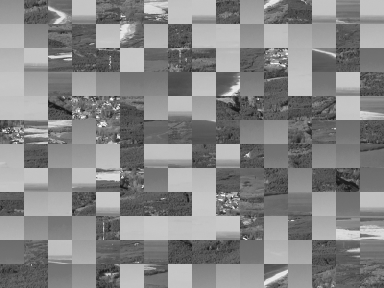
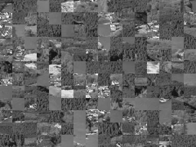
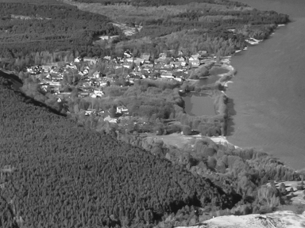
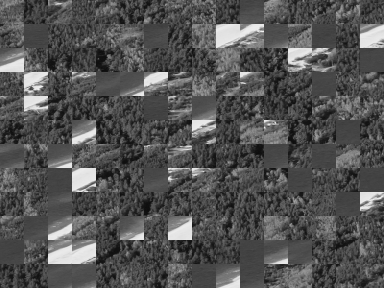
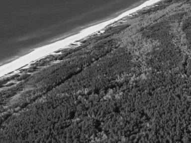
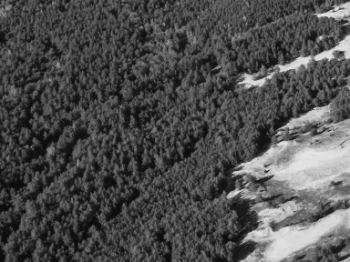
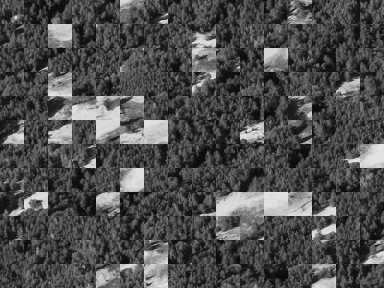
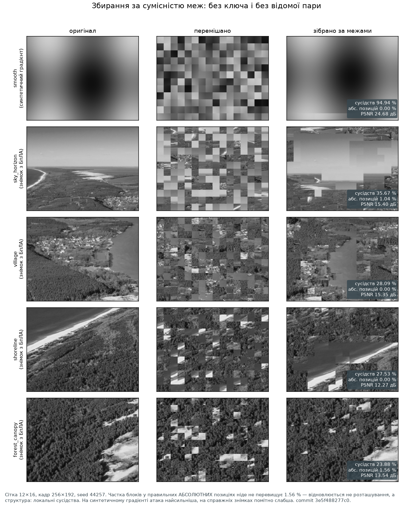

# Завдання ISITIA 2021: відтворення, межі, вдосконалення

<!-- DOCNAV -->
> **Призначення документа.** Повна відповідь на завдання одним документом: відтворити схему захисту відеоканалу БпЛА зі статті ISITIA 2021, повторити її на справжніх знімках, показати межі й запропонувати вдосконалення.
>
> **Цільовий читач.** Читач, який працює з документом окремо від решти репозиторію. Для кожного числового результату наведено прогін, коміт і команду для його перерахунку.
>
> **Пов'язані документи:** [місце серед інших робіт](related_work.md) · [чому перестановки недостатньо](threat_model.md) · [реєстр тверджень](claims.md) · [таблиці результатів](results.md) · [README](../README.md)
<!-- /DOCNAV -->

<!-- TOC -->
<details>
<summary><b>Зміст</b></summary>

- [0. Призначення та структура документа](#0-призначення-та-структура-документа)
  - [Команда відтворення](#команда-відтворення)
  - [Джерела числових результатів](#джерела-числових-результатів)
- [Частина 1. Відтворення](#частина-1-відтворення)
  - [1.1 Параметри, наведені у вихідній публікації](#11-параметри-наведені-у-вихідній-публікації)
  - [1.2 Параметри, не визначені у вихідній публікації](#12-параметри-не-визначені-у-вихідній-публікації)
  - [1.3 Будова реконструкції B1](#13-будова-реконструкції-b1)
  - [1.4 Репліка таблиць I–III](#14-репліка-таблиць-iiii)
  - [1.5 Що таке «подібність» статті і чому це не міра конфіденційності](#15-що-таке-подібність-статті-і-чому-це-не-міра-конфіденційності)
  - [1.6 Простір початкових станів і умови порівняння часових характеристик](#16-простір-початкових-станів-і-умови-порівняння-часових-характеристик)
- [Частина 2. Повтор на різних фото](#частина-2-повтор-на-різних-фото)
  - [2.1 Звідки знімки](#21-звідки-знімки)
  - [2.2 Вихідне, скрембльоване та відновлене зображення](#22-вихідне-скрембльоване-та-відновлене-зображення)
  - [2.3 Залежність результату від вмісту зображення](#23-залежність-результату-від-вмісту-зображення)
- [Частина 3. Атаки](#частина-3-атаки)
  - [3.0 Спільна модель загроз](#30-спільна-модель-загроз)
  - [3.1 Обраний кадр](#31-обраний-кадр)
  - [3.2 Відома пара](#32-відома-пара)
  - [3.3 Збирання за сумісністю меж](#33-збирання-за-сумісністю-меж)
  - [3.4 Багатокадрова атака](#34-багатокадрова-атака)
  - [3.5 Перебір початкових станів регістра](#35-перебір-початкових-станів-регістра)
  - [3.6 Підсумок результатів криптоаналізу](#36-підсумок-результатів-криптоаналізу)
- [Частина 4. Вдосконалення](#частина-4-вдосконалення)
  - [4.1 B1 → B2: криптографічний генератор щокадрово](#41-b1--b2-криптографічний-генератор-щокадрово)
  - [4.2 B2 → B3: AEAD замість перестановки](#42-b2--b3-aead-замість-перестановки)
  - [4.3 B3 → B4: незалежні сегменти замість відмови від кадру](#43-b3--b4-незалежні-сегменти-замість-відмови-від-кадру)
  - [4.4 B4 → B4t: транспорт під пакетні пошкодження](#44-b4--b4t-транспорт-під-пакетні-пошкодження)
  - [4.5 Будова запропонованої схеми P](#45-будова-запропонованої-схеми-p)
    - [4.5.1 Наскрізний тракт](#451-наскрізний-тракт)
    - [4.5.2 Транспортна одиниця](#452-транспортна-одиниця)
    - [4.5.3 Множинний опис (MDC)](#453-множинний-опис-mdc)
    - [4.5.4 Розміщення з урахуванням пакетів (BAWP)](#454-розміщення-з-урахуванням-пакетів-bawp)
    - [4.5.5 Параметри P і B4t поруч](#455-параметри-p-і-b4t-поруч)
  - [4.6 Порівняння конфігурацій B4t і P](#46-порівняння-конфігурацій-b4t-і-p)
  - [4.7 Відповідність між вразливостями та внесеними змінами](#47-відповідність-між-вразливостями-та-внесеними-змінами)
- [5. Відтворені та невідтворені елементи](#5-відтворені-та-невідтворені-елементи)
- [6. Порядок відтворення результатів](#6-порядок-відтворення-результатів)

</details>
<!-- /TOC -->

> [!NOTE]
> **Формули в цьому документі** записані простим текстом у моноширинному
> блоці — так їх видно в будь-якому переглядачі Markdown. Під кожною згорнуто
> джерело LaTeX для копіювання в статтю. Рядкова математика не
> використовується; одиночні символи беруться в лапки коду.

Першоджерело:

> Mardiyanto R., Suryoatmojo H., Setiawan F., Irfansyah A. N.
> *Low Cost Analog Video Transmission Security of Unmanned Aerial Vehicle (UAV)
> based on Linear Feedback Shift Register (LFSR).*
> 2021 International Seminar on Intelligent Technology and Its Applications
> (ISITIA), с. 414–419.
> DOI [10.1109/ISITIA52817.2021.9502241](https://doi.org/10.1109/ISITIA52817.2021.9502241)

---

## 0. Призначення та структура документа

Матеріал організовано в чотири розділи: реконструкція, випробування на
зображеннях, криптоаналіз і дослідження модифікацій.

| Частина | Питання | Відповідь у розділі |
| --- | --- | --- |
| **Відтворення** | як саме працює схема 2021 року і чи відтворюються її власні числа | [Частина 1](#частина-1-відтворення) |
| **Повтор на фото** | що буде на справжніх знімках з БпЛА, а не на синтетичних картинках | [Частина 2](#частина-2-повтор-на-різних-фото) |
| **Атаки** | де межі схеми і що саме з неї витікає | [Частина 3](#частина-3-атаки) |
| **Вдосконалення** | чим замінити кожну вразливість і скільки це коштує | [Частина 4](#частина-4-вдосконалення) |

Для кожного числового результату зазначено джерело даних і конфігурацію
прогону: підпис таблиці називає прогін і коміт, а команда для перерахунку
наведена поруч.

### Команда відтворення

Розділи 1 і 2 відтворюються одним запуском:

```bash
run.bat lab
```

(або `./run.sh lab` на Linux/macOS). Результат — у
[`results/lab/`](../results/lab): три CSV, `lab.json` з повним записом
середовища й рисунок `lab_isitia.png`, який і наведено нижче.

<p align="center">
  
</p>

<sub><b>Рис. 1.</b> Ліворуч — репліка таблиць I–III статті на трьох seed-ах;
праворуч — та сама схема на чотирьох вирізках справжнього знімка з БпЛА.
Джерело: <code>results/lab/</code>, run_id <code>fe45d509310b99d4</code>,
коміт <code>2ed7a9e</code>, робоче дерево чисте. Дані рисунка —
<a href="img/isitia_lab_table_seeds.csv">isitia_lab_table_seeds.csv</a> і
<a href="img/isitia_lab_natural.csv">isitia_lab_natural.csv</a>.</sub>

### Джерела числових результатів

Три різні прогони, кожен зі своїм комітом. У підписі до кожної таблиці
названо, який саме:

| Позначення | Що це | run_id | Коміт | Кадр |
| --- | --- | --- | --- | --- |
| **[Л]** | стенд `avsec lab` — [`results/lab/`](../results/lab) | `fe45d509310b99d4` | `2ed7a9e` | 384×288 |
| **[Р]** | рисунки частини 3 — `scripts/make_isitia_attack_figure.py` | — | `3e5f488` | 256×192 |
| **[О]** | опублікований прогін `avsec research` — [`results/main/`](../results/main) | `fe45d509310b99d4` | `2553462` | 256×192 |

Середовище всіх трьох: Python 3.12.10, NumPy 2.5.3, Windows 11 (26200).
Сітка блоків скрізь **12×16 = 192 блоки** — та, яку стаття називає для свого
експерименту на Raspberry Pi.

> [!IMPORTANT]
> **Кадр 384×288 і кадр 256×192 дають різні числа для атаки збирання**, і це
> не помилка: при 12×16 блок у першому випадку 32×24 пікселі, у другому —
> 16×16. Довший шов між блоками — більше інформації для зіставлення. Тому
> кожне число атаки нижче йде з розміром кадру, а порівнювати між собою можна
> лише числа одного розміру. Сама ця залежність — результат, і вона
> проговорена в [3.3](#33-збирання-за-сумісністю-меж).

---

## Частина 1. Відтворення

### 1.1 Параметри, наведені у вихідній публікації

| Що | Значення у статті |
| --- | --- |
| Принцип | таблиця перестановки, побудована «Pseudo Random LFSR by seed input»; зображення ділиться на частини, які міняються місцями за таблицею |
| Сітка в блок-схемі | 4×3, тобто 12 частин; «will be increased in future development up to 12x10» |
| Сітка в експерименті на Raspberry Pi | «12x16 block divider» |
| Seed-и в експериментах | 44257, 1234, 1111 |
| Міра «схожості» | коефіцієнт кореляції, поданий у відсотках |
| Результат | середня схожість оригіналу і перемішаного **3,94 %**; оригіналу і розшифрованого **98,24 %** |
| Затримка | інтегрована система — 2,2 с |
| Обладнання | Raspberry Pi 3 (в інтегрованому тесті — Pi Zero), вебкамера, передавач TS5828, PAL, video grabber на приймачі |
| Дальність | найкраща якість до 500 м, шуми понад 600 м (наземні випробування) |

Значення **44257** використано далі як заданий початковий стан регістра
реконструкції ([1.3](#13-будова-реконструкції-b1)); оцінювання складності
його перебору наведено в [3.5](#35-перебір-початкових-станів-регістра).

### 1.2 Параметри, не визначені у вихідній публікації

Стаття **не** задає:

* розрядності регістра LFSR;
* полінома зворотного зв'язку;
* форми (Фібоначчі чи Галуа) і напряму зсуву;
* точного правила оновлення стану;
* обробки нульового стану;
* способу перетворення станів регістра на перестановку;
* порядку обходу блоків;
* обробки розмірів кадру, не кратних сітці (доповнення чи обрізання);
* чи змінюється перестановка між кадрами.

Дев'ять невідомих — це дев'ять рішень, які довелося ухвалити за авторів. Усі
вони нижче названі явно й **не приписуються оригінальній роботі**.

### 1.3 Будова реконструкції B1

Схема 2021 року реалізована як базова лінія `B1`
([`src/avsec/lfsr.py`](../src/avsec/lfsr.py)) і складається з трьох кроків.

**Крок 1 — регістр зсуву.** Форма Фібоначчі, 16 біт, відводи `(16, 15, 13, 4)`,
що відповідає примітивному поліному максимальної довжини:

```text
   P(x)  =  x¹⁶ + x¹⁵ + x¹³ + x⁴ + 1

   fb     =  s₁₅ ⊕ s₁₄ ⊕ s₁₂ ⊕ s₃            біт t читається як (state >> (t−1)) & 1
   state  ←  ( (state << 1)  OR  fb )  AND  0xFFFF

   нульовий стан замінюється на 1        (політика force_one)
   період    =  2¹⁶ − 1  =  65535         перевірено тестом, а не заявлено
```

<details><summary>LaTeX</summary>

```math
P(x)=x^{16}+x^{15}+x^{13}+x^{4}+1,\qquad
\mathrm{fb}=\bigoplus_{t\in\{16,15,13,4\}} s_{t-1},\qquad
\mathrm{state}\leftarrow\bigl((\mathrm{state}\ll 1)\,\vert\,\mathrm{fb}\bigr)\wedge(2^{16}-1)
```

</details>

**Крок 2 — перестановка.** Стани регістра перетворюються на перестановку 192
блоків тасуванням Фішера–Єйтса з **вибірковим відхиленням**: стан, що виходить
за межу кратності, відкидається, а не береться за модулем. Це прибирає
зміщення, яке дає наївне `state mod n`:

```text
   для i = n−1, n−2, ..., 1:
       m     = i + 1
       limit = (65535 // m) · m               межа відхилення
       беремо стани s, поки не трапиться s ≤ limit
       j     = (s − 1) mod m
       обмін perm[i] ↔ perm[j]
```

<details><summary>LaTeX</summary>

```math
\text{для } i=n-1,\dots,1:\quad
m=i+1,\quad
L=\Bigl\lfloor\tfrac{2^{16}-1}{m}\Bigr\rfloor m,\quad
j=(s-1)\bmod m \ \text{ для першого } s\le L
```

</details>

Другий варіант — `first_occurrence` (`state mod n`, зайнятий слот — тактувати
далі) — теж реалізований: це зміщена, але реалістична інтерпретація речення
статті, і вона доступна для порівняння.

**Крок 3 — обмін блоками і передавання растром.** Кадр ділиться на сітку
`R×C = 12×16`, блоки нумеруються рядково (растрово), і перестановка
застосовується так:

```text
   b(r, c)  =  r · C + c            r = 0..R−1,  c = 0..C−1,  n = R · C = 192

   out[b]   =  in[ π(b) ]           π — перестановка з кроку 2

   зворотне:  in[ π(b) ]  =  out[b]   через π⁻¹
```

<details><summary>LaTeX</summary>

```math
b(r,c)=rC+c,\qquad \mathrm{out}[b]=\mathrm{in}[\pi(b)],\qquad \mathrm{in}=\mathrm{out}\circ\pi^{-1}
```

</details>

Перемішаний кадр далі подається на аналоговий передавач як звичайний растр —
саме так, як в оригінальній роботі. Приймач застосовує `π⁻¹`.

**Усі рішення реконструкції — в одному місці:**

| Рішення | Наше значення за замовчуванням | Де задається |
| --- | --- | --- |
| Розрядність регістра | 16 | `LFSRConfig.width` |
| Поліном | `x^16 + x^15 + x^13 + x^4 + 1` | `LFSRConfig.taps` |
| Форма | Фібоначчі | `LFSRConfig.form` |
| Правило оновлення | `state = ((state << 1) | fb) & mask` | `LFSR.step` |
| Нульовий стан | замінюється на 1 (`force_one`) | `LFSRConfig.zero_state_policy` |
| Побудова перестановки | Фішер–Єйтс із вибірковим відхиленням | `lfsr_permutation` |
| Альтернатива | «перше входження»: `state mod n` | `variant="first_occurrence"` |
| Порядок обходу блоків | рядковий (растровий) | `BlockScrambler` |
| Некратні розміри | доповнення (`pad`) або обрізання (`crop`) | `ScramblerConfig.size_policy` |
| Зміна між кадрами | за замовчуванням **стала** перестановка | `ScramblerConfig.per_frame` |

Перевірено тестами: усі поліноми за замовчуванням дають максимальний період
`2^w − 1`; обидва варіанти побудови дають коректну бієкцію; перетворення точно
оборотне для всіх перевірених розмірів і обох політик розміру.

### 1.4 Репліка таблиць I–III

Стаття наводить три таблиці — по одній на seed, з трьома зображеннями в
кожній. Стенд повторює саме цю структуру: **3 seed-и × 3 зображення = 9
клітинок**, та сама міра, та сама сітка 12×16.

**Таблиця I — seed 44257**

| Зображення | Оригінал ↔ перемішане, % | Оригінал ↔ розшифроване, % | Побітово точне відновлення |
| --- | ---: | ---: | :---: |
| `smooth` (гладкий градієнт) | 5,7275 | 100,0000 | так |
| `edges` (різкі контури) | 4,0499 | 100,0000 | так |
| `texture` (щільна текстура) | 0,0097 | 100,0000 | так |

**Таблиця II — seed 1234**

| Зображення | Оригінал ↔ перемішане, % | Оригінал ↔ розшифроване, % | Побітово точне відновлення |
| --- | ---: | ---: | :---: |
| `smooth` | 6,2688 | 100,0000 | так |
| `edges` | 4,3435 | 100,0000 | так |
| `texture` | 0,5834 | 100,0000 | так |

**Таблиця III — seed 1111**

| Зображення | Оригінал ↔ перемішане, % | Оригінал ↔ розшифроване, % | Побітово точне відновлення |
| --- | ---: | ---: | :---: |
| `smooth` | 3,5420 | 100,0000 | так |
| `edges` | 7,2319 | 100,0000 | так |
| `texture` | 1,5623 | 100,0000 | так |

**Середнє по всіх дев'ятьох клітинках — і поруч числа авторів:**

| Величина | Наша репліка | Стаття |
| --- | ---: | ---: |
| Середня подібність оригінал ↔ перемішане | **3,7021 %** | **3,94 %** |
| Середня подібність оригінал ↔ розшифроване | **100,0000 %** | **98,24 %** |
| Розкид по клітинках (мін…макс) | 0,0097…7,2319 % | не наведено |
| Побітово точне відновлення | 9 із 9 клітинок | не наведено |

<sub><b>Таблиці I–III.</b> Джерело: **[Л]**
<a href="../results/lab/table_seeds.csv">results/lab/table_seeds.csv</a>,
run_id <code>fe45d509310b99d4</code>, коміт <code>2ed7a9e</code>, кадр 384×288,
сітка 12×16. Команда: <code>run.bat lab</code>.</sub>

**Що з цього випливає, а що ні.**

Наші 3,70 % і авторські 3,94 % — це різні зображення й різні реалізації, тож
збіг у межах чверті відсоткового пункту **не є підтвердженням** їхнього числа.
Він означає лише те, що величина такого порядку природно виходить з
перестановки 192 блоків: кореляція між зображенням і його перемішаною копією
близька до нуля просто тому, що блоки роз'їхалися.

Різниця в другому рядку показовіша. У нас **100,0000 %** і побітово точне
відновлення в усіх дев'яти клітинках, бо перестановка — бієкція, і обернена до
неї відновлює кадр точно. Авторські **98,24 %** — це вимірювання **наскрізного
аналогового тракту**: камера, передавач TS5828, ефір, приймач, video grabber.
Втрачені 1,76 % — властивість каналу, а не алгоритму. Порівнювати ці два числа
безпосередньо не можна, і документ цього не робить.

### 1.5 Що таке «подібність» статті і чому це не міра конфіденційності

Міра, яку стаття подає у відсотках, — це модуль коефіцієнта кореляції Пірсона
між оригіналом і перемішаним зображенням:

```text
                        ∑ (xᵢ − x̄)(yᵢ − ȳ)
   r  =  ─────────────────────────────────────────────
          sqrt(  ∑ (xᵢ − x̄)²  ·  ∑ (yᵢ − ȳ)²  )

   «подібність»  =  |r| · 100 %
```

<details><summary>LaTeX</summary>

```math
r=\frac{\sum_i (x_i-\bar x)(y_i-\bar y)}{\sqrt{\sum_i (x_i-\bar x)^2}\sqrt{\sum_i (y_i-\bar y)^2}},
\qquad \text{«подібність»}=|r|\cdot 100\,\%
```

</details>

Це коректна **статистична міра схожості двох масивів пікселів**. Мірою
конфіденційності вона не є, і причина суто механічна:

* **перестановка не змінює жодного пікселя.** Гістограма перемішаного кадру
  збігається з гістограмою оригіналу до останнього відліку; зберігаються
  середнє, дисперсія, усі моменти, увесь набір локальних статистик усередині
  кожного блока;
* **кореляція вимірюється поточково, за однаковими координатами.** Вона
  падає до нуля від самого лише зсуву координат. Той самий кадр, зсунутий на
  один блок, теж дасть «подібність» одиниці відсотка — і при цьому буде
  повністю читабельним;
* **низька кореляція не забороняє відновлення.** У тому самому прогоні атака
  за сумісністю меж збирає з перемішаного кадру зображення з PSNR 24,68 дБ, не
  знаючи ключа — при кореляції 5,7 % ([3.3](#33-збирання-за-сумісністю-меж)).

Формулювання, якого цей репозиторій не вживає ніде: «подібність 3,94 % свідчить
про стійкість шифрування». Вона свідчить про те, що блоки переставлені.

### 1.6 Простір початкових станів і умови порівняння часових характеристик

**65535.** Простір ключів «16-бітний LFSR → 65535 ненульових станів» — це
наслідок **нашого** вибору розрядності, а не встановлена характеристика
оригінальної роботи: стаття розрядності не вказує. Перебір цього простору
знаходить seed за секунди ([3.5](#35-перебір-початкових-станів-регістра)). Якщо взяти ширший
регістр, це конкретне число зміниться — але жодна з атак
[3.1](#31-обраний-кадр)–[3.4](#34-багатокадрова-атака) від розрядності не
залежить узагалі.

**2,2 с.** Це затримка **всієї інтегрованої системи** авторів: камера,
захоплення, обробка на Raspberry Pi, аналоговий передавач, приймач, video
grabber, обробка й відображення. Її не можна приписувати самому лише LFSR чи
перестановці. Наш стенд рахує окремо: час обчислень по етапах, час накопичення
смуги, накопичення в перемежувачі, серіалізацію в канал, приймання, FEC, AEAD,
декодування й буферизацію — і окремо wall-clock час симулятора
([`timings.csv`](../results/main/timings.csv)).

---

## Частина 2. Повтор на різних фото

Синтетичні `smooth` / `edges` / `texture` з частини 1 зручні тим, що їх можна
описати одним реченням. Але схема призначена для відеоканалу БпЛА, тож
питання, на яке має відповісти ця частина, інше: **що буде на справжньому
знімку з дрона.**

### 2.1 Звідки знімки

Усі чотири сцени — вирізки з **однієї** фотографії:
`data/real/curonian_spit_epha_dune.jpg`, Куршська коса, аерознімок біля дюни
Ефа, 12 травня 2017 р. Автор: A. Savin. Камера **DJI FC6310** (сенсор Phantom 4
Pro), 4213×2633 px, кадр камери повного розміру, завантажений з Wikimedia
Commons і **не** перекодований тут. Ліцензія: Free Art License 1.3; атрибуція
подорожує з даними в кожному маніфесті, який пише цей репозиторій.

> [!WARNING]
> Це **чотири вирізки з одного знімка**, а не чотири незалежні фотографії: одна
> камера, один об'єктив, одна година одного дня, один ландшафт. Вони показують
> залежність від **вмісту**, і цього достатньо для твердження цієї частини.
> Вони **не** є вибіркою знімків з БпЛА й не узагальнюються на новий запис. Для
> набору, що узагальнюється між зйомками, у репозиторії є окремий модуль
> `avsec.sources.natural` — двадцять чотири фотографії двадцяти чотирьох
> авторів; тут він не використовується, бо завдання цієї частини — саме повтор
> схеми на польотному матеріалі.

| Сцена | Що на ній | Категорія |
| --- | --- | --- |
| `sky_horizon` | море й небо над косою — найплоскіший вміст набору | low-detail |
| `village` | село — поле дрібних яскравих об'єктів | high-detail |
| `shoreline` | берегова лінія — довга контрастна межа | structure |
| `forest_canopy` | крона сосон — найважча текстура кадру | high-detail |

### 2.2 Вихідне, скрембльоване та відновлене зображення

Для кожної сцени — оригінал, перемішаний кадр і розшифрований, усі три з
одного прогону, seed 44257, сітка 12×16, кадр 384×288.

<table>
<tr><th width="22%">Сцена</th><th width="26%">Оригінал</th><th width="26%">Перемішано</th><th width="26%">Розшифровано</th></tr>
<tr>
  <td><b>sky_horizon</b><br><sub>море й небо</sub></td>
  <td></td>
  <td></td>
  <td></td>
</tr>
<tr>
  <td><b>village</b><br><sub>село</sub></td>
  <td></td>
  <td></td>
  <td></td>
</tr>
<tr>
  <td><b>shoreline</b><br><sub>берегова лінія</sub></td>
  <td></td>
  <td></td>
  <td></td>
</tr>
<tr>
  <td><b>forest_canopy</b><br><sub>крона сосон</sub></td>
  <td></td>
  <td></td>
  <td></td>
</tr>
</table>

**Числа до цих зображень:**

| Сцена | Енергія градієнта | Оригінал ↔ перемішане, % | Оригінал ↔ розшифроване, % | Побітово точне |
| --- | ---: | ---: | ---: | :---: |
| `sky_horizon` | 75,98 | **7,0794** | 100,0000 | так |
| `village` | 114,05 | 0,8403 | 100,0000 | так |
| `shoreline` | 115,30 | 4,1181 | 100,0000 | так |
| `forest_canopy` | 137,21 | **0,5287** | 100,0000 | так |
| **Середнє** | — | **3,1416** | **100,0000** | 4 із 4 |

<sub><b>Таблиця IV.</b> Джерело: **[Л]**
<a href="../results/lab/natural_photos.csv">results/lab/natural_photos.csv</a>,
run_id <code>fe45d509310b99d4</code>, коміт <code>2ed7a9e</code>, seed 44257,
кадр 384×288. Команда: <code>run.bat lab</code>.</sub>

Розшифрування скрізь точне до біта — як і має бути для бієкції. Це відтворює
принцип оригінальної роботи й підтверджує, що реалізація коректна.

### 2.3 Залежність результату від вмісту зображення

Головне в цій таблиці — не середнє, а **розкид**. Усі чотири рядки отримані
при **одному й тому самому seed 44257** та одній сітці. Різниця між ними —
винятково вміст кадру:

```text
   найменша подібність   0,5287 %   forest_canopy   (крона сосон)
   найбільша подібність  7,0794 %   sky_horizon     (море й небо)
   ─────────────────────────────────────────────────────────────
   розкид                6,5507 відсоткового пункту при незмінному ключі
```

Порядок не випадковий. Стенд окремо міряє детальність кадру через
середньоквадратичну відповідь оператора Собеля:

```text
   E  =  sqrt(  mean( Gx² + Gy² )  )            Gx, Gy — Собель 3×3
```

<details><summary>LaTeX</summary>

```math
E=\sqrt{\operatorname{mean}\bigl(G_x^2+G_y^2\bigr)}
```

</details>

І виміряна детальність упорядковує сцени точно проти подібності: найплоскіша
сцена (`sky_horizon`, `E` = 75,98) дає найвищу подібність 7,08 %, найтекстурніша
(`forest_canopy`, `E` = 137,21) — найнижчу 0,53 %. Причина проста: на плоскому
вмісті сусідні блоки схожі один на одного, тож їх перестановка змінює кадр
менше й кореляція лишається вищою.

**Наслідок для оцінювання схеми.** Число «середня подібність 3,94 %» не є
характеристикою алгоритму — це характеристика **пари «алгоритм + набір
зображень»**. При фіксованому ключі його можна зсунути більш ніж на шість
відсоткових пунктів, просто змінивши, куди дивиться камера. Схема захисту,
показник якої настільки залежить від сюжету, не може спиратися на цей показник
як на доказ стійкості — і саме тому частина 3 міряє не подібність, а
відновлення.

---

## Частина 3. Атаки

П'ять атак, усі реалізовані в [`src/avsec/attacks/`](../src/avsec/attacks) і
запускані однією командою:

```bash
python -m avsec.cli attack --config configs/research_main.yaml
```

### 3.0 Спільна модель загроз

Атаки впорядковані за тим, **що зловмиснику доводиться знати** — від
найсильніших припущень до найслабших:

| # | Атака | Ключ | Відкритий текст | Скільки кадрів | Що ще потрібно |
| --- | --- | :---: | --- | ---: | --- |
| [3.1](#31-обраний-кадр) | обраний кадр | ні | **обирає сам** | 1 | стала перестановка |
| [3.2](#32-відома-пара) | відома пара | ні | **одна пара** | 1 | та сама перестановка |
| [3.5](#35-перебір-початкових-станів-регістра) | перебір seed | ні | **одна пара** | 1 | знання розрядності регістра |
| [3.4](#34-багатокадрова-атака) | багатокадрова | ні | ні | ≥ 12 | перестановка повторюється між кадрами |
| [3.3](#33-збирання-за-сумісністю-меж) | збирання за межами | ні | **ні** | 1 | лише публічна сітка |

Спільне для всіх: **сітка вважається публічною**. Це не поступка — розмір
блоків видно з самого перемішаного кадру за розривами на швах.

### 3.1 Обраний кадр

**Модель загроз.** Зловмисник може подати на вхід свій кадр (наприклад,
підставивши тестову таблицю перед камерою або скориставшись передпольотним
режимом) і бачить перемішаний результат. Ключа не знає.

**Як працює.** У кадр вписується 192 різні блоки-мітки. Позиція кожної мітки у
вихідному кадрі прямо називає, куди перестановка відправила відповідний блок.
Одного кадру досить, щоб виписати всю таблицю.

**Результат.**

| Величина | Значення |
| --- | ---: |
| Частка правильно відновлених позицій | **1,000** (192 із 192) |
| Кадрів використано | 1 |
| Час | **0,0012 с** |

<sub>Джерело: **[О]** <a href="../results/main/attacks.json">results/main/attacks.json</a>,
`chosen_plaintext_permutation_recovery`, run_id <code>fe45d509310b99d4</code>,
коміт <code>2553462</code>.</sub>

**Що це означає.** За сталої перестановки одного обраного кадру достатньо, щоб
відновити ключ повністю й читати весь подальший потік. Це не «слабкість
реалізації» — це прямий наслідок того, що перестановка стала, а
запис у файл `notes` самого прогону формулює межу: «Recovering a static
permutation does not break an independently regenerated permutation» — тобто
атака перестає працювати, щойно перестановка генерується щокадрово
([4.1](#41-b1--b2-криптографічний-генератор-щокадрово)).

### 3.2 Відома пара

**Модель загроз.** Зловмисник не керує входом, але має **одну** пару
(оригінал, перемішаний кадр) — наприклад, кадр із загальновідомим орієнтиром,
знятий тим самим бортом.

**Як працює.** Обидва кадри ріжуться на 192 блоки; кожен блок перемішаного
кадру зіставляється з блоком оригіналу за вмістом. Зіставлення точне: блоки не
змінюються, лише переїжджають.

**Результат на синтетичному матеріалі [О]:**

| Вміст | Частка правильних позицій | Вартість зіставлення | Час |
| --- | ---: | ---: | ---: |
| `smooth` | **1,000** | 0,0 | 0,0321 с |
| `texture` | **1,000** | 0,0 | 0,0319 с |
| `edges` | 0,333 | 0,0 | 0,0342 с |
| `text` | 0,453 | 0,0 | 0,0332 с |

**Результат на знімках з БпЛА [Л]** (кадр 384×288):

| Сцена | Частка правильних позицій | Час |
| --- | ---: | ---: |
| `sky_horizon` | **1,000** | 0,0757 с |
| `village` | **1,000** | 0,0787 с |
| `shoreline` | **1,000** | 0,0768 с |
| `forest_canopy` | **1,000** | 0,0792 с |

<sub>Джерела: **[О]** <a href="../results/main/attacks.csv">results/main/attacks.csv</a>,
коміт <code>2553462</code>; **[Л]**
<a href="../results/lab/attacks_natural.csv">results/lab/attacks_natural.csv</a>,
коміт <code>2ed7a9e</code>.</sub>

> [!NOTE]
> Рядки `edges` (0,333) і `text` (0,453) виглядають як невдача атаки, але
> **вартість зіставлення там теж нульова**. Причина в тому, що ці синтетичні
> зображення містять **однакові блоки**: порожні ділянки тла не відрізняються
> одна від одної, тож перестановка на них не єдина. Атака відновлює *якусь* із
> кількох перестановок, що дають побітово той самий кадр; зображення при цьому
> реконструюється точно. Іншими словами, низька частка тут означає
> неоднозначність нумерації, а не залишкову конфіденційність. На всіх чотирьох
> справжніх знімках, де однакових блоків немає, частка дорівнює 1,000.

**Що це означає.** Одна відома пара повністю розкриває ключ для кожного
наступного кадру. Це відтворює відомий результат про перестановкові схеми
(TIFS 2016) і є основною причиною, чому перестановка не вважається шифруванням.

### 3.3 Збирання за сумісністю меж

Це найважливіша атака в документі, бо їй **не потрібно ні ключа, ні відомої
пари** — лише один перехоплений перемішаний кадр.

**Модель загроз.** Зловмисник бачить перемішаний кадр і знає розмір сітки.
Більше нічого.

**Як працює.** Жадібний розв'язувач типу «пазл»: для кожної пари блоків
рахується вартість шва (наскільки погано сходяться пікселі вздовж спільної
межі), далі блоки викладаються на поле від найдешевшої пари. Жодної навченої
моделі не використано — це чиста локальна неперервність зображення, яку
перестановка не чіпає.

Міряються три різні речі, і плутати їх не можна:

```text
   абсолютні позиції  =  частка блоків, що стали на СВОЄ місце в кадрі
   сусідства          =  частка сусідніх пар у зібраному кадрі,
                         які були сусідніми в оригіналі
   PSNR               =  наскільки зібраний кадр схожий на оригінал
```

<details><summary>LaTeX</summary>

```math
\mathrm{direct}=\frac{|\{p:\ \mathrm{grid}[p]=\pi^{-1}[p]\}|}{n},\qquad
\mathrm{neigh}=\frac{|\{\text{сусідні пари, сусідні й в оригіналі}\}|}{|\{\text{сусідні пари}\}|}
```

</details>

<p align="center">
  
</p>

<sub><b>Рис. 2.</b> Атака збирання за сумісністю меж за незмінних сітки та
початкового стану регістра: синтетичний градієнт і чотири фрагменти
аерофотографії.
Джерело: **[Р]** <a href="img/isitia_attacks.csv">docs/img/isitia_attacks.csv</a>,
коміт <code>3e5f488</code>, кадр 256×192, сітка 12×16, seed 44257. Команда:
<code>python scripts/make_isitia_attack_figure.py</code>.</sub>

**Результат [Р], кадр 256×192 (блок 16×16):**

| Вміст | Сусідства | Абсолютні позиції | PSNR | Час |
| --- | ---: | ---: | ---: | ---: |
| `smooth` (синтетичний градієнт) | **94,94 %** | **0,00 %** | 24,68 дБ | 0,084 с |
| `sky_horizon` (знімок з БпЛА) | 35,67 % | 1,04 % | 15,40 дБ | 0,088 с |
| `village` (знімок з БпЛА) | 28,09 % | 0,00 % | 15,35 дБ | 0,103 с |
| `shoreline` (знімок з БпЛА) | 27,53 % | 0,00 % | 12,27 дБ | 0,100 с |
| `forest_canopy` (знімок з БпЛА) | 23,88 % | 1,56 % | 13,54 дБ | 0,108 с |

**Результат [О] на решті синтетичного матеріалу, той самий кадр 256×192:**

| Вміст | Сусідства | Абсолютні позиції | PSNR |
| --- | ---: | ---: | ---: |
| `texture` | 67,42 % | 0,52 % | 14,62 дБ |
| `edges` | 3,37 % | 1,04 % | 6,03 дБ |
| `text` | 0,56 % | 0,52 % | 10,98 дБ |

**Результат [Л] на знімках з БпЛА при більшому кадрі 384×288 (блок 32×24):**

| Сцена | Сусідства | Абсолютні позиції | PSNR | Час |
| --- | ---: | ---: | ---: | ---: |
| `forest_canopy` | **62,64 %** | 0,00 % | 11,83 дБ | 0,123 с |
| `sky_horizon` | 45,51 % | 3,65 % | 15,99 дБ | 0,100 с |
| `village` | 45,22 % | 0,52 % | 14,78 дБ | 0,114 с |
| `shoreline` | 40,45 % | 0,00 % | 12,63 дБ | 0,108 с |

<sub>Джерела: **[Р]** <a href="img/isitia_attacks.csv">docs/img/isitia_attacks.csv</a>,
коміт <code>3e5f488</code>; **[О]**
<a href="../results/main/attacks.csv">results/main/attacks.csv</a>, коміт
<code>2553462</code>; **[Л]**
<a href="../results/lab/attacks_natural.csv">results/lab/attacks_natural.csv</a>,
коміт <code>2ed7a9e</code>.</sub>

**Як це слід формулювати.**

Стовпець «абсолютні позиції» ніде не перевищує **3,65 %**, а на гладкому
градієнті, де атака найсильніша за сусідствами, дорівнює **рівно нулю**.
Правильні локальні сусідства не означають точного відновлення координат:
зібране зображення — це правильно склеєні фрагменти, покладені не туди.
Збережений алгоритм не позначає жоден із цих результатів як успішне
відновлення (критерій успіху — понад половина абсолютних позицій).

Тому точне формулювання таке:

> **Збирання за межами дає витік структури, а не повне розкриття кадру.**

Цей результат не обґрунтовує ні висновку про повне розкриття схеми, ні
висновку про збереження конфіденційності на підставі кореляції 5,7 %:
94,94 % правильних сусідств і 24,68 дБ на гладкому вмісті означають, що
великі структури кадру відновлюються без знання ключа.

Дві залежності, які видно з таблиць вище і які варто назвати окремо:

1. **Від вмісту.** На синтетичному градієнті 94,94 %, на справжніх знімках при
   тому самому розмірі кадру — 23,88…35,67 %. Ідеалізований гладкий градієнт
   — найзручніший можливий випадок для розв'язувача пазлів; реальний
   аерознімок помітно складніший. Це **уточнює** гіпотезу про те, що гладкий
   вміст, характерний для аерозйомки, є найсприятливішим для атаки:
   найплоскіша реальна сцена (`sky_horizon`) справді найвразливіша серед
   чотирьох, але до синтетичного градієнта їй далеко.
2. **Від розміру блока.** Ті самі чотири сцени при 384×288 (блок 32×24) дають
   40,45…62,64 % проти 23,88…35,67 % при 256×192 (блок 16×16). Довший шов —
   більше пікселів для зіставлення — сильніша атака. Отже, «збільшити роздільну
   здатність» **не** є засобом захисту: за незмінної сітки 12×16 це посилює
   атаку, а не послаблює її.

### 3.4 Багатокадрова атака

**Модель загроз.** Зловмисник бачить багато перемішаних кадрів поспіль
(12 у цьому прогоні), ключа й відкритого тексту не має, але знає **статистику
класу сцен** — наприклад, що зверху небо, а знизу земля.

**Як працює.** Для кожного блока рахується часова дисперсія його пікселів по
всіх кадрах. За сталої перестановки карта дисперсій перемішаного потоку — це
просто переставлена копія карти дисперсій оригіналу, тобто стійкий відбиток.
Блоки зіставляються за цим відбитком.

**Результат.**

| Величина | Значення |
| --- | ---: |
| Частка правильно відновлених позицій | **0,5104** |
| Рівень випадкового вгадування (1/192) | 0,0052 |
| Кадрів | 12 |
| Час | **0,0035 с** |

<sub>Джерело: **[О]** <a href="../results/main/attacks.json">results/main/attacks.json</a>,
`multi_frame_variance_fingerprint`, коміт <code>2553462</code>.</sub>

**Що це означає.** Половина таблиці перестановки відновлюється **без жодного
відкритого тексту** — у 98 разів краще за випадкове вгадування. Достатньо того,
що перестановка повторюється між кадрами. Це прямий аргумент за щокадрову
генерацію ([4.1](#41-b1--b2-криптографічний-генератор-щокадрово)). Запис
прогону окремо зазначає: успіх цієї атаки **не** є доказом стійкості
щокадрового варіанта.

### 3.5 Перебір початкових станів регістра

**Модель загроз.** Зловмисник має одну відому пару (як у [3.2](#32-відома-пара))
і знає параметри реконструкції — розрядність регістра, поліном, спосіб побудови
таблиці.

**Як працює.** Для кожного кандидата seed від 1 до 65535 будується перестановка
і перевіряється, чи дає вона саме цей перемішаний кадр. Перший збіг —
відповідь.

**Результат:**

| Величина | Значення |
| --- | ---: |
| Простір ключів | 65535 (`2¹⁶ − 1`) |
| Перебрано до збігу | 44257 |
| **Знайдений seed** | **44257** |
| Швидкість | 8 604 seed/с |
| Час | **5,14 с** |

<sub>Джерело: **[О]** <a href="../results/main/attacks.json">results/main/attacks.json</a>,
`lfsr_seed_bruteforce`, коміт <code>2553462</code>. Повторний прогін **[Р]**
(коміт <code>3e5f488</code>) визначив той самий заданий стан за 5,13 с —
<a href="img/isitia_b1_vs_b2.csv">isitia_b1_vs_b2.csv</a>.</sub>

**Інтерпретація результату.** Для оцінювання складності перебору використано
реалізовану реконструкцію з 16-бітним регістром зсуву з лінійним зворотним
зв'язком. Початковий стан регістра **встановлено рівним 44257**; це значення
обрано відповідно до прикладу у вихідній публікації. Алгоритм перебору
отримував вихідний і відповідний скрембльований кадри та параметри
реконструкції й визначив заданий початковий стан за 5,13 с.

Результат характеризує складність атаки на **реалізовану конфігурацію**.
Відновлення параметра, який було задано в цьому ж експерименті, не є
незалежною перевіркою авторської реалізації; тотожність параметрів
реконструкції невказаним параметрам оригінальної системи не встановлювалася.

Дві межі інтерпретації:

* **простір 65535 — параметр реконструкції, а не властивість публікації.**
  Розрядність регістра у вихідній роботі не вказана. Ширший регістр робить
  саме цей перебір непрактичним;
* **на решту атак це не впливає.** Атаки [3.1](#31-обраний-кадр),
  [3.2](#32-відома-пара), [3.3](#33-збирання-за-сумісністю-меж) і
  [3.4](#34-багатокадрова-атака) не використовують властивостей генератора й
  застосовуються до самої перестановки. Збільшення простору ключів усуває
  один рядок таблиці з п'яти.

### 3.6 Підсумок результатів криптоаналізу

| Атака | Ключ потрібен | Відкритий текст | Результат | Час |
| --- | :---: | :---: | --- | ---: |
| Обраний кадр | ні | обирає сам | **повне відновлення таблиці** (1,000) | 0,0012 с |
| Відома пара | ні | одна пара | **повне відновлення таблиці** (1,000) | 0,032 с |
| Перебір початкових станів | ні | одна пара | **визначено заданий стан 44257** | 5,14 с |
| Багатокадрова | ні | **ні** | половина таблиці (0,5104 проти 0,0052) | 0,0035 с |
| Збирання за межами | ні | **ні** | **витік структури**: 94,94 % сусідств, 0,00 % абсолютних позицій, 24,68 дБ | 0,084 с |

Висновки, впорядковані за силою твердження:

1. **За наявності відомого відкритого тексту конфіденційність не
   забезпечується.** Одного кадру достатньо для відновлення перестановки та
   читання подальшого потоку. Це вимірювання, а не гіпотеза.
2. **За відсутності відкритого тексту перестановка також відновлюється
   частково.** Багатокадрова атака визначає половину таблиці на самому лише
   повторенні перестановки між кадрами.
3. **З одного перехопленого кадру відновлюється структура, а не кадр.**
   Результат не обґрунтовує ні висновку про повне розкриття схеми, ні
   висновку про збереження конфіденційності.
4. **Автентичність не забезпечується.** Атаки на неї не виконувалися, оскільки
   в схемі 2021 року відсутні мітка автентичності та лічильник свіжості:
   підміна кадру приймається без перевірки. Для відеоканалу БпЛА цей наслідок
   не менш істотний, ніж можливість читання.

---

## Частина 4. Вдосконалення

Кожен крок нижче відповідає на **конкретний рядок таблиці 3.6** і має названу
ціну. Ланцюжок: `B1 → B2 → B3 → B4 → B4t / P`.

> [!IMPORTANT]
> Числа цієї частини походять з опублікованого прогону **[О]**
> (`results/main`, коміт `2553462`), канал **bursty** — пакетні пошкодження,
> найближчі до реального аналогового тракту. Набір цього прогону —
> **процедурно згенерований** (34 сцени, попередження маніфесту: «every clip is
> procedurally generated»), а не польотні записи. Одиниця незалежності —
> сцена; інтервали — кластерний bootstrap за сценами (10 000 перевибірок, seed
> 20240909); множинність — поправка Holm за наперед оголошеною сім'єю.

### 4.1 B1 → B2: криптографічний генератор щокадрово

**Яку вразливість закриває.** Рядки «перебір seed» і «багатокадрова» з
таблиці 3.6.

**Що змінюється.** LFSR замінюється на ключований CSPRNG, а перестановка
генерується **заново для кожного кадру**.

**Виміряно — ті самі атаки проти обох схем:**

| Атака | B1 (LFSR, стала перестановка) | B2 (CSPRNG, щокадрово) |
| --- | ---: | ---: |
| Відома пара | 1,000 | **1,000** |
| Збирання за межами (сусідства) | 94,94 % | **94,94 %** |
| Збирання за межами (PSNR) | 24,68 дБ | **24,68 дБ** |
| Багатокадрова | 0,5104 | **0,0000** |
| Перебір ключа | 65535 → знайдено 44257 за 5,13 с | простір `2²⁵⁶`, перебір не застосовний |

<sub>Джерело: **[Р]** <a href="img/isitia_b1_vs_b2.csv">docs/img/isitia_b1_vs_b2.csv</a>,
коміт <code>3e5f488</code>, кадр 256×192, сітка 12×16. Рівень випадкового
вгадування — 0,0052. Команда:
<code>python scripts/make_isitia_attack_figure.py</code>.</sub>

**Що це дає і чого не дає.** Дві атаки закрито повністю: багатокадрова падає з
0,5104 **нижче рівня випадкового вгадування** (0,0000 проти 0,0052), перебір
ключа перестає існувати як клас. Дві інші — **не зрушили ні на сотку**: 1,000
і 94,94 % / 24,68 дБ в обох колонках. Це не збіг, а тотожність: розв'язувач
меж не бачить ключа, а зіставлення плиток потребує лише однієї пари. Обидва
працюють із **перестановкою**, а не з генератором.

**Ціна.** Нульова за смугою й затримкою. За якістю передавання — теж нульова, і
це показано формально: різниця `B1 − B2` за `psnr_full` становить
**+0,003 дБ**, 95 % CI [−0,016; +0,021], і TOST підтверджує **еквівалентність
у межах ±0,5 дБ**. Працездатність у каналі bursty: 0,095 (B1) проти 0,092 (B2).

**Висновок кроку.** Заміна генератора — необхідна, дешева і **недостатня**.
Поки захист є перестановкою, головна безключова атака лишається на місці.

### 4.2 B2 → B3: AEAD замість перестановки

**Яку вразливість закриває.** Рядки «відома пара», «збирання за межами» і
відсутність автентичності — тобто все, що лишилося після 4.1.

**Що змінюється.** Перестановка прибирається зовсім. Кадр кодується, і потік
байтів захищається **автентифікованим шифруванням** ChaCha20-Poly1305: кожне
поле заголовка прив'язане як асоційовані дані, кожна одиниця має лічильник
свіжості.

**Що це дає.**

* зіставлення плиток нічого не зіставляє: у каналі немає плиток;
* розв'язувач меж нічого не збирає: шифротекст не має локальної неперервності;
* підміна перестає прийматися. **35 із 35 протокольних перевірок** проходять:
  повтор прийнятої одиниці, змінений шифротекст, змінена мітка, урізаний
  шифротекст, підміна будь-якого автентифікованого поля заголовка —
  відхиляються з названою причиною
  ([`protocol_checks.json`](../results/main/protocol_checks.json)).

**Ціна — і вона висока.** AEAD — усе або нічого: якщо мітка не збіглася,
одиниця відкидається цілком. У B3 одиниця — **увесь кадр**, тож одна пакетна
завада знищує кадр повністю:

| Показник (канал bursty) | B2 | B3 |
| --- | ---: | ---: |
| Доступність | 1,000 | **0,627** |
| Частка працездатних моментів показу | 0,092 | **0,627** |
| Причини відмов | — | `deadline_miss` 429, `no_sync` 168 |

<sub>Джерело: **[О]** <a href="../results/main/operability.csv">results/main/operability.csv</a>,
канал bursty, 20 сцен, 1600 запланованих моментів показу, коміт <code>2553462</code>.</sub>

Доступність падає з 1,000 до 0,627 — але зверніть увагу на другий рядок:
**частка працездатних моментів зростає з 0,092 до 0,627**. B1 і B2 «доступні»
завжди лише тому, що вони нічого не перевіряють і показують пошкоджений кадр
як нормальний. Щойно з'являється критерій якості (покриття ≥ 0,9 і
PSNR ≥ 20 дБ), виявляється, що зображення без автентифікації майже ніколи не
придатне до використання.

### 4.3 B3 → B4: незалежні сегменти замість відмови від кадру

**Яку вразливість закриває.** Не атаку, а **ціну** попереднього кроку: відмову
від цілого кадру через одну пошкоджену ділянку.

**Що змінюється.** Кадр ріжеться на незалежні одиниці по 640 байтів корисного
навантаження, кожна зі своїм AEAD-контекстом. Пошкоджена одиниця втрачається
сама, решта кадру показується.

**Результат:**

| Показник (канал bursty) | B3 | B4 |
| --- | ---: | ---: |
| Доступність | 0,627 | **0,879** |
| Частка працездатних моментів | 0,627 | 0,404 |
| `psnr_full` (якість **успішних** передач) | вища на **7,40 дБ** | база |

<sub>Джерела: **[О]** <a href="../results/main/operability.csv">operability.csv</a> і
<a href="../results/main/paired_effects.csv">paired_effects.csv</a>, канал bursty,
різниця `B3 − B4` = +7,396 дБ, 95 % CI [+6,280; +8,531], 19 спільних сцен.</sub>

> [!NOTE]
> Рядки таблиці спрямовані в різні боки, оскільки вимірюють різні величини.
> `psnr_full` — якість **успішних передавань**. Схема B3 виводить кадр рідше,
> але виведений кадр цілий, тому її умовне середнє вище на 7,40 дБ. Схема B4
> виводить кадр частіше (доступність 0,879 проти 0,627), включно з кадрами,
> де частину одиниць втрачено. Порівняння лише за `psnr_full` надавало б
> перевагу схемі, яка відмовляється від складних кадрів; тому доступність і
> працездатність публікуються окремо і не об'єднуються в один показник.

**Ціна.** Заголовок і мітка автентичності тепер на кожну одиницю, а не на
кадр. Плюс з'являється новий клас відмов — `capacity` (80 випадків): кадр не
вміщується в растр.

### 4.4 B4 → B4t: транспорт під пакетні пошкодження

**Яку вразливість закриває.** Знову не атаку, а фізику каналу: пакетна завада
вибиває суміжні байти, тобто б'є по одній одиниці цілком.

**Що змінюється.** Три узгоджені зміни транспорту: менша одиниця (640 → 320 Б),
сильніший Reed–Solomon (nsym 96 → 128) і нижча якість кодування (12 → 8), щоб
усе це вмістилося в ту саму смугу. Разом із перемежуванням це розносить
пакетне пошкодження по багатьох кодових словах.

**Результат:**

| Показник (канал bursty) | B4 | B4t |
| --- | ---: | ---: |
| Доступність | 0,879 | **0,939** |
| Частка працездатних моментів | 0,404 | **0,632** |
| `psnr_full` | база | **+2,67 дБ** |

<sub>Джерело: **[О]** <a href="../results/main/paired_effects.csv">paired_effects.csv</a>,
різниця `B4t − B4` = +2,673 дБ, 95 % CI [+1,838; +3,582],
`p_holm` = 0,0005, 19 спільних сцен, канал bursty.</sub>

**Ціна — точна, з бюджету:**

| | B4 | B4t |
| --- | ---: | ---: |
| Корисне навантаження одиниці | 640 Б | 320 Б |
| На дроті | 1288 Б | 872 Б |
| Одиниць на растр | 4 | 6 |
| **Корисна швидкість** | **0,512 Мбіт/с** | **0,384 Мбіт/с** |
| Ефективність | 0,485 | 0,364 |
| Затримка | 159 мс | 159 мс |

<sub>Джерело: **[О]** <a href="../results/main/budgets.csv">results/main/budgets.csv</a>,
коміт <code>2553462</code>. Валова швидкість у растрі однакова для всіх
методів — 1,0564 Мбіт/с.</sub>

Тобто **чверть корисної смуги** віддано за +2,67 дБ і за зростання частки
працездатних моментів з 0,404 до 0,632. Це і є ціна кроку, названа прямо.

### 4.5 Будова запропонованої схеми P

Кроки 4.1–4.4 називали, яку вразливість закриває кожна зміна. Цей розділ
описує, **як влаштована** схема, що з них вийшла, бо без цього ланцюжок є
переліком властивостей, а не пропозицією.

`P` — це цифровий тракт поверх наявного аналогового каналу. Аналоговими
лишаються тільки **сигнал на композитному інтерфейсі** та **сам тракт
передавання**; уся обробка до передавача і після приймача цифрова. Схему не слід
називати «аналоговим шифруванням».

#### 4.5.1 Наскрізний тракт

```text
   ПЕРЕДАВАЛЬНА СТОРОНА                        ПРИЙМАЛЬНА СТОРОНА

   кадр                                        прийнятий растр
    │                                           │
    ├─ поділ на смуги по 24 рядки               ├─ пошук синхронізації
    ├─ кодування джерела (DCT), 2 описи         ├─ оцінка підсилення і зміщення
    ├─ сегмент → одна одиниця                   ├─ демодуляція + стирання
    ├─ заголовок 56 Б                           ├─ обернене перемежування
    ├─ AEAD: ChaCha20-Poly1305                  ├─ FEC-декодування (RS)
    ├─ FEC: Рід — Соломон                       ├─ суворий розбір заголовка
    ├─ розміщення одиниць у растрі (BAWP)       ├─ перевірка AEAD + свіжості
    └─ модуляція у растр                        └─ збирання + карта доступності
            │                                           ▲
            └────── композитний відеосигнал ────────────┘
                    (наявний аналоговий тракт)
```

<p align="center">
  
</p>

<sub><b>Рис. 4.</b> Той самий кадр на чотирьох етапах наскрізного тракту:
вихідне зображення, модульований растр у каналі, прийнятий растр із
пошкодженнями, реконструкція з картою доступності.</sub>

Ключова відмінність від `B1` в одному реченні: у схемі 2021 року **саме
зображення** їде аналоговим растром, а тут растром їдуть **шифровані дані**, з
яких зображення збирається вже після перевірки цілісності.

#### 4.5.2 Транспортна одиниця

Одиниця — це атомарний об'єкт тракту: вона кодується, шифрується, захищається
кодом і перевіряється самостійно. Втрата однієї одиниці не робить недекодованим
нічого, крім неї самої.

```text
   plaintext  = корисні дані ‖ доповнення нулями до 320 Б
   ciphertext = AEAD_seal( ключ, nonce(лічильник), plaintext, aad = заголовок[0:52] )
   у канал    = RS(заголовок 56 Б) ‖ RS(ciphertext ‖ тег 16 Б)
```

Поля заголовка — версія, профіль, ідентифікатор сеансу, **епоха**, потік, номер
кадру, номер смуги, номер опису, номер сегмента, геометрія, довжина корисних
даних, прапорці — прив'язані як **асоційовані дані** AEAD. Підміна будь-якого з
них відхиляється тегом; це і є ті 35 із 35 протокольних перевірок із
[розділу 4.2](#42-b2--b3-aead-замість-перестановки).

Властивість, яка звідси випливає і яка зафіксована тестом: **фізичний слот у
растрі не автентифікований, а семантична позиція — автентифікована**. Тому
перестановка двох одиниць між слотами нешкідлива (кожна сама каже, куди
належить), а підміна координат — кадру, смуги, опису — не проходить перевірку.
Слот впливає лише на стійкість до пакетних пошкоджень.

Розмір одиниць сталий, тож розклад повністю детермінований і публічний, а обсяг
трафіку не залежить від вмісту кадру.

#### 4.5.3 Множинний опис (MDC)

Перший із двох механізмів, які пропонує робота.

Кадр ділиться на горизонтальні смуги по 24 рядки. Кожна смуга кодується у **два
описи** — регулярні поліфазні підрешітки: для двох описів це поділ стовпців за
парністю.

```text
   опис 0:  стовпці 0, 2, 4, 6, …        крок 2
   опис 1:  стовпці 1, 3, 5, 7, …        крок 2

   кожен опис сам відновлює грубу версію смуги;
   два описи разом дають повну вибірку
```

Задум: якщо пакетне пошкодження знищить одиниці одного опису, смуга все одно
відновлюється з другого — з половинною роздільністю по горизонталі, але
відновлюється. Пропущені відліки добудовуються детерміновано (найближчий
наявний плюс згладжування) і **завжди позначаються в карті доступності**, тож
домальовані пікселі ніколи не рахуються як отримані дані.

Ціна: два описи означають удвічі більше одиниць на ту саму смугу, тому для
збереження бюджету довелося знизити якість кодування з 12 до 8.

#### 4.5.4 Розміщення з урахуванням пакетів (BAWP)

Другий механізм. Він вирішує, **у які комірки растру** лягають символи одиниць.

```text
   1. Растр обробляється вікнами по W рядків символів.
      Вікно ділиться на G = max(1, min(D, ⌊W / B⌋)) суміжних смуг,
      де D — кількість описів, B — розрахункова довжина пакета.
      У профілі P: W = увесь растр (window_rows = 0), D = 2, B = 8,
      σ = 1, переливання між смугами дозволене.

   2. Одиниця опису d додається до смуги d mod G;
      якщо смуга заповнена, одиниця переливається в наступну вільну.

   3. Усередині смуги з рядками [r0, r0 + h) і C стовпцями
      l-й символ пишеться у клітинку:

         рядок   = r0 + (l mod h)
         стовпець = ( ⌊l / h⌋ + σ · (l mod h) ) mod C
```

Правило дає дві різні за силою властивості:

* **Розсіювання кодового слова** — виконується **безумовно**. Послідовні
  символи одного кодового слова потрапляють у різні рядки, тож пакет у `b ≤ h`
  рядків вилучає не більше ніж `b · ⌈n / h⌉` символів слова довжини `n`.
* **Ізоляція описів** — виконується **умовно**. Вона тримається на припущенні,
  що кожна смуга несе один клас опису. Крок 2 це припущення порушує: щойно
  одиниця переливається в чужу смугу, смуга несе два класи, і пакет може
  зачепити три. Контрприклад знайдено й зафіксовано тестом (дефект F12).

Це важливо сказати прямо: **друга гарантія не є теоремою для цього профілю**, і
саме тому вона перевіряється перебором положень пакета, а не приймається на
віру.

#### 4.5.5 Параметри P і B4t поруч

`B4t` — контрольна схема, якій доступні **ті самі параметри транспорту**, що й
`P`. Відмінностей рівно дві, і це саме те, що пропонує робота:

| Параметр | `B4` (вихідна) | `B4t` (контрольна) | `P` (запропонована) |
| --- | --- | --- | --- |
| Висота смуги | 24 рядки | 24 рядки | 24 рядки |
| Кодек | DCT | DCT | DCT |
| Якість кодування | 12 | 8 | 8 |
| Корисні дані одиниці | 640 Б | 320 Б | 320 Б |
| Парність FEC корисних даних | 96 | 128 | 128 |
| Парність FEC заголовка | 48 | 48 | 48 |
| **Кількість описів** | 1 | **1** | **2 (MDC)** |
| **Розміщення** | блочне, глибина 278 | **блочне, глибина 278** | **BAWP, розрахунковий пакет 8 рядків** |

<sub>Джерело: `src/avsec/config.py`, профілі `_TUNED_SINGLE`, `_RETUNED_SINGLE`,
`_TUNED_MDC`. Параметри обрано командою `avsec tune` на калібрувальній і
валідаційній частинах набору.</sub>

Тому порівняння `P − B4t` вимірює **рівно два запропоновані механізми**, а
`B4t − B4` — параметри транспорту, які були доступні й вихідній схемі. Це
розділення і є причиною, чому контрольна схема взагалі існує.

**Що виходить у каналі:**

| Величина | `B4` | `B4t` і `P` |
| --- | ---: | ---: |
| Корисні дані одиниці | 640 Б | 320 Б |
| На дроті (заголовок + парність + тег) | 1288 Б | 872 Б |
| Одиниць на растр | 4 | 6 |
| Корисна швидкість | 0,512 Мбіт/с | 0,384 Мбіт/с |
| Ефективність | 0,485 | 0,364 |
| Затримка | 159 мс | 159 мс |

<sub>Джерело: **[О]** <a href="../results/main/budgets.csv">results/main/budgets.csv</a>,
коміт <code>2553462</code>.</sub>

Докладний опис формату, правил приймача, епох і реєстру сеансів —
[protocol.md](protocol.md); рівні моделі й розподіл відповідальності —
[architecture.md](architecture.md).

### 4.6 Порівняння конфігурацій B4t і P

**Що додає P.** Два механізми поверх B4t: **множинний опис (MDC)** — кадр
кодується двома незалежними описами, кожен з яких сам по собі дає прийнятне
зображення, — і **BAWP**, розміщення одиниць у растрі з урахуванням геометрії
пакетних пошкоджень.

**Попередньо зареєстроване порівняння `P − B4` у каналі bursty:**

| Порівняння | Різниця `psnr_full` | 95 % CI | `p` після Holm | Висновок |
| --- | ---: | --- | ---: | --- |
| **P − B4** (основне) | **+1,50 дБ** | [+0,65; +2,44] | 0,0030 | перевага P, значуще |
| **B4t − B4** | +2,67 дБ | [+1,84; +3,58] | 0,0005 | перевага B4t, значуще |
| **B4t − P** | **+1,19 дБ** | [+0,80; +1,64] | 0,0005 | **перевага B4t, значуще** |

<sub>Джерело: **[О]** <a href="../results/main/paired_effects.csv">paired_effects.csv</a>,
канал bursty, 18 спільних сцен, коміт <code>2553462</code>.</sub>

**У каналі bursty середня парна різниця якості B4t − P становить +1,19 дБ**
(95 % CI [+0,80; +1,64], `p` після Holm = 0,0005, 18 спільних сцен). Отже, у
цьому прогоні запропоновані механізми (MDC + BAWP) не компенсують своєї
вартості: та сама зміна транспорту без них дає вищий результат.

Розклад E13 розділяє джерела виміряної переваги:

| Джерело виграшу `B4 → P` | дБ |
| --- | ---: |
| Зміни транспорту (менша одиниця, сильніший FEC, нижча якість) | **+4,18** |
| Механізми (MDC + BAWP) | **−1,00** |

<sub>Джерело: **[О]** <a href="../results/main/e13.json">results/main/e13.json</a>,
канал bursty, 15 спільних сцен, коміт <code>2553462</code>.</sub>

Додатково встановлено **недопустимість зворотної послідовності модифікацій**:
якщо додавати MDC і BAWP до B4 до зменшення розміру одиниці, вони не
вміщуються в бюджет растра. Отже, ці два механізми не є самостійним
доповненням до базової схеми; вони застосовні лише після тих змін транспорту,
які й дають усю виміряну перевагу.

**Співвідношення з рештою ланцюжка.** Кроки 4.1–4.4 відповідають на атаки
розділу 3, крок 4.5 — на властивості каналу. Ці висновки не суперечать один
одному:

* конфіденційність і автентичність дає **B3** (AEAD), і жодна з п'яти атак
  частини 3 до неї не застосовна;
* доступність під пакетними пошкодженнями дає **B4 + транспорт B4t**;
* MDC і BAWP у цьому прогоні **не дають переваги за кінцевою якістю**. У
  каналах `clean` і `mild` простіша B4 перевершує P на 3,45 дБ; ці значення
  опубліковано в [results.md](results.md).

**Доступність і працездатність у тому самому каналі bursty:**

| Показник | B4 | B4t | P |
| --- | ---: | ---: | ---: |
| Доступність | 0,879 | **0,939** | 0,898 |
| Частка працездатних моментів | 0,404 | **0,632** | 0,318 |
| Відмови за місткістю | 80 | 80 | **160** |

<sub>Джерело: **[О]** <a href="../results/main/operability.csv">results/main/operability.csv</a>,
канал bursty, 20 сцен, 1600 запланованих моментів показу, коміт <code>2553462</code>.</sub>

P програє B4t не лише за якістю: він удвічі частіше не вміщується в растр
(160 відмов за місткістю проти 80), бо два описи треба провести крізь ту саму
смугу.

Рекомендація, що випливає з вимірювань: **B4t**. Вона дає автентифікацію, ту
саму конфіденційність, найвищу працездатність (0,632) і найвищу доступність
(0,939) у каналі bursty — без двох механізмів, які цього не окупили.

### 4.7 Відповідність між вразливостями та внесеними змінами

| Вразливість B1 (частина 3) | Що її закриває | Виміряний ефект | Ціна |
| --- | --- | --- | --- |
| Обраний кадр — 1,000 за 0,0012 с | **B2**: щокадрова перестановка | атака на сталу таблицю перестає застосовуватися | 0 |
| Відома пара — 1,000 | **B3**: AEAD замість перестановки | у каналі немає плиток, які можна зіставити | доступність 1,000 → 0,627 |
| Збирання за межами — 94,94 % сусідств, 24,68 дБ | **B3**: AEAD | шифротекст не має локальної неперервності | те саме |
| Багатокадрова — 0,5104 | **B2**: CSPRNG щокадрово | **0,0000** (нижче рівня вгадування 0,0052) | 0 |
| Перебір seed — 44257 за 5,13 с | **B2**: ключ замість seed | простір `2²⁵⁶`, перебір не застосовний | 0 |
| Немає автентичності | **B3**: AEAD + свіжість | **35 із 35** протокольних перевірок | заголовок і мітка на одиницю |
| Відмова від цілого кадру (ціна B3) | **B4**: незалежні сегменти | доступність 0,627 → 0,879 | новий клас відмов `capacity` |
| Пакетна завада вибиває суміжні байти | **B4t**: 320 Б + RS 128 + перемежування | працездатність 0,404 → 0,632, `psnr_full` +2,67 дБ | смуга 0,512 → 0,384 Мбіт/с |
| — | **P**: MDC + BAWP | **−1,19 дБ проти B4t**; зворотний порядок не проходить | не виправдано в цьому прогоні |

---

## 5. Відтворені та невідтворені елементи

**Відтворено:**

* принцип поділу на прямокутні фрагменти та їх перестановку за
  псевдовипадковою послідовністю LFSR;
* сітки 4×3 і 12×16 як конфігурації;
* seed-и 44257, 1234, 1111 у таблицях подібності;
* міру «подібності» як коефіцієнт кореляції у відсотках;
* структуру таблиць I–III статті — 3 seed-и × 3 зображення;
* передавання перемішаного зображення аналоговим растром і зворотне
  перетворення на приймачі.

**Не відтворено (і не заявляється):**

* конкретна реалізація авторів — вихідний код недоступний;
* їхнє обладнання і вимірювання дальності 500 м;
* їхня затримка 2,2 с — це число наскрізної системи, а не алгоритму;
* їхні зображення для таблиць подібності — тому наші 3,70 % не є ані
  підтвердженням, ані спростуванням їхніх 3,94 %.

**Обмеження цього документа, названі прямо:**

* чотири «фотографії» частини 2 — це чотири вирізки **з одного знімка**; вони
  показують залежність від вмісту й не є вибіркою знімків з БпЛА;
* набір прогону **[О]**, з якого взято всю частину 4, — **процедурно
  згенерований**, а не польотний;
* усі атаки — програмні, на модельованому каналі; апаратного перехоплення
  аналогового тракту тут немає;
* числа частини 3 залежать від розміру кадру, і кожна таблиця його називає.

## 6. Порядок відтворення результатів

```bash
run.bat lab
```

Відтворює **частини 1 і 2** повністю: таблиці I–III, таблицю IV, усі
зображення і рисунок 1 у `results/lab/`. Тривалість — близько хвилини.

```bash
python -m avsec.cli attack --config configs/research_main.yaml
```

Запускає **всі п'ять атак** частини 3 і 35 протокольних перевірок.

```bash
python scripts/make_isitia_attack_figure.py
```

Будує рисунок 2 і таблицю «B1 проти B2» з розділу 4.1, а також оновлює копії
стенду в `docs/img/`.

```bash
run.bat research
```

Повний прогін, з якого взято **частину 4**: матриця методів × каналів,
статистика, бюджети, розклад E13. Тривалість — години.

**Перевірка вже опублікованих чисел без повторного прогону:**

```bash
python -m avsec.cli verify --input results/main
```

Перераховує кожне опубліковане число з таблиць прогону і звітує розбіжності.

---

<div align="center">
<sub>

[← README](../README.md) · [модель загроз](threat_model.md) ·
[реєстр тверджень](claims.md) · [таблиці результатів](results.md) ·
[місце серед інших робіт](related_work.md)

</sub>
</div>
