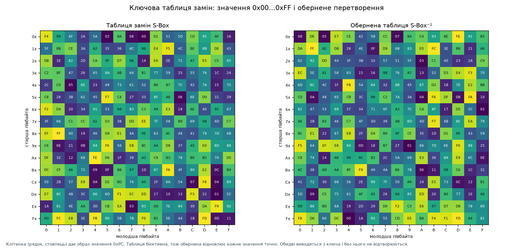
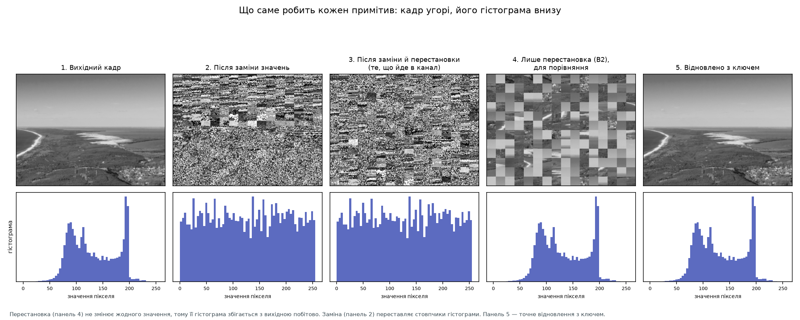
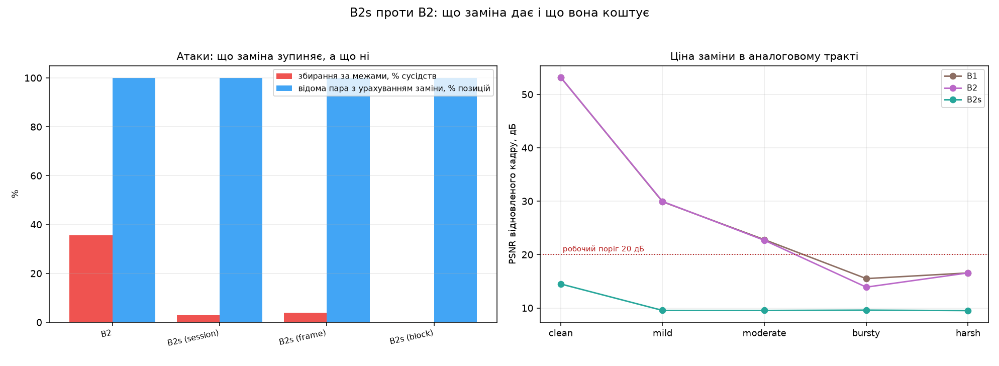
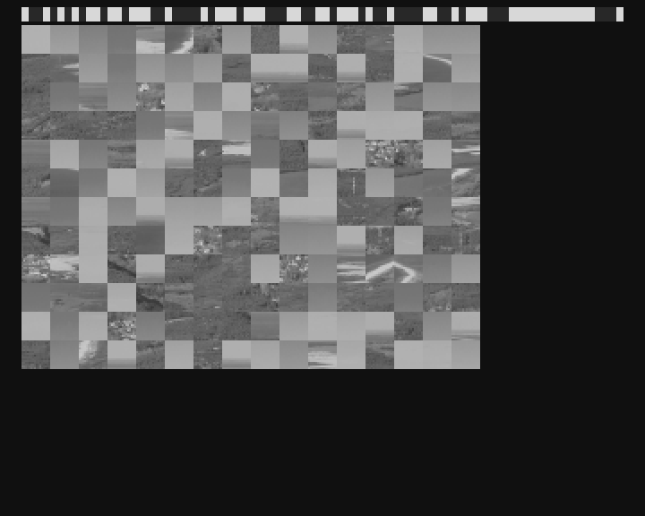
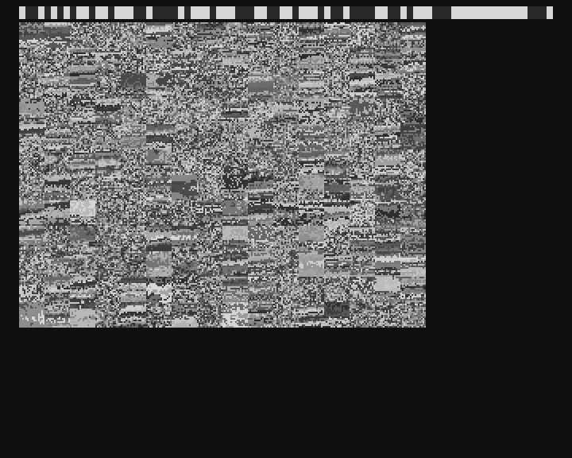
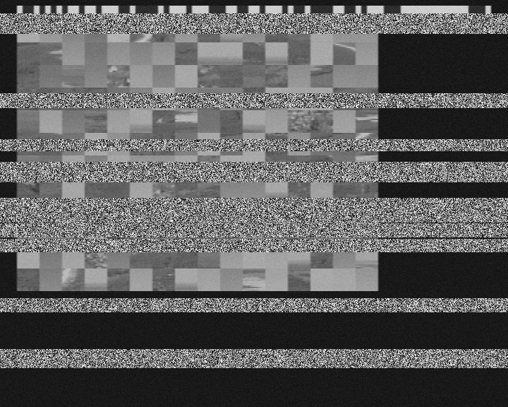
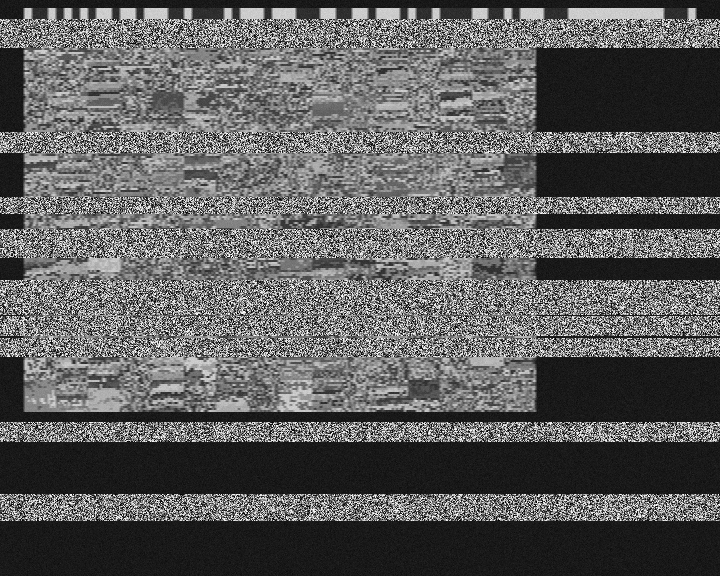
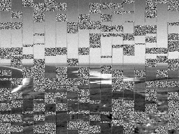
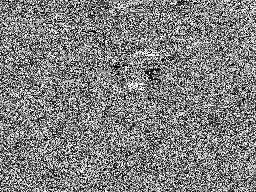
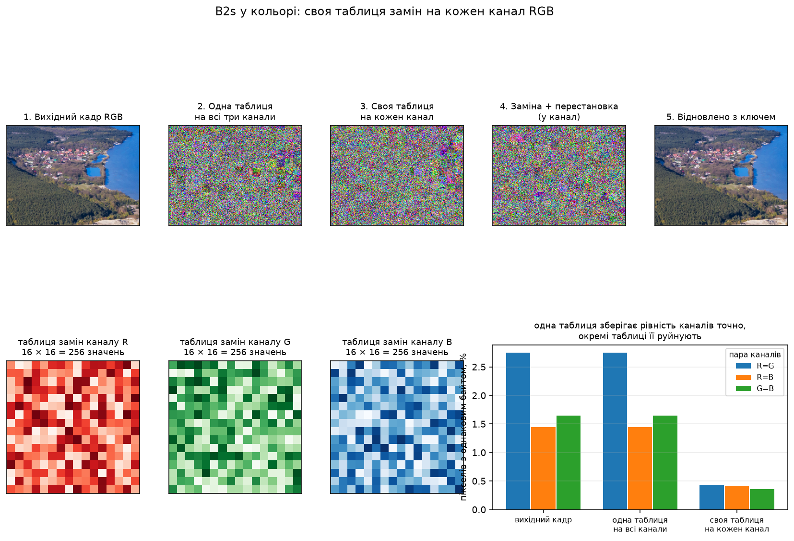

# B2s: заміна значень пікселів разом із перестановкою блоків

<!-- DOCNAV -->
> **Призначення документа.** Другий криптографічний примітив у схемі: ключова таблиця замін значень пікселів, додана до перестановки блоків. Побудова, повні таблиці, криптоаналіз і виміряна вартість в аналоговому тракті.
>
> **Цільовий читач.** Читач, який оцінює, що дає поєднання двох примітивів і за яких умов воно застосовне.
>
> **Пов'язані документи:** [завдання ISITIA 2021](reconstruction_2021.md) · [каталог усіх схем](methods.md) · [модель загроз](threat_model.md) · [реєстр тверджень](claims.md) · [межі застосовності](limitations.md) · [карта документації](README.md)
<!-- /DOCNAV -->

<!-- TOC -->
<details>
<summary><b>Зміст</b></summary>

- [1. Постановка](#1-постановка)
- [2. Побудова схеми B2s](#2-побудова-схеми-b2s)
  - [2.1 Таблиця замін і обернена таблиця](#21-таблиця-замін-і-обернена-таблиця)
  - [2.2 Режими зміни таблиці](#22-режими-зміни-таблиці)
  - [2.3 Порядок перетворень](#23-порядок-перетворень)
- [3. Перевірка коректності](#3-перевірка-коректності)
- [4. Що приховує кожен примітив](#4-що-приховує-кожен-примітив)
- [5. Криптоаналіз](#5-криптоаналіз)
  - [5.1 Атака за відомою парою: пряме зіставлення](#51-атака-за-відомою-парою-пряме-зіставлення)
  - [5.2 Атака за відомою парою з урахуванням заміни](#52-атака-за-відомою-парою-з-урахуванням-заміни)
  - [5.3 Збирання за сумісністю меж](#53-збирання-за-сумісністю-меж)
  - [5.4 Багатокадрова атака](#54-багатокадрова-атака)
  - [5.5 Матриця повторного використання](#55-матриця-повторного-використання)
- [6. Вартість в аналоговому тракті](#6-вартість-в-аналоговому-тракті)
  - [6.1 Механізм: підсилення похибки](#61-механізм-підсилення-похибки)
  - [6.2 Прогін по профілях каналу](#62-прогін-по-профілях-каналу)
  - [6.3 Приклади передавання](#63-приклади-передавання)
- [7. Кольорове зображення: таблиця на кожен канал](#7-кольорове-зображення-таблиця-на-кожен-канал)
  - [7.1 Чому таблиця має розмір 16 × 16](#71-чому-таблиця-має-розмір-16--16)
  - [7.2 Конструкція](#72-конструкція)
  - [7.3 Чим обґрунтовано окрему таблицю на канал](#73-чим-обґрунтовано-окрему-таблицю-на-канал)
- [8. Висновки](#8-висновки)
- [9. Порядок відтворення](#9-порядок-відтворення)

</details>
<!-- /TOC -->

## 1. Постановка

Схеми `B1` і `B2` побудовані на **одному** криптографічному примітиві —
перестановці блоків. Перестановка переміщує пікселі й не змінює жодного
значення, тому все, що несе значення пікселя, переживає перетворення. Це
підтверджується прямим вимірюванням: гістограма перемішаного кадру збігається
з гістограмою вихідного **побайтово** ([розділ 4](#4-що-приховує-кожен-примітив)).

Схема `B2s` додає другий класичний примітив — **заміну**. Кожне значення
яскравості `0x00…0xFF` замінюється за ключовою бієктивною таблицею. У
термінах Шеннона перестановка забезпечує **розсіювання** (переміщує
інформацію по кадру), заміна — **заплутування** (руйнує зв'язок між значенням
і його змістом). Разом вони утворюють найпростішу коректну
підстановочно-перестановочну мережу над зображенням.

**Реалізація:** [`src/avsec/substitution.py`](../src/avsec/substitution.py).
**Стенд:** [`src/avsec/subst_lab.py`](../src/avsec/subst_lab.py), команда
`run.bat subst-lab`.

> [!IMPORTANT]
> **Походження всіх чисел документа.** Прогін `avsec subst-lab`,
> run_id `fe45d509310b99d4`, коміт `af78ae7`, робоче дерево чисте.
> Середовище: Python 3.12.10, NumPy 2.5.3, Windows 11 (26200).
> Кадр 256×192, сітка блоків 12×16 = 192 блоки, блок 16×16 пікселів.
> Повні таблиці — у [`results/b2s/`](../results/b2s).

---

## 2. Побудова схеми B2s

### 2.1 Таблиця замін і обернена таблиця

Таблиця замін `S` — це перестановка алфавіту `0…255`, виведена з ключа сеансу
тим самим ключованим тасуванням Фішера — Єйтса, яким будується перестановка
блоків. Одна процедура вибірки на весь проєкт означає одне місце, де могло б
сховатися зміщення за модулем.

```text
   шифрування:     c = S[v]            v — значення пікселя, 0 ≤ v ≤ 255
   розшифрування:  v = S⁻¹[c]          S⁻¹[S[v]] = v для всіх v

   S виводиться як:  S = keyed_Fisher_Yates( 256, key, context )
   context = "avsec/b2s|sbox|" ‖ session_id ‖ frame_id ‖ block_id
```

<details><summary>LaTeX</summary>

```math
c = S(v),\qquad v = S^{-1}(c),\qquad S^{-1}\circ S = \mathrm{id}_{\{0,\dots,255\}}
```

</details>

<p align="center">
  
</p>

<sub><b>Рис. 1.</b> Повна таблиця замін і обернена до неї. Клітинка в рядку
`Рx` і стовпці `С` дає образ значення `0xРС`. Дані:
<a href="img/b2s_sbox.csv">b2s_sbox.csv</a> і
<a href="img/b2s_sbox_inverse.csv">b2s_sbox_inverse.csv</a>. Прогін
<code>fe45d509310b99d4</code>, коміт <code>af78ae7</code>.</sub>

**Властивості цієї таблиці — виміряні, а не заявлені:**

| Властивість | Значення | Очікуване для випадкової перестановки |
| --- | ---: | ---: |
| Бієктивність | так | — |
| Обернена таблиця точна | так | — |
| Нерухомих точок `S[v] = v` | 2 | 1 |
| Середній зсув значення, `abs(S[v] - v)` | 81,88 | 85,33 |
| Простір таблиць | 256! ≈ 8,6 · 10^506 | — |

<sub>Джерело: `results/b2s/b2s.json` → `sbox`.</sub>

Для порівняння: простір початкових станів 16-бітного регістра в схемі `B1`
дорівнює 65 535, і його перебір знаходить потрібний стан за 5,13 с
([reconstruction_2021.md, розділ 3.5](reconstruction_2021.md#35-перебір-початкових-станів-регістра)).
Перебір 256! неможливий. Це не означає, що схема стійка — це означає лише, що
атака перебором таблиці до неї не застосовна.

### 2.2 Режими зміни таблиці

| Режим | Таблиць одночасно | Аналогія з класичною криптографією |
| --- | ---: | --- |
| `session` | 1 на весь сеанс | моноалфавітний шифр |
| `frame` | 1 на кадр | моноалфавітний шифр зі зміною ключа щокадрово |
| `block` | 192, по одній на блок | поліалфавітний шифр |

Режим `session` реалізовано навмисно: його слабкість — вимірюваний результат,
а не недогляд ([розділ 5](#5-криптоаналіз)). Режим за замовчуванням у стенді —
`block`.

### 2.3 Порядок перетворень

```text
   передавач:   кадр  ──заміна S──►  ──перестановка π──►  растр у канал

   приймач:     растр ──π⁻¹──►  ──S⁻¹──►  відновлений кадр
```

Заміна застосовується **до** перестановки, у вихідній геометрії блоків. Тому
приймач спершу знімає перестановку — блоки повертаються на ті позиції, чиї
таблиці було використано, — і лише потім застосовує обернені таблиці.
Зворотний порядок дав би неправильний блок для кожної таблиці в режимі `block`.

---

## 3. Перевірка коректності

| Режим заміни | Таблиць на кадр | Побітово точне відновлення | Кадрів перевірено |
| --- | ---: | :---: | ---: |
| `session` | 1 | так | 3 |
| `frame` | 1 | так | 3 |
| `block` | 192 | так | 3 |

<sub>Джерело: <a href="img/b2s_correctness.csv">b2s_correctness.csv</a>.
Додатково регресійними тестами перевірено відновлення для розмірів кадру, не
кратних сітці, і те, що хибний ключ не наближає результат до оригіналу
(<code>tests/test_substitution.py</code>, 25 тестів).</sub>

Оскільки обидва перетворення бієктивні, композиція теж бієктивна: **за
відсутності спотворень у каналі відновлення точне до біта**. Уся втрата
якості, показана в [розділі 6](#6-вартість-в-аналоговому-тракті), походить від
каналу, а не від схеми.

---

## 4. Що приховує кожен примітив

<p align="center">
  
</p>

<sub><b>Рис. 2.</b> Угорі — кадр на кожному етапі, внизу — його гістограма.
Панель 4 показує лише перестановку (`B2`) для порівняння. Прогін
<code>fe45d509310b99d4</code>, коміт <code>af78ae7</code>, сцена
<code>sky_horizon</code>.</sub>

Виміряні факти:

| Статистика | Після перестановки | Після однієї глобальної заміни | Після заміни по блоках |
| --- | :---: | :---: | :---: |
| Гістограма збігається з вихідною | **так** (L1 = 0) | ні (L1 = 55 348) | ні |
| **Упорядкована** гістограма збігається | так | **так** | ні (L1 = 33 674) |

<sub>Джерело: `results/b2s/b2s.json` → `histograms`.</sub>

Три висновки, кожен із наслідком:

1. **Перестановка не приховує гістограму взагалі.** Це не оцінка, а рівність
   нулю відстані L1. Будь-який аналіз, що спирається лише на розподіл значень,
   працює з перемішаним кадром так само, як із вихідним.
2. **Одна глобальна таблиця приховує гістограму, але не її форму.** Заміна
   переставляє стовпчики гістограми; упорядкована гістограма лишається тією
   самою. Цей інваріант і є тим, на чому працює атака
   [5.2](#52-атака-за-відомою-парою-з-урахуванням-заміни).
3. **Окрема таблиця на кожен блок руйнує й цей інваріант.** На панелі 2
   рисунка 2 гістограма стає близькою до рівномірної.

Рівномірна гістограма сама по собі **не є доказом конфіденційності** — це те
саме застереження, що й до показника «подібності» у схемі 2021 року. Доказом є
результат атак.

---

## 5. Криптоаналіз

Усі атаки виконано на однаковому вмісті, однаковій сітці й у тому самому
прогоні, тож колонки порівнянні між собою.

<p align="center">
  
</p>

<sub><b>Рис. 3.</b> Ліворуч — атаки, праворуч — якість відновлення за
профілями каналу. Дані: <a href="img/b2s_attacks.csv">b2s_attacks.csv</a> і
<a href="img/b2s_channel_sweep.csv">b2s_channel_sweep.csv</a>.</sub>

### 5.1 Атака за відомою парою: пряме зіставлення

**Модель загроз.** Зловмисник має одну пару (вихідний кадр, шифрований кадр) і
знає сітку. Ключа не має.

**Метод.** Зіставлення плиток за вмістом у метриці L2
(`attack_known_pair`) — атака, яка ламає `B2` за один кадр.

| Ціль | Частка правильно відновлених позицій | Час |
| --- | ---: | ---: |
| `B2` (лише перестановка) | **1,0000** | 0,029 с |
| `B2s` (`session`) | 0,0312 | 0,031 с |
| `B2s` (`frame`) | 0,0052 | 0,031 с |
| `B2s` (`block`) | 0,0104 | 0,031 с |

Рівень випадкового вгадування — 0,0052. Пряме зіставлення після заміни падає
**до рівня випадкового вгадування**: замінена плитка не схожа на свою вихідну.

### 5.2 Атака за відомою парою з урахуванням заміни

Попередній результат не можна подавати як стійкість. Він означає лише, що
атака, написана проти перестановки, не враховує заміни. Адаптована атака
(`attack_substitution_known_pair`) враховує:

```text
   інваріант:  заміна є бієкцією на значеннях, тож вона переставляє
               стовпчики гістограми плитки й НЕ змінює її впорядковану
               гістограму

   крок 1:  зіставити плитки за впорядкованою гістограмою  → перестановка
   крок 2:  заміна діє попіксельно, тож із зіставленої пари таблиця
            читається безпосередньо                        → таблиці
   крок 3:  об'єднати таблиці всіх блоків; несуперечливість означає, що
            таблиця одна, суперечність — що таблиці різні
```

| Ціль | Частка правильно відновлених позицій | Виявлено одну таблицю | Час |
| --- | ---: | :---: | ---: |
| `B2` | **1,0000** | так | 0,045 с |
| `B2s` (`session`) | **1,0000** | **так** | 0,047 с |
| `B2s` (`frame`) | **1,0000** | **так** | 0,045 с |
| `B2s` (`block`) | **1,0000** | **ні** (20 059 суперечностей) | 0,045 с |

**Це найважливіший результат розділу, і він незручний: заміна не приховує
перестановку.** Одна відома пара кадрів відновлює перестановку повністю в усіх
трьох режимах — за 45 мілісекунд. Понад те, крок 3 дозволяє зловмиснику
дізнатися, який саме режим використовується, ще до атаки на сам ключ.

Що заміна справді змінює — це **термін придатності** здобутого знання, і це
виміряно окремо в [5.5](#55-матриця-повторного-використання).

### 5.3 Збирання за сумісністю меж

Це єдина атака, якій **не потрібні ні ключ, ні відома пара**. Саме проти неї
заміна спрямована, бо вона тримається на неперервності пікселів на швах між
блоками.

| Ціль | Правильних сусідств | Правильних абсолютних позицій | PSNR зібраного кадру |
| --- | ---: | ---: | ---: |
| `B2` (лише перестановка) | **35,67 %** | 1,04 % | 15,40 дБ |
| `B2s` (`session`) | 2,81 % | 0,52 % | 9,58 дБ |
| `B2s` (`frame`) | 3,93 % | 0,52 % | 9,43 дБ |
| `B2s` (`block`) | **0,28 %** | 0,52 % | 9,60 дБ |

**Заміна усуває цю атаку.** Частка правильних сусідств падає з 35,67 % до
0,28 % — у 127 разів, до рівня, який не відрізняється від випадкового
розкладання. Це і є те, заради чого додано другий примітив.

Механізм прямий: розв'язувач шукає пари блоків, у яких пікселі вздовж
спільної межі сходяться за значенням. Таблиця замін не зберігає близькості
(див. [6.1](#61-механізм-підсилення-похибки)), тож після неї дві сусідні в
оригіналі колонки пікселів не мають жодного зв'язку.

### 5.4 Багатокадрова атака

| Ціль | Частка правильно відновлених позицій |
| --- | ---: |
| `B2` | 0,0000 |
| `B2s` (усі три режими) | 0,0000 |

Рівень випадкового вгадування — 0,0052. Атака не працює проти жодної з цих
схем, бо перестановка в обох будується щокадрово. Вона лишається дієвою проти
`B1` зі сталою перестановкою (0,5104 —
[reconstruction_2021.md, розділ 3.4](reconstruction_2021.md#34-багатокадрова-атака)).

### 5.5 Матриця повторного використання

Питання: **чи розшифровує наступний кадр те, що зловмисник здобув із
попереднього?** Два примітиви — два незалежні вибори: перестановка може бути
сталою або щокадровою, таблиця замін — на сесію, на кадр або на блок.

| Перестановка | Заміна | PSNR кадру 1 | Кадр читається |
| --- | --- | ---: | :---: |
| **стала** | **`session`** | **45,32 дБ** | **так** |
| стала | `frame` | 10,66 дБ | ні |
| стала | `block` | 15,51 дБ | ні |
| щокадрова | `session` | 12,22 дБ | ні |
| щокадрова | `frame` | 11,29 дБ | ні |
| щокадрова | `block` | 15,50 дБ | ні |

<sub>Джерело: <a href="img/b2s_reuse_matrix.csv">b2s_reuse_matrix.csv</a>.
Критерій читабельності — PSNR ≥ 20 дБ. У всіх шести клітинках перестановку
кадру 0 відновлено повністю (частка 1,0000); різниця лише в тому, чи придатне
це знання для кадру 1.</sub>

Єдина клітинка, де атака переноситься на наступний кадр, — та, в якій **обидва**
примітиви сталі. Достатньо оновлювати будь-який один із них, щоб здобуте знання
знецінилося. Це прямий аргумент: **не можна робити висновок про схему,
розглядаючи примітиви окремо** — властивість дає їхня комбінація разом із
політикою оновлення ключового матеріалу.

---

## 6. Вартість в аналоговому тракті

### 6.1 Механізм: підсилення похибки

Перестановка переносить значення незміненими, тож похибка амплітуди в `d`
рівнів лишається похибкою в `d` рівнів. Таблиця замін — бієкція **без
структури порядку**: сусідні значення вона розкидає по всьому алфавіту. Тому
та сама похибка після оберненої таблиці дає практично довільне значення.

```text
   перестановка:  |v̂ − v| = d

   заміна:        |S⁻¹[c + d] − S⁻¹[c]| ≈ E|X − Y| = 255/3 ≈ 85,
                  де X, Y — незалежні рівномірні на 0…255
```

<details><summary>LaTeX</summary>

```math
\mathbb{E}\bigl|S^{-1}(c+d)-S^{-1}(c)\bigr|\;\approx\;\mathbb{E}|X-Y|=\frac{255}{3}\approx 85,
\qquad X,Y\sim\mathcal{U}\{0,\dots,255\}
```

</details>

**Виміряно:**

| Похибка на дроті, рівнів | Похибка після перестановки | Похибка після заміни (середня за модулем) |
| ---: | ---: | ---: |
| ±1 | 1 | **85,08** |
| ±2 | 2 | 86,17 |
| ±4 | 4 | 86,22 |
| ±8 | 8 | 81,89 |
| ±16 | 16 | 80,36 |

<sub>Джерело: <a href="img/b2s_error_amplification.csv">b2s_error_amplification.csv</a>.
Опорне значення для двох незалежних рівномірних величин — 85.</sub>

**Похибка в один рівень стає похибкою у 85 рівнів.** Це не деградація, а повна
втрата значення пікселя. Один рядок таблиці пояснює весь наступний розділ.

### 6.2 Прогін по профілях каналу

Три схеми через ту саму реалізацію каналу, ті самі траси, той самий бюджет.

| Профіль каналу | `B1` | `B2` | `B2s` |
| --- | ---: | ---: | ---: |
| `clean` | 53,19 дБ | 53,19 дБ | **14,49 дБ** |
| `mild` | 29,89 дБ | 29,95 дБ | **9,54 дБ** |
| `moderate` | 22,79 дБ | 22,66 дБ | **9,53 дБ** |
| `bursty` | 15,49 дБ | 13,89 дБ | **9,59 дБ** |
| `harsh` | 16,55 дБ | 16,56 дБ | **9,50 дБ** |

<sub>PSNR відновленого кадру, середнє за двома сценами й трьома кадрами.
Джерело: <a href="img/b2s_channel_sweep.csv">b2s_channel_sweep.csv</a>. Профілі
каналу — різні умови, а не повторні реалізації однієї; вони не усереднюються.</sub>

Ключовий рядок — **`clean`**. Це найчистіший профіль, у якому `B1` і `B2`
дають 53,19 дБ. Залишкова похибка тут — це квантування аналогового носія,
близько половини рівня. Для перестановки це непомітно; для заміни цього
достатньо, щоб опустити результат до 14,49 дБ. Робочий поріг дослідження —
20 дБ; `B2s` не досягає його **в жодному профілі, включно з найчистішим**.

### 6.3 Приклади передавання

Для кожного профілю збережено повний ланцюг передавання: що пішло в канал, що
прийнято, що відновлено. Файли — у
[`results/b2s/images/`](../results/b2s/images) за схемою
`<профіль>_<схема>_<етап>.png`.

| Етап | `B2` (лише перестановка) | `B2s` (перестановка + заміна) |
| --- | --- | --- |
| Передано в канал |  |  |
| Прийнято з каналу |  |  |
| Відновлено з ключем |  |  |

<sub>Профіль каналу <code>bursty</code>, сцена <code>sky_horizon</code>, кадр 0.
Прогін <code>fe45d509310b99d4</code>, коміт <code>af78ae7</code>.</sub>

У перемішаному кадрі `B2` сцену видно неозброєним оком — це та сама властивість,
яку кількісно міряє атака [5.3](#53-збирання-за-сумісністю-меж). У кадрі `B2s`
сцени не видно. Але в останньому рядку видно й ціну: `B2` відновлюється в
придатне до перегляду зображення, `B2s` — ні.

---

## 7. Кольорове зображення: таблиця на кожен канал

Досі схема працювала з яскравістю — одна площина по вісім бітів. Кольоровий
піксель складається з трьох таких площин, і кожна з них є окремим байтом.

### 7.1 Чому таблиця має розмір 16 × 16

Таблиця замін покриває **усі значення одного байта**: від `0x00` до `0xFF`, тобто
рівно 256 записів. Їх зручно друкувати сіткою, де рядок задає старшу півбайту,
а стовпець — молодшу:

```text
   16 рядків × 16 стовпців  =  256 записів  =  усі значення байта

   клітинка (Р, С) дає образ значення 0xРС
```

Сітка 15 × 15 дала б 225 записів і не покрила б алфавіт: значення від `0xE1` до
`0xFF` лишилися б без образу, а перетворення перестало б бути бієкцією й
перестало б бути оборотним.

### 7.2 Конструкція

| Параметр | Значення |
| --- | --- |
| Канали | `R`, `G`, `B` — по 8 бітів, разом **24 біти** на піксель |
| Альфа-канал | підтримано (`RGBA`, 32 біти), але для зображення не потрібен |
| Таблиць на канал | стільки, скільки задає режим заміни: 1 або 192 |
| Таблиць на кадр у режимі `block` | 192 × 3 = **576** |
| Перестановка блоків | **спільна** для каналів |
| Відновлення | **побітово точне** |

Кожен канал виводить власні таблиці з ключа: тег каналу входить у контекст
виведення, тож три набори таблиць незалежні.

Перестановка блоків спільна навмисно. Блоки — це одне зображення; розводити їх
поканально було б **іншим** перетворенням, а не сильнішим, і зруйнувало б
геометричну відповідність між площинами. Варіант із покановою перестановкою
реалізовано параметром `per_channel_permutation` для порівняння.

<p align="center">
  
</p>

<sub><b>Рис. 4.</b> Угорі — кольоровий кадр на етапах перетворення. Унизу
ліворуч — таблиці замін трьох каналів, кожна 16 × 16. Унизу праворуч —
показник, який розрізняє дві конструкції. Дані:
<a href="img/b2s_colour_correlation.csv">b2s_colour_correlation.csv</a>,
<a href="img/b2s_sbox_channel_R.csv">sbox_channel_R.csv</a>,
<a href="img/b2s_sbox_channel_G.csv">sbox_channel_G.csv</a>,
<a href="img/b2s_sbox_channel_B.csv">sbox_channel_B.csv</a>. Прогін
<code>fe45d509310b99d4</code>, коміт <code>af78ae7</code>, сцена
<code>village</code>.</sub>

### 7.3 Чим обґрунтовано окрему таблицю на канал

Перший показник, який тут напрошується, — кореляція між каналами. Він
**не годиться**, і це варто показати, а не приховати:

| Кадр | Максимальний модуль кореляції між каналами |
| --- | ---: |
| Вихідний кадр | 0,7438 |
| Одна таблиця на всі три канали | 0,0213 |
| Своя таблиця на кожен канал | 0,0022 |

Обидві конструкції дають величину біля нуля. Причина проста: заміна є
перестановкою значень **без структури порядку**, тож вона руйнує лінійний
зв'язок між площинами незалежно від того, спільна таблиця чи ні.

Справжній розрізняльник — **рівність каналів**. Одна таблиця відображає рівні
значення в рівні завжди: якщо `R = G` у пікселі, то `S(R) = S(G)`.

| Кадр | `R = G` | `R = B` | `G = B` | Середнє |
| --- | ---: | ---: | ---: | ---: |
| Вихідний кадр | 2,750 % | 1,440 % | 1,650 % | **1,950 %** |
| Одна таблиця на всі три канали | 2,750 % | 1,440 % | 1,650 % | **1,950 %** |
| Своя таблиця на кожен канал | 0,430 % | 0,420 % | 0,360 % | **0,400 %** |

<sub>Частка пікселів, у яких два канали несуть однаковий байт. Джерело:
<a href="img/b2s_colour_correlation.csv">b2s_colour_correlation.csv</a>.
Рівень випадкового збігу — 1/256 = 0,391 %.</sub>

Одна спільна таблиця зберігає цю частку **до останньої цифри**: 1,950 % до
перетворення і 1,950 % після. Окремі таблиці опускають її до 0,400 %, тобто до
рівня випадкового збігу. Сірі й нейтральні ділянки кадру, де канали рівні,
лишаються впізнаваними за однієї таблиці й перестають бути за трьох.

Це і є причина робити таблицю на кожен канал — виміряна, а не постульована.

---

## 8. Висновки

**Що додавання другого примітиву дало:**

1. Безключова атака збирання за сумісністю меж **усунена**: 35,67 % → 0,28 %
   правильних сусідств, тобто до рівня випадкового розкладання.
2. Простір ключового матеріалу заміни — 256! замість 65 535 у схемі `B1`;
   атака перебором таблиці не застосовна.
3. Гістограма кадру більше не збігається з вихідною, а в режимі `block` стає
   близькою до рівномірної.
4. Відновлення лишається **точним до біта** за відсутності спотворень,
   зокрема й для кольорового кадру з трьома таблицями на блок.
5. У кольорі окрема таблиця на канал прибирає рівність каналів: 1,950 %
   однакових байтів у парі каналів проти 0,400 % — рівня випадкового збігу.

**Чого воно не дало:**

1. **Перестановка не прихована.** Одна відома пара кадрів відновлює її
   повністю за 45 мс у всіх трьох режимах — зіставленням за впорядкованою
   гістограмою, інваріантною щодо заміни.
2. **Режим заміни визначається зловмисником** із тієї самої однієї пари.
3. **Автентичності немає.** Ані мітки цілісності, ані лічильника свіжості в
   схемі немає; підміна кадру приймається без перевірки. Заміна на це не
   впливає.
4. **Схема непридатна для аналогового тракту в цій формі.** Робочого порогу
   20 дБ не досягнуто в жодному профілі каналу, включно з найчистішим.

**Чому це не є невдачею, а є результатом.** Пункт 4 має точну причину
([6.1](#61-механізм-підсилення-похибки)): заміна не зберігає близькості
значень, тому будь-яка залишкова похибка амплітуди стає повною втратою пікселя.
Звідси випливає інженерне правило, яке в цьому репозиторії вже реалізоване в
схемах `B3` і `B4`: **заміну застосовують не до значень пікселів в
аналоговому тракті, а до цифрового потоку — після кодування джерела й перед
завадостійким кодуванням**, де кожен біт або дійшов правильно, або виправлений
кодом Ріда — Соломона. Тоді підстановці немає на чому зламатися.

Поєднання, яке з цього випливає:

```text
   B1, B2   один примітив             → безключова атака працює
   B2s      два примітиви в аналозі   → атака усунена, канал зруйновано
   B3, B4   заміна (гамування AEAD)   → атака усунена, канал збережено
            над цифровим потоком        завадостійким кодуванням
            з мітками цілісності
```

Отже, `B2s` — не альтернатива `B3`/`B4`, а вимірювання, яке показує, **чому**
`B3`/`B4` влаштовані саме так.

**Другий спосіб побудувати таблицю.** Таблиці вище виведені ключовим
перемішуванням і зберігаються в пам'яті. Їх можна замість цього **обчислювати**
за правилом у полі GF(2⁸) — і тоді стійкість до диференціального й лінійного
аналізу стає теоремою, а не результатом розіграшу. Побудова, звірка з
опублікованою таблицею AES і виміряне порівняння обох конструкцій —
[galois_sbox.md](galois_sbox.md).

**Наступний крок.** Поточна заміна є підстановкою за таблицею, тобто залежить
лише від значення пікселя й номера блока. Наступний рівень — залежність від
позиції пікселя всередині блока, тобто перехід від підстановки до гамування;
там таблиця вироджується в потік ключа, а схема — у потоковий шифр. Саме це й
реалізовано в `B3`/`B4` через ChaCha20.

---

## 9. Порядок відтворення

```bash
run.bat subst-lab
```

Виконує все, що наведено вище, і записує в
[`results/b2s/`](../results/b2s): таблиці `sbox.csv` і `sbox_inverse.csv`,
таблиці трьох каналів `sbox_channel_R/G/B.csv`, `colour_correlation.csv`,
таблиці атак, матрицю повторного використання, прогін по каналах, зображення
всіх етапів і три рисунки. Тривалість — близько двох хвилин.

```bash
python -m avsec.cli subst-lab --config configs/research_main.yaml --output runs/b2s
```

Те саме в окремий каталог, без перезапису опублікованих результатів.

```bash
python -m pytest tests/test_substitution.py -q
```

25 регресійних тестів навколо тверджень цього документа, зокрема двох
незручних: що заміна не приховує перестановку від атаки за відомою парою і що
одна глобальна таблиця лишає впорядковану гістограму інваріантною.
